# BHT-Nexus: Panduan Teknis dan Pelaksanaan Pembangunan Command Center

Tanggal pembaruan: 12 Juli 2026  
Status: arah kerja awal tim, berkembang mengikuti hasil implementasi dan masukan pengguna  
Pembaca: anggota tim teknis, mentor, supervisor, dan pembaca nonteknis

> BHT-Nexus adalah nama kerja yang muncul dalam koordinasi tim. Dokumen ini tidak membuat, menginisialisasi, atau mengubah repository GitHub. Isinya menjadi bahan bersama agar tim dapat mulai membangun dengan arah yang sama tanpa menunggu seluruh rancangan menjadi sempurna.

## 1. Keputusan Utama dalam Satu Halaman

### Produk yang dibangun

BHT-Nexus adalah aplikasi web internal yang secara bertahap menyatukan data kegiatan, anggota, Knowledge Management, kesiapan audit, dan materi showcase CoE BHT. Sistem membantu pengurus berpindah dari pengumpulan data yang tersebar dan manual menuju data yang lebih terstruktur, dapat ditelusuri sumbernya, dapat diperiksa kualitasnya, dan dapat digunakan untuk laporan maupun pengambilan keputusan.

### Cara memulai

Tim tidak perlu membangun seluruh Command Center sekaligus. Tim memulai dari **satu alur kecil yang selesai dari awal sampai akhir**:

```text
File contoh publikasi
→ diperiksa formatnya
→ ditampilkan sebagai preview
→ dicari kemungkinan duplikatnya
→ disimpan ke database
→ muncul dalam daftar dan ringkasan
→ dapat difilter dan diekspor
```

Alur pertama menggunakan data dummy atau data yang telah disanitasi. Setelah berfungsi, hasilnya didemokan, dinilai, lalu diperbaiki sebelum modul berikutnya dibuat.

### Bentuk repository

Gunakan **satu repository gabungan** pada tahap awal. Di dalamnya terdapat:

- aplikasi web Next.js;
- database dan migration;
- program Python untuk impor, konektor data, ekstraksi dokumen, dan RAG;
- dokumentasi kebutuhan, arsitektur, API, operasional, dan keputusan.

Satu repository memudahkan tim kecil bekerja, melakukan review, menjalankan pengujian, dan menyiapkan satu paket deployment. Pemisahan menjadi beberapa repository baru dilakukan ketika terdapat kebutuhan operasi yang nyata, bukan sejak hari pertama.

### Teknologi inti

| Bagian | Pilihan awal | Fungsi utama |
|---|---|---|
| Web | Next.js 16.x + React 19.2.x + TypeScript 5.9.x | Halaman aplikasi, API utama, login, workflow, dashboard |
| Runtime web | Node.js 24 LTS | Menjalankan dan membangun aplikasi web |
| Database | PostgreSQL 17.x | Menyimpan data terstruktur dan riwayat sumber |
| Akses database | Drizzle ORM, versi dikunci dalam lockfile | Schema, migration, dan query TypeScript yang dekat dengan SQL |
| Grafik | Apache ECharts 6.x | Grafik interaktif dan visualisasi KPI |
| Data dan AI | Python 3.13.x | Impor, cleaning, konektor, ekstraksi, analitik, RAG |
| API Python | FastAPI, hanya ketika program Python perlu dipanggil sebagai layanan | Menjembatani web dengan proses Python |
| Local environment | Docker Compose v2 | Menyamakan database dan layanan pada laptop anggota |
| Kolaborasi | GitHub organization + private repository | Issue, branch, pull request, review, dan CI |

### Prinsip biaya

Gunakan perangkat lunak open-source dan infrastruktur institusi yang telah tersedia. Sasaran yang jujur adalah **tidak menambah biaya langganan pada fase awal**, bukan mengklaim bahwa seluruh sistem tidak memiliki biaya. Server, storage, backup, listrik, waktu operator, dan pemeliharaan tetap merupakan biaya operasional.

### Prinsip jangka panjang

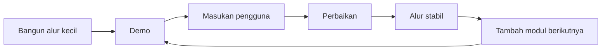

## 2. Dasar Penyusunan Arah Kerja

Arah dalam dokumen ini dibangun dari temuan yang konsisten pada materi kebutuhan, workbook awal, percakapan koordinasi, rekaman pembahasan mingguan, contoh sistem yang ditampilkan saat meeting, dan profil teknis anggota tim.

### Temuan kerja yang paling penting

- sistem yang diharapkan bersifat web-based;
- infrastruktur dan situs sebelumnya tersedia, tetapi situs masih dominan sebagai tampilan statis;
- pengembangan dapat dimulai secara lokal tanpa menunggu akses deployment;
- tim diperbolehkan memulai pembangunan secara mandiri dan iteratif;
- fokus utama berada pada pengelolaan kegiatan dan anggota, audit/Knowledge Management, serta showcase/branding;
- data saat ini tersebar pada Excel, PDF, sumber publik, dan sistem internal yang belum terintegrasi;
- pengumpulan serta cross-check data masih membutuhkan pekerjaan manual;
- satu sumber dapat belum lengkap sehingga data harus dibandingkan dengan sumber lain;
- sistem diharapkan dapat menampilkan, mengekspor, dan membantu pengukuran untuk pengambilan kebijakan;
- framework awal, pemetaan fitur, dan pemetaan role perlu terbentuk lebih dulu, tetapi framework boleh berkembang selama pembangunan;
- satu repository dianggap lebih sesuai untuk tahap awal selama kompleksitas masih dapat dikelola;
- RAG offline, konektor SINTA, dan konektor Google Scholar telah muncul sebagai area eksperimen tim;
- SRS dengan struktur IEEE diperbolehkan sebagai dokumentasi kebutuhan.

### Tiga fokus produk

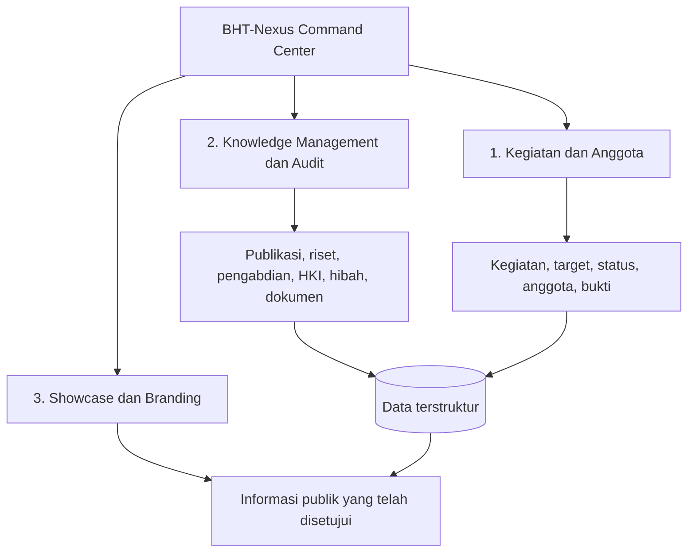

Diagram tersebut menunjukkan bahwa showcase tidak seharusnya memiliki input data terpisah yang seluruhnya dikerjakan manual. Informasi showcase idealnya berasal dari data internal yang telah diperiksa dan dipilih untuk publikasi.

## 3. Arti Command Center dalam Bahasa Awam

Command Center bukan sekadar halaman penuh grafik. Command Center adalah tempat yang membantu pengguna melakukan empat pekerjaan:

1. **Melihat keadaan**  
   Contohnya jumlah kegiatan aktif, capaian publikasi, dokumen yang belum lengkap, dan distribusi kontribusi anggota.

2. **Mengetahui bagian yang perlu ditindaklanjuti**  
   Contohnya data tanpa bukti, tenggat mendekat, data ganda, atau kegiatan yang tidak memiliki pembaruan.

3. **Mengerjakan tindakan**  
   Contohnya memperbaiki data, menyetujui hasil impor, mengunggah bukti, mengubah status, atau mengekspor laporan.

4. **Menelusuri alasan suatu angka muncul**  
   Setiap angka penting dapat dilacak kembali ke data pembentuk, sumber, waktu pembaruan, dan status pemeriksaan.

### Perbedaan dashboard biasa dan BHT-Nexus

| Dashboard biasa | BHT-Nexus yang dituju |
|---|---|
| Menampilkan grafik | Menampilkan grafik dan tindakan |
| Data sering disiapkan manual | Data masuk melalui alur impor/konektor yang tercatat |
| Angka sulit ditelusuri | Angka terhubung ke data dan bukti |
| Tidak menunjukkan kualitas data | Menunjukkan error, duplikasi, dan kelengkapan |
| Pembaruan bergantung satu orang | Memiliki role, owner, riwayat, dan dokumentasi |
| Hanya untuk dilihat | Mendukung laporan, audit, dan keputusan |

## 4. Pengguna dan Kebutuhan Utamanya

Nama role berikut adalah rancangan kerja awal. Role dapat disesuaikan tanpa mengubah fondasi sistem.

| Role | Pekerjaan dalam sistem | Informasi yang dibutuhkan |
|---|---|---|
| Supervisor/Observer | memantau hasil dan progres | ringkasan KPI, tren, masalah data, laporan |
| Admin Sistem | menjaga akun dan konfigurasi | user, role, referensi data, status sistem |
| Data Steward | menjaga kualitas data | import, preview, error, duplikasi, provenance |
| Pengurus Bidang | mengelola data sesuai bidang | kegiatan, target, anggota, bukti, tindak lanjut |
| Anggota CoE | melihat atau mengusulkan pembaruan data diri | capaian, keterlibatan, bukti, status verifikasi |
| Pengelola Showcase | memilih konten yang aman dipublikasi | konten terverifikasi, status persetujuan publik |

### Alur pengguna secara umum

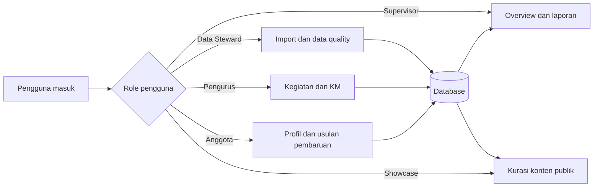

Hak akses selalu diperiksa di server. Menyembunyikan tombol pada layar tidak cukup untuk melindungi data.

## 5. Peta Fitur Lengkap dan Tahap Pembangunannya

### 5.1 Fondasi bersama

Fondasi dipakai oleh seluruh modul.

| Fitur | Isi | Hasil yang harus terlihat |
|---|---|---|
| User dan role | akun, role, status aktif, ruang lingkup akses | pengguna hanya melihat dan melakukan aksi yang diizinkan |
| Master data | bidang, jenis kegiatan, jenis capaian, status, periode | istilah konsisten di seluruh modul |
| Audit trail | pencatat perubahan data | siapa, kapan, data sebelum/sesudah, alasan perubahan |
| Evidence | metadata bukti dan lokasi file/tautan | capaian dapat dihubungkan ke bukti yang diizinkan |
| Import runs | setiap proses impor menjadi satu riwayat | status, jumlah sukses/gagal, file asal, waktu, operator |
| Data quality | rule validasi, duplikasi, data tidak lengkap | masalah data terlihat dan dapat ditindaklanjuti |
| Export | CSV/XLSX/PDF sesuai kebutuhan | hasil filter dapat dijadikan bahan laporan |
| Notification internal | tanda pekerjaan atau data bermasalah | pengguna melihat tugas tanpa integrasi berbayar |

### 5.2 Pengelolaan kegiatan dan anggota

| Fitur | Isi utama | Tahap |
|---|---|---|
| Direktori anggota | identitas kerja, bidang, keahlian, status | awal |
| Kegiatan | judul, jenis, periode, target, status, penanggung jawab | awal |
| Keterlibatan anggota | relasi anggota dengan kegiatan dan peran | awal |
| Milestone | target antara, tenggat, progres | menengah |
| Evidence kegiatan | laporan, dokumentasi, luaran | awal |
| Ringkasan kontribusi | distribusi keterlibatan dan capaian | menengah |
| Beban dan gap | kegiatan tanpa owner atau tanpa pembaruan | menengah |

### 5.3 Knowledge Management dan kesiapan audit

| Kelompok data | Contoh isi | Kemampuan sistem |
|---|---|---|
| Publikasi | judul, penulis, tahun, venue, DOI, indeks, bukti | impor, deduplikasi, relasi anggota, ringkasan |
| Penelitian | judul, skema, periode, anggota, pendanaan, luaran | pencatatan, dokumen, target, status |
| Pengabdian masyarakat | kegiatan, mitra, periode, anggota, nilai, luaran | pencatatan dan kelengkapan bukti |
| HKI/paten | jenis, nomor, judul, pemegang, status, tahun | agregasi dan verifikasi |
| Hibah/pendanaan | sumber, skema, nilai, periode, penerima | ringkasan dengan kontrol akses |
| Prestasi anggota | kategori, tingkat, tahun, bukti | distribusi capaian |
| Dokumen audit | indikator, dokumen, status, catatan | gap list dan progress kelengkapan |

Kemampuan lintas data:

- satu anggota dapat memiliki banyak publikasi dan kegiatan;
- satu publikasi dapat memiliki banyak penulis;
- satu dokumen dapat mendukung lebih dari satu indikator jika diperbolehkan;
- data dari sumber berbeda dapat digabung tanpa menghapus jejak sumber;
- data yang meragukan masuk antrean review, bukan langsung dianggap benar;
- agregasi dapat dihitung per tahun, bidang, anggota, jenis capaian, atau status.

### 5.4 Showcase dan branding

| Fitur | Cara kerja | Pengamanan |
|---|---|---|
| Berita/kegiatan | mengambil kegiatan yang telah disetujui | hanya field public-safe |
| Capaian | mengambil capaian terverifikasi | tidak menampilkan bukti internal |
| Member | profil publik terpilih | persetujuan dan field whitelist |
| Research/community service | ringkasan dari data internal | nilai sensitif dapat disembunyikan |
| Training/seminar | jadwal, deskripsi, status pendaftaran | data peserta tetap internal |
| Partner | daftar kolaborasi yang boleh dipublikasi | mengikuti izin dan periode publikasi |

Showcase menggunakan mekanisme **publish approval**. Data internal tidak otomatis menjadi data publik.

### 5.5 Fitur tahap lanjut

- registrasi dan pengelolaan kegiatan;
- penerbitan sertifikat;
- formulir pengajuan kolaborasi mitra;
- reminder terjadwal;
- konektor sumber internal;
- konektor publik berkala;
- ekstraksi data dokumen;
- pencarian semantik;
- RAG dengan sumber jawaban;
- analitik tren dan distribusi yang lebih dalam.

## 6. Alur Data dari Sumber sampai Dashboard

### Gambaran menyeluruh

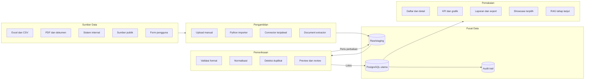

### Arti setiap lapisan

1. **Sumber data** adalah tempat informasi berasal.
2. **Pengambilan** membaca data tanpa langsung menganggapnya benar.
3. **Raw/staging** adalah tempat transit agar data asli tetap dapat dibandingkan.
4. **Pemeriksaan** menyamakan format dan menemukan masalah.
5. **PostgreSQL utama** hanya menerima data yang sudah memenuhi rule.
6. **Audit trail** mencatat perubahan penting.
7. **Pemakaian** menyajikan data berdasarkan role dan tujuan.

### Data lineage

Data lineage berarti jejak perjalanan data. Contoh jejak satu publikasi:

```text
Sumber: file import publikasi_2026.xlsx
Baris asal: 27
Waktu dibaca: 2026-07-15 09:10
Hasil normalisasi: DOI diubah menjadi huruf kecil
Hasil deduplikasi: cocok dengan satu data lama
Keputusan reviewer: gabungkan metadata venue
Record utama: publication_id 184
Dipakai oleh KPI: jumlah publikasi 2026
```

Jejak ini membuat angka dashboard lebih mudah dipercaya dan diperiksa.

## 7. Arsitektur Sistem yang Direkomendasikan

### 7.1 Bentuk besar sistem

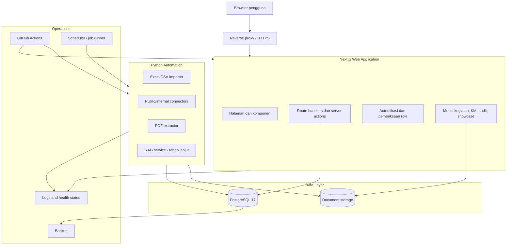

### 7.2 Tanggung jawab setiap bagian

| Komponen | Tanggung jawab | Tidak dikerjakan di sini |
|---|---|---|
| Next.js UI | tampilan, formulir, tabel, filter, grafik | scraping dan model AI berat |
| Next.js server | validasi request, role, CRUD, KPI ringan | pipeline dokumen panjang |
| PostgreSQL | sumber data utama, constraint, view, audit data | menyimpan file besar sebagai pilihan default |
| Python scripts | impor, cleaning, eksperimen konektor | menggandakan seluruh API web |
| FastAPI | endpoint untuk proses Python yang harus dipanggil aplikasi | dipasang sejak awal tanpa kebutuhan |
| Scheduler | menjalankan job terjadwal | memuat logika bisnis utama |
| Storage dokumen | menyimpan file dan versi bukti | menjadi database metadata |

### 7.3 Pola aplikasi utama

Aplikasi utama menggunakan **modular monolith**. Istilah ini berarti satu aplikasi yang dijalankan sebagai satu unit, tetapi isi kodenya dipisahkan per bagian bisnis.

```text
Satu aplikasi utama
├── modul anggota
├── modul kegiatan
├── modul publikasi
├── modul penelitian
├── modul audit
├── modul import
└── modul showcase
```

Setiap modul memiliki model, layanan, validasi, akses data, halaman, dan test yang jelas. Modul tidak boleh mengambil data modul lain secara sembarangan.

### 7.4 Hubungan Next.js dan Python

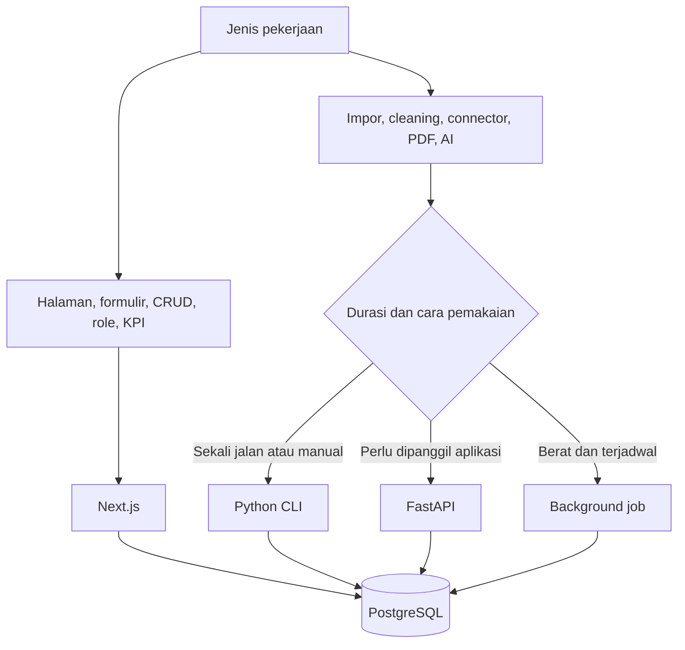

Pada fase awal, importer cukup berupa program Python yang dijalankan manual. FastAPI ditambahkan ketika aplikasi benar-benar perlu memulai job, membaca status, atau menerima hasil melalui API.

## 8. Keputusan Satu Repository Gabungan

### 8.1 Penjelasan istilah

- **Repository** adalah tempat source code dan dokumentasi disimpan di GitHub.
- **Satu repository gabungan** berarti web, Python, database, dan docs berada dalam satu repository.
- **Modular** berarti kode tetap dibagi rapi walaupun berada di satu tempat.
- **Multi-repository** berarti setiap sistem memiliki repository berbeda.
- **Microservices** berarti aplikasi dipecah menjadi banyak layanan yang berjalan dan dirilis terpisah.

Untuk tim kecil dan tahap awal, satu repository gabungan memberi biaya koordinasi paling rendah.

### 8.2 Struktur yang disarankan

```text
bht-nexus/
├── apps/
│   └── web/                         # Next.js 16
│       ├── src/app/                 # halaman dan route
│       ├── src/modules/             # modul bisnis
│       ├── src/components/          # komponen UI bersama
│       ├── src/lib/                 # helper teknis
│       └── tests/                   # test web
├── services/
│   └── automation/                  # Python 3.13
│       ├── src/importers/            # Excel/CSV
│       ├── src/connectors/           # sumber publik/internal
│       ├── src/extractors/           # dokumen
│       ├── src/rag/                  # tahap lanjut
│       └── tests/
├── packages/
│   ├── contracts/                    # skema request/event bersama
│   └── config/                       # konfigurasi lint/test bersama
├── database/
│   ├── schema/                       # Drizzle schema
│   ├── migrations/                   # perubahan database
│   ├── seeds/                        # data dummy
│   └── views/                        # query laporan bila diperlukan
├── docs/
│   ├── requirements/                 # SRS dan use case
│   ├── architecture/                 # diagram dan ADR
│   ├── data/                         # kamus data dan mapping
│   ├── operations/                   # runbook dan deployment
│   └── weekly/                       # ringkasan progres public-safe/internal-safe
├── sample-data/                      # data dummy saja
├── .github/
│   ├── workflows/                    # CI
│   ├── ISSUE_TEMPLATE/
│   └── pull_request_template.md
├── compose.yaml
├── pnpm-workspace.yaml
├── package.json
├── pyproject.toml
└── README.md
```

### 8.3 Alasan memilih satu repository

| Pertimbangan | Satu repository | Banyak repository |
|---|---|---|
| Tim kecil | lebih sederhana | koordinasi lebih berat |
| Perubahan web + data | satu pull request dapat menunjukkan hubungan | perubahan tersebar |
| Dokumentasi | satu sumber | mudah berbeda versi |
| CI awal | satu pipeline | banyak pipeline |
| Deployment awal | satu paket | banyak release |
| Pembatasan akses kode | kurang fleksibel | lebih fleksibel |
| Scaling organisasi | cukup untuk awal | lebih cocok ketika tim/layanan bertambah |

### 8.4 Kondisi pemisahan di masa depan

Pemisahan dilakukan setelah salah satu keadaan berikut benar-benar terjadi:

- Python service memerlukan deployment dan resource yang berbeda;
- ritme release web dan AI berbeda jauh;
- hak akses source code harus berbeda;
- satu layanan memiliki beban tinggi dan harus diskalakan terpisah;
- tim pemelihara telah terbagi secara permanen;
- kegagalan satu komponen sering mengganggu komponen lain;
- pipeline CI menjadi terlalu lama dan tidak dapat diperbaiki dengan pembagian job.

Pemisahan tersebut dapat dilakukan tanpa mengubah konsep produk karena batas modul telah disiapkan sejak awal.

## 9. Alasan Memilih Tech Stack

### 9.1 Web framework

| Opsi | Kelebihan | Kekurangan pada konteks tim | Keputusan |
|---|---|---|---|
| Next.js + TypeScript | sesuai pengalaman full-stack tim, UI dan API ringan dalam satu proyek, ekosistem React kuat | perlu disiplin agar proses data berat tidak masuk web | dipilih |
| React SPA + backend terpisah | pemisahan jelas | dua aplikasi wajib sejak awal, lebih banyak setup | tidak dipilih untuk awal |
| Django | Python end-to-end dan admin kuat | kompetensi frontend utama tim lebih kuat di TypeScript/React | cadangan, bukan default |
| FastAPI sebagai seluruh backend | baik untuk API dan AI | CRUD bisnis menjadi dua ekosistem sejak awal | dipakai hanya untuk layanan Python |
| BI tool sebagai produk utama | cepat membuat grafik | kurang cocok sebagai system of record dan workflow jangka panjang | hanya pelengkap bila dibutuhkan |

### 9.2 Database

| Opsi | Kekuatan | Keterbatasan | Keputusan |
|---|---|---|---|
| PostgreSQL | relasi, constraint, JSON, view, full-text, pgvector, open-source | perlu operasi database yang benar | dipilih |
| MySQL | matang dan umum | jalur vector serta fitur analitik tertentu kurang sesuai arah yang direncanakan | tidak menjadi default |
| MongoDB | fleksibel untuk dokumen | relasi anggota-kegiatan-capaian dan audit lebih sulit dijaga | tidak dipilih sebagai sumber utama |
| Spreadsheet | mudah dipakai | rawan duplikasi, sulit menjaga relasi dan audit trail | hanya sumber impor/ekspor |

### 9.3 ORM

Drizzle ORM dipilih sebagai akses database TypeScript karena:

- pengalaman anggota tim terlihat pada Drizzle dan PostgreSQL;
- gaya query dekat dengan SQL sehingga cocok dengan kemampuan data/SQL tim;
- schema dan migration dapat disimpan sebagai kode;
- lebih mudah melihat SQL yang dihasilkan;
- cukup ringan untuk aplikasi Next.js.

Aturan pentingnya adalah hanya menggunakan **satu ORM utama**. Prisma tidak digunakan bersamaan dengan Drizzle dalam modul yang sama.

### 9.4 Visualisasi

Apache ECharts 6 dipilih karena open-source, mendukung grafik dashboard yang kaya, dapat dikendalikan dari React, dan tidak menambah biaya lisensi. Grafik tetap dibuat sederhana dan berorientasi keputusan.

Contoh pemetaan grafik:

| Pertanyaan pengguna | Visual yang tepat |
|---|---|
| Jumlah capaian per periode | line/bar chart |
| Distribusi capaian anggota | sorted bar atau box plot |
| Proporsi jenis capaian | stacked bar, bukan pie berlebihan |
| Tenggat dan status kegiatan | timeline atau status table |
| Kelengkapan bukti | progress bar dan daftar gap |
| Kolaborasi antaranggota | network chart hanya jika benar-benar membantu |

## 10. Baseline Versi dan Software Prerequisite

Versi berikut adalah baseline proyek per 12 Juli 2026. Patch version dikunci ketika repository di-scaffold agar seluruh anggota memakai versi yang sama.

### 10.1 Runtime dan platform inti

| Komponen | Baseline | Kebijakan |
|---|---|---|
| Node.js | 24 LTS | gunakan latest patch pada jalur 24 dan pin melalui `.nvmrc` atau `.tool-versions` |
| pnpm | 10.x | pin melalui `packageManager` pada root `package.json` |
| Next.js | 16.x | pin exact version di lockfile; gunakan App Router |
| React | 19.2.x | mengikuti kompatibilitas Next.js 16 |
| TypeScript | 5.9.x | dipilih lebih konservatif daripada TypeScript 6 yang baru dirilis; strict mode aktif |
| Python | 3.13.x | baseline layanan automation; pin melalui `.python-version` dan `pyproject.toml` |
| PostgreSQL | 17.x | gunakan latest minor 17; stabil dan masih didukung sampai 2029 |
| Docker | Engine/Desktop dengan Compose v2 | versi stabil yang mendukung Compose Specification |

Pengecualian Python hanya berlaku jika dependency RAG lokal yang telah dipilih belum mendukung Python 3.13. Dalam keadaan tersebut, service automation boleh memakai Python 3.12.10 secara terisolasi dan alasan keputusan dicatat pada ADR.

### 10.2 Library utama

| Area | Library | Catatan versi |
|---|---|---|
| UI | Tailwind CSS 4.x | pin exact version |
| Komponen | shadcn/ui atau komponen internal | source component, bukan dependency desain yang tidak terkendali |
| Chart | Apache ECharts 6.x | gunakan wrapper React yang kompatibel atau integrasi langsung |
| Validation web | Zod stable | schema request dan form |
| Database | Drizzle ORM + Drizzle Kit | keduanya dipin berpasangan dalam lockfile |
| Test unit web | Vitest stable | test fungsi dan service |
| Test browser | Playwright stable | alur pengguna utama |
| Python dependency | uv + `pyproject.toml` + lockfile | environment dapat direproduksi |
| Data | pandas atau Polars | pilih per kebutuhan, hindari memakai keduanya tanpa alasan |
| Excel | openpyxl melalui pipeline Python | pembacaan file dan rule impor |
| API Python | FastAPI + Pydantic | hanya ketika service API diperlukan |
| Test Python | pytest | unit dan integration test |
| Lint Python | Ruff | format/lint yang cepat |

Library 0.x seperti Drizzle dan FastAPI harus dipin exact version. Upgrade dilakukan melalui pull request khusus yang menjalankan seluruh test.

### 10.3 Software pada laptop anggota

| Software | Wajib untuk | Fungsi |
|---|---|---|
| Git | semua anggota teknis | mengambil dan mengirim perubahan |
| Node.js 24 LTS | web/full-stack | menjalankan Next.js |
| pnpm 10 | web/full-stack | dependency JavaScript |
| Python 3.13 | data/AI | importer, connector, extraction, RAG |
| uv | data/AI | dependency Python dan virtual environment |
| Docker + Compose | integrasi sistem | PostgreSQL dan layanan lokal |
| VS Code/editor lain | semua anggota teknis | menulis dan mereview kode |
| DBeaver/pgAdmin opsional | data | melihat database saat development |

## 11. Pemetaan Kompetensi Tim Berdasarkan Bukti GitHub

Pemetaan ini tidak menilai tingkat senioritas. Tujuannya adalah menempatkan pekerjaan awal pada kekuatan yang sudah terlihat sekaligus tetap memberi ruang belajar silang.

### 11.1 Ringkasan bukti

| Anggota | Bukti yang terlihat | Kekuatan yang relevan |
|---|---|---|
| Caldera — [Facalder](https://github.com/Facalder) | profil menekankan React/Next; proyek blog Next.js; Student Achievement Dashboard; proyek backend TypeScript/PostgreSQL/Drizzle dengan Docker, CI, testing, dan dokumentasi API | frontend/full-stack, struktur aplikasi web, UI dashboard, TypeScript backend, database integration, engineering workflow |
| Rifqi — [Liamours](https://github.com/Liamours) | profil AI dan repository Python; FastAPI, React, Docker, pytest; deep learning, multimodal, computer vision, NLP/research | data/AI automation, FastAPI, model/RAG evaluation, Python engineering, research-oriented experimentation |
| Zaenal — [Zendin110206](https://github.com/Zendin110206) | SQL/PostgreSQL, analitik KPI, Power BI, Python/FastAPI, Docker, MLOps, full-stack integration, data cleaning, RAG learning | data modeling, KPI/data quality, SQL, integrasi web-ML, dokumentasi dan batasan sistem |

### 11.2 Pembagian ownership awal

| Area kerja | Primary owner | Reviewer | Bentuk kolaborasi |
|---|---|---|---|
| Next.js architecture dan UI | Caldera | Zaenal | pairing pada data contract dan dashboard |
| PostgreSQL schema dan data quality | Zaenal | Caldera | schema direview dari sisi aplikasi dan SQL |
| Python importer, connector, RAG experiment | Rifqi | Zaenal | evaluasi data, akurasi, dan provenance bersama |
| API contract web-Python | Caldera + Rifqi | Zaenal | kontrak ditulis sebelum integrasi |
| KPI dan rekonsiliasi | Zaenal | Rifqi | definisi angka dan uji hasil |
| CI, Docker, quality gate | rotasi mingguan | dua anggota lain | tidak menjadi pengetahuan satu orang |
| SRS dan dokumentasi keputusan | Caldera sebagai penggerak draft | seluruh tim | perubahan mengikuti hasil implementasi |

Primary owner menjaga kesinambungan area, bukan mengerjakan semuanya sendiri. Setiap pull request tetap memiliki reviewer dari area lain.

### 11.3 Alur kerja tim

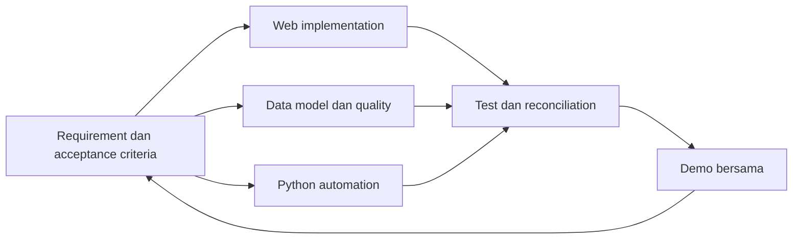

## 12. Model Data Inti

Model data dimulai kecil dan tumbuh melalui migration. Diagram berikut menunjukkan hubungan utama, bukan seluruh kolom.

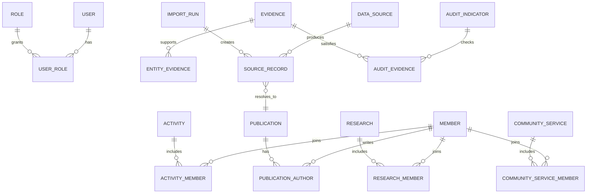

### 12.1 Entity fondasi

| Entity | Fungsi | Kolom penting contoh |
|---|---|---|
| users | akun aplikasi | id, email, status |
| roles | jenis hak akses | id, code, name |
| members | profil anggota CoE | id, institutional_id, name, field, status |
| activities | kegiatan | id, type, title, period, status, owner |
| data_sources | daftar sumber | id, type, name, access_class |
| import_runs | riwayat proses impor | id, source, started_at, status, summary |
| source_records | data mentah terstruktur | id, import_run, source_key, payload, checksum |
| evidence | metadata bukti | id, title, storage_key/url, classification, version |
| audit_logs | riwayat perubahan | actor, action, entity, before, after, timestamp |

### 12.2 Entity KM awal

| Entity | Fungsi | Identifier penting |
|---|---|---|
| publications | publikasi utama | DOI jika ada, normalized title, year |
| publication_authors | relasi publikasi-anggota | publication_id, member_id, author_order |
| research | penelitian | institutional key, title, period |
| community_services | pengabdian | institutional key, title, period |
| intellectual_properties | HKI/paten | registration number, type, year |
| grants | hibah/pendanaan | source, scheme, period, restricted amount |

### 12.3 Aturan model data

- identifier institusi lebih kuat daripada nama;
- DOI dinormalisasi sebelum dibandingkan;
- judul digunakan sebagai sinyal duplikasi, bukan satu-satunya identifier;
- nilai sensitif dipisahkan dari field yang boleh dipublikasi;
- file disimpan di storage, database menyimpan metadata dan lokasi;
- tanggal memiliki timezone yang konsisten;
- record tidak dihapus permanen tanpa kebutuhan; gunakan status atau soft delete untuk data bisnis penting;
- setiap perubahan schema memiliki migration;
- KPI dihitung dari query/view yang dapat diuji, bukan dari angka yang diketik manual.

## 13. Alur Kerja Pertama: Publikasi dari File sampai Dashboard

Alur pertama dipilih karena cukup kecil untuk selesai, tetapi sudah menguji fondasi penting sistem.

### 13.1 Data contoh

Template impor awal:

| Kolom | Wajib | Contoh aman | Rule |
|---|---|---|---|
| title | ya | Example Research Title | tidak kosong |
| publication_year | ya | 2026 | empat digit dan masuk akal |
| authors | ya | Member A; External B | minimal satu nama |
| doi | tidak | 10.1000/182 | contoh format dinormalisasi |
| venue | tidak | Example Conference | teks |
| publication_type | ya | conference_paper | harus ada di master data |
| source_url | tidak | https://example.org/item | URL valid |
| evidence_status | ya | pending | enum |

### 13.2 Urutan proses

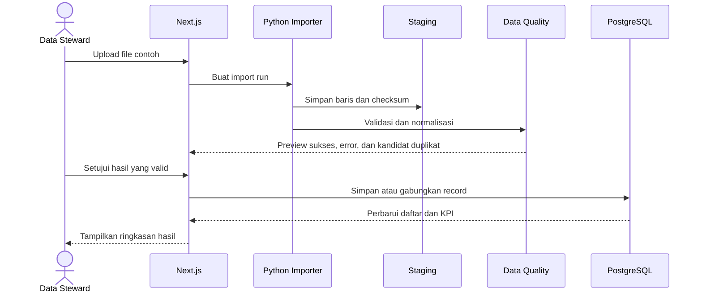

### 13.3 Data quality rule awal

1. judul dan tahun wajib tersedia;
2. spasi berlebih dibersihkan;
3. DOI diubah ke format konsisten;
4. tipe publikasi dipetakan ke master data;
5. nama anggota dicocokkan dengan identifier atau alias;
6. duplikasi dicari melalui DOI, source key, dan kemiripan judul+tahun;
7. URL diperiksa formatnya tanpa mengunduh konten otomatis;
8. baris error tidak menghentikan seluruh file;
9. setiap baris menyimpan asal dan nomor baris;
10. hasil hanya masuk data utama setelah persetujuan.

### 13.4 Tampilan hasil impor

```text
┌──────────────────────────────────────────────────────────────┐
│ Import Publikasi - Preview                                  │
├──────────────────────────────────────────────────────────────┤
│ 120 dibaca | 96 valid | 11 error | 8 duplikat | 5 unknown  │
├──────────────────────────────────────────────────────────────┤
│ Filter: [Semua] [Valid] [Error] [Duplikat] [Unknown]        │
├────┬──────────────────────┬────────┬─────────────┬───────────┤
│ No │ Judul                │ Tahun  │ Status      │ Tindakan  │
├────┼──────────────────────┼────────┼─────────────┼───────────┤
│ 01 │ Example A            │ 2026   │ Valid       │ Simpan    │
│ 02 │ Example B            │ 2026   │ Duplikat    │ Bandingkan│
│ 03 │ -                    │ 2025   │ Judul kosong│ Perbaiki  │
└────┴──────────────────────┴────────┴─────────────┴───────────┘
```

### 13.5 Ringkasan dashboard awal

KPI awal dibatasi menjadi:

- total publikasi pada periode;
- jumlah publikasi terverifikasi;
- jumlah data tanpa bukti;
- jumlah kandidat duplikat yang belum diselesaikan;
- distribusi publikasi per tahun dan tipe.

Setiap kartu KPI dapat dibuka untuk melihat data pembentuknya.

## 14. Konektor SINTA dan Google Scholar

Konektor tidak langsung menjadi pengganti impor manual. Tim membangun adapter agar sumber dapat diganti tanpa mengubah modul publikasi.

### 14.1 Pola adapter

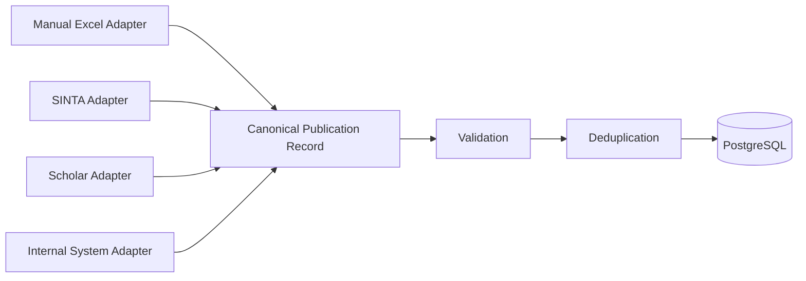

Canonical record adalah format tengah yang sama untuk seluruh sumber. Contoh:

```json
{
  "source": "example_source",
  "source_record_id": "abc-123",
  "title": "Example Research Title",
  "authors": ["Member A", "External B"],
  "year": 2026,
  "doi": "10.1000/182",
  "venue": "Example Venue",
  "source_url": "https://example.org/item",
  "retrieved_at": "2026-07-15T09:10:00Z"
}
```

### 14.2 Tahap konektor

1. **Proof of concept kecil** — satu profil dan maksimum puluhan record.
2. **Parser test** — HTML/response contoh disimpan sebagai fixture sanitasi.
3. **Normalisasi** — output mengikuti canonical record.
4. **Rate limit dan cache** — tidak mengambil halaman berulang tanpa alasan.
5. **Failure handling** — perubahan halaman menghasilkan error yang jelas.
6. **Manual fallback** — data tetap dapat dimasukkan melalui template.
7. **Scheduled run** — baru diaktifkan setelah stabil.

### 14.3 Batas keamanan dan kualitas

- konektor hanya mengambil field yang diperlukan;
- kredensial tidak ditulis di source code;
- sumber publik tetap dicatat URL dan waktunya;
- perubahan struktur halaman tidak boleh menghasilkan data salah secara diam-diam;
- output tidak langsung masuk tabel utama;
- data dari dua sumber tidak dijumlahkan sebelum deduplikasi;
- penggunaan konektor mengikuti aturan sumber dan kebijakan institusi;
- scraping agresif tidak digunakan.

## 15. Pengelolaan PDF dan Dokumen

PDF dapat berisi informasi yang belum tersedia sebagai metadata. Sistem menangani dokumen melalui dua tingkat.

### Tingkat 1 — Metadata dan bukti

- pengguna menambahkan judul dokumen;
- memilih jenis dokumen;
- menghubungkan dengan kegiatan/capaian;
- menentukan klasifikasi akses;
- menyimpan versi dan checksum;
- menambahkan catatan review.

Tingkat ini sudah berguna untuk kesiapan audit walaupun ekstraksi AI belum tersedia.

### Tingkat 2 — Ekstraksi terkontrol

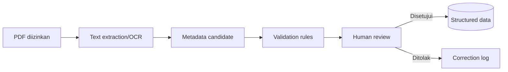

Hasil ekstraksi selalu dianggap kandidat sampai diperiksa. Sistem menyimpan halaman atau bagian asal agar reviewer dapat membandingkan hasil dengan dokumen.

## 16. RAG sebagai Fitur Tahap Lanjut

RAG adalah cara agar AI mencari bagian dokumen yang relevan terlebih dahulu, lalu menyusun jawaban berdasarkan bagian tersebut. RAG bukan sumber kebenaran untuk angka dashboard.

### 16.1 Penggunaan yang sesuai

- mencari dokumen yang membahas kewajiban tertentu;
- merangkum isi dokumen dengan sumber halaman;
- menemukan bukti yang berkaitan dengan indikator;
- membantu pengguna menjelajahi kumpulan dokumen yang diizinkan.

### 16.2 Penggunaan yang tidak sesuai

- menghitung KPI resmi tanpa query database;
- membuat keputusan otomatis tanpa review;
- membaca seluruh dokumen tanpa kontrol akses;
- memberikan jawaban tanpa kutipan sumber;
- menjadi syarat agar modul inti dapat berjalan.

### 16.3 Arsitektur RAG

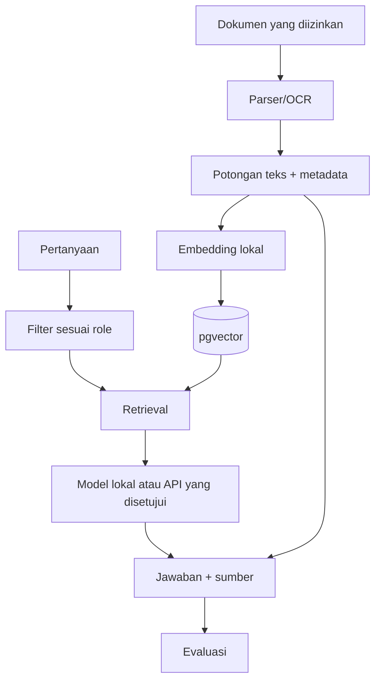

### 16.4 Jalur biaya rendah

- PostgreSQL + pgvector untuk index;
- embedding model open-source yang cukup kecil;
- model lokal melalui runtime seperti Ollama bila perangkat mendukung;
- dataset evaluasi kecil yang dibuat tim;
- pembatasan jumlah dokumen dan ukuran konteks;
- pencatatan latency, RAM, storage, dan kualitas jawaban.

Model lokal tidak memiliki biaya per-request, tetapi tetap memakai RAM, CPU/GPU, storage, dan waktu pemeliharaan.

## 17. Desain Halaman Aplikasi

### 17.1 Navigasi utama

```text
Overview
Members
Activities
Knowledge Management
  ├── Publications
  ├── Research
  ├── Community Service
  ├── Intellectual Property
  └── Grants
Audit Readiness
Imports & Data Quality
Reports
Showcase
Administration
```

### 17.2 Overview

```text
┌──────────────────────────────────────────────────────────────┐
│ BHT-Nexus                   Periode [2026]   Bidang [Semua] │
├────────────┬────────────┬────────────┬───────────────────────┤
│ Kegiatan   │ Publikasi  │ Bukti      │ Data perlu review     │
│ aktif      │ terverif.  │ lengkap    │                       │
│ 12         │ 48         │ 76%        │ 17                    │
├────────────┴────────────┴────────────┴───────────────────────┤
│ Tren capaian per bulan                                     │
│ [grafik]                                                    │
├──────────────────────────────┬───────────────────────────────┤
│ Tenggat terdekat             │ Masalah kualitas data        │
│ [daftar tindakan]            │ [daftar tindakan]            │
└──────────────────────────────┴───────────────────────────────┘
```

Overview menampilkan ringkasan dan tindakan, bukan seluruh data.

### 17.3 Halaman daftar

Semua daftar memakai pola yang sama:

- judul dan deskripsi singkat;
- filter yang benar-benar dibutuhkan;
- pencarian;
- kolom status dan kelengkapan;
- tautan ke detail;
- ekspor berdasarkan filter;
- empty state yang menjelaskan tindakan;
- loading dan error state yang jelas.

### 17.4 Halaman detail

Halaman detail menampilkan:

- informasi utama;
- anggota/relasi;
- status dan riwayat;
- bukti;
- sumber data;
- masalah kualitas data;
- perubahan terakhir;
- tindakan sesuai role.

## 18. Keamanan dan Privasi

### 18.1 Tiga zona informasi

| Zona | Isi | Lokasi |
|---|---|---|
| Privat lokal | chat mentah, catatan AI, source internal, file sensitif | workspace lokal terbatas |
| Repository tim privat | source code, docs teknis, sample sanitasi, issue | GitHub organization private |
| Publik | README aman, dokumentasi umum, demo dummy, showcase yang disetujui | repo/site publik bila diizinkan |

### 18.2 Klasifikasi data aplikasi

| Kelas | Contoh | Perlakuan |
|---|---|---|
| Publik | berita dan capaian yang disetujui | dapat masuk showcase |
| Internal | status kerja dan data operasional | hanya pengguna terautentikasi |
| Terbatas | nilai pendanaan, dokumen tertentu, data pribadi | role khusus dan audit log |
| Rahasia | credential, token, private key | secret manager/environment, tidak masuk database bisnis |

### 18.3 Kontrol minimum

- HTTPS pada environment yang dapat diakses jaringan;
- password/token tidak masuk Git;
- pemeriksaan role di server;
- validasi seluruh input;
- rate limit pada endpoint sensitif;
- log tanpa membocorkan isi dokumen atau credential;
- upload dibatasi tipe dan ukuran;
- nama file storage tidak memakai nama pribadi mentah jika tidak perlu;
- database backup terenkripsi sesuai kemampuan infrastruktur;
- sample dan screenshot selalu disanitasi;
- dependency scanning dan secret scanning pada CI bila tersedia.

### 18.4 Autentikasi

Fase local development menggunakan akun seed dan role simulasi. Autentikasi production dipasang melalui metode identitas institusi yang tersedia. Pemisahan ini membuat pembangunan modul data tidak terhenti oleh integrasi login, tanpa mengorbankan requirement keamanan production.

## 19. Strategi Biaya Nol/Rendah

### 19.1 Arsitektur biaya

| Komponen | Pilihan | Lisensi awal | Biaya operasional |
|---|---|---:|---|
| Next.js/React | open-source | 0 | CPU/RAM server |
| PostgreSQL | open-source | 0 | storage, backup, operator |
| Drizzle | open-source | 0 | maintenance migration |
| Python/FastAPI | open-source | 0 | compute job |
| ECharts | open-source | 0 | browser/server resource |
| Docker | sesuai lisensi penggunaan | 0 untuk jalur yang sesuai | resource host |
| GitHub Free organization | private collaboration dengan fitur terbatas | 0 | batas Actions/storage |
| Local RAG | open-source model | 0 per API call | RAM/GPU/storage/waktu |
| Infrastruktur institusi | memanfaatkan aset tersedia | tidak menambah subscription | tetap memiliki cost internal |

### 19.2 Cara menahan biaya

- satu aplikasi dan satu database pada fase awal;
- tidak memakai Kubernetes;
- tidak memakai Redis sebelum antrean job benar-benar membutuhkannya;
- importer manual lebih dulu, scheduler kemudian;
- notification dalam aplikasi lebih dulu;
- file besar tidak disimpan ganda;
- data demo tidak membutuhkan layanan cloud terpisah;
- RAG dibatasi pada dokumen dan skenario kecil;
- monitoring awal memakai log terstruktur dan health endpoint;
- layanan baru hanya ditambahkan jika mengurangi risiko atau pekerjaan nyata.

### 19.3 Batas penggunaan free tier

Free tier cocok untuk eksperimen dengan data dummy, tetapi bukan asumsi default untuk data internal. Penyebaran data ke banyak vendor gratis meningkatkan kompleksitas, risiko privasi, dan beban handover.

## 20. Environment dan Deployment Bertahap

Deployment tidak menghambat pembangunan awal. Aplikasi memakai empat environment dengan tujuan berbeda.

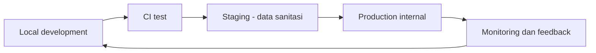

| Environment | Data | Pengguna | Tujuan |
|---|---|---|---|
| Local | dummy/sanitasi | developer | membangun dan debug |
| CI | generated test data | automation | memastikan kualitas kode |
| Staging | sanitasi atau subset yang diizinkan | tim dan reviewer | UAT dan demo |
| Production | data nyata sesuai role | pengguna resmi | operasi |

### Pola deployment target

```text
Internet/internal network
→ HTTPS reverse proxy
→ Next.js application
→ PostgreSQL
→ document storage

Scheduler
→ Python automation jobs
→ PostgreSQL/document storage
```

Apabila host mendukung container, Compose dapat digunakan untuk aplikasi, automation service, dan database sesuai kebijakan operasi. Apabila container tidak tersedia, komponen yang sama tetap dapat dijalankan sebagai process/service terpisah. Pilihan host tidak mengubah struktur modul dan kontrak data.

## 21. Git, Branch, Commit, dan Review

### 21.1 Alur perubahan

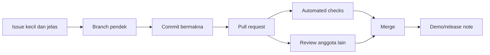

### 21.2 Branch

```text
feat/publication-import-preview
feat/publication-dashboard
fix/doi-normalization
docs/initial-srs
test/import-validation
chore/web-ci
```

Branch dibuat pendek dan hanya menyelesaikan satu tujuan. Branch besar yang hidup berminggu-minggu meningkatkan konflik.

### 21.3 Commit

```text
docs(requirements): define publication import acceptance criteria
feat(data): add publication and source record schema
feat(import): validate publication workbook rows
feat(web): show publication import preview
fix(dedupe): normalize DOI before matching records
test(import): cover missing title and invalid year
chore(ci): run web and automation checks on pull request
```

Aturan commit:

- satu commit memiliki satu maksud;
- kode dan test terkait boleh berada pada commit yang sama;
- commit tidak memuat data mentah internal;
- commit tidak memuat `.env`, token, credential, atau local path;
- pesan menjelaskan perubahan, bukan aktivitas seperti `update file`;
- backdate commit dan rekayasa histori tidak digunakan;
- perubahan generated lockfile diperiksa, bukan diabaikan.

### 21.4 Pull request

Template pull request memuat:

- masalah yang diselesaikan;
- perubahan utama;
- cara menguji;
- bukti test;
- screenshot sanitasi bila ada UI;
- perubahan database;
- risiko dan rollback;
- dokumentasi yang ikut diperbarui.

## 22. SRS dan Dokumentasi yang Hidup

SRS IEEE dapat digunakan sebagai kerangka formal. SRS tidak berhenti sebagai dokumen awal; requirement yang berubah mengikuti hasil demo diperbarui melalui version control.

### Struktur SRS yang disarankan

1. Introduction
2. Purpose and Scope
3. Definitions and Acronyms
4. Product Perspective
5. User Classes and Characteristics
6. Operating Environment
7. Assumptions and Dependencies
8. System Features
9. External Interface Requirements
10. Data Requirements
11. Nonfunctional Requirements
12. Security and Privacy Requirements
13. Acceptance Criteria
14. Traceability Matrix
15. Appendix

### Requirement ID

```text
FR-IMP-001  System shall preview publication rows before approval.
FR-DQ-001   System shall identify records with missing required fields.
FR-PUB-001  System shall display a filterable publication list.
NFR-SEC-001 Server shall enforce role permissions for protected actions.
NFR-AUD-001 System shall record actor, time, and changed fields.
```

### Traceability

| Requirement | Design | Code module | Test | Demo evidence |
|---|---|---|---|---|
| FR-IMP-001 | Import preview flow | modules/imports | E2E import preview | demo recording |
| FR-DQ-001 | Validation rules | automation/importers | pytest validation | error summary |
| FR-PUB-001 | Publication list | modules/publications | Playwright list/filter | screenshot sanitasi |

Traceability mencegah requirement hilang di antara dokumen, kode, dan pengujian.

## 23. Testing dan Quality Gate

### 23.1 Lapisan test

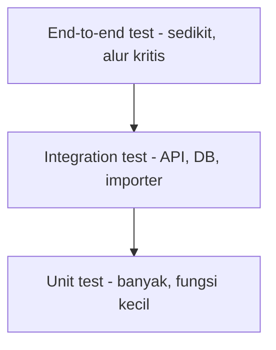

### 23.2 Test minimum alur publikasi

Unit test:

- normalisasi DOI;
- validasi tahun;
- parsing penulis;
- mapping tipe publikasi;
- perhitungan KPI;
- similarity rule untuk kandidat duplikat.

Integration test:

- migration dari database kosong;
- importer menyimpan staging record;
- approval memindahkan data ke tabel utama;
- transaction rollback saat terjadi error;
- role yang tidak diizinkan ditolak;
- view KPI cocok dengan fixture.

End-to-end test:

- login role data steward;
- upload file valid;
- melihat preview;
- menyetujui record;
- melihat record pada daftar;
- memfilter dan mengekspor;
- melihat error file invalid.

### 23.3 Rekonsiliasi

Rekonsiliasi membandingkan hasil sistem dengan sumber contoh.

```text
Jumlah record sumber: 120
Record valid: 96
Record disetujui: 90
Record baru: 82
Record digabung: 8
Record utama setelah proses: bertambah 82
```

Selisih harus dapat dijelaskan oleh log, bukan hanya dianggap wajar.

### 23.4 CI awal

Pull request menjalankan:

- install dependency dari lockfile;
- TypeScript typecheck;
- lint dan format check;
- unit test web;
- unit test Python;
- build Next.js;
- migration check;
- secret scan bila tersedia;
- end-to-end test pada tahap berikutnya.

## 24. Logging, Monitoring, Backup, dan Handover

### Logging

Log minimum:

- waktu;
- service;
- level;
- request/job ID;
- action;
- status;
- error code;
- durasi;
- actor ID bila relevan dan diizinkan.

Log tidak menyalin isi PDF, token, password, atau seluruh payload data pribadi.

### Status job

Setiap job automation memiliki status:

```text
queued → running → succeeded
                 ↘ failed → retrying → failed_permanently
```

Pengguna dapat melihat ringkasan kegagalan dan tindakan perbaikan.

### Backup

Backup yang baik memiliki:

- jadwal;
- retensi;
- lokasi terpisah;
- enkripsi sesuai kebutuhan;
- owner;
- catatan uji restore.

File backup tanpa uji restore belum membuktikan sistem dapat dipulihkan.

### Handover

Dokumentasi handover mencakup:

- arsitektur;
- inventory service;
- cara menjalankan;
- cara deploy;
- migration;
- backup dan restore;
- pengelolaan secret;
- monitoring;
- troubleshooting;
- owner setelah internship;
- daftar dependency dan jadwal upgrade.

## 25. Roadmap Pembangunan 16 Pekan

Roadmap tetap fleksibel. Setiap tahap menghasilkan sesuatu yang dapat ditunjukkan atau diuji.

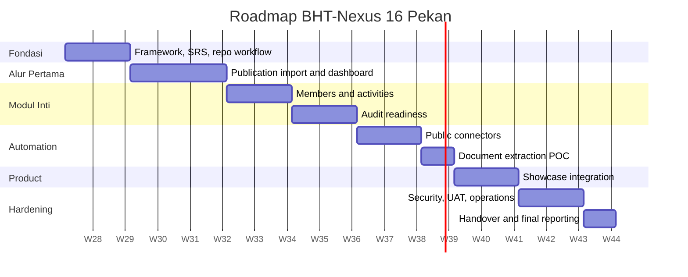

### Pekan 1–2 — fondasi dan kerangka kerja

- project statement;
- scope dan batas scope;
- SRS awal;
- pemetaan fitur dan role;
- arsitektur awal;
- data dictionary awal;
- repository workflow;
- walking skeleton web + PostgreSQL;
- satu halaman membaca data dummy.

### Pekan 3–5 — alur publikasi lengkap

- template impor;
- staging;
- validation;
- preview;
- deduplication;
- approval;
- daftar/detail;
- KPI;
- filter/export;
- test dan demo pengguna.

### Pekan 6–7 — anggota dan kegiatan

- member directory;
- activity management;
- hubungan anggota-kegiatan;
- evidence;
- status dan ringkasan.

### Pekan 8–9 — kesiapan audit

- indikator;
- evidence mapping;
- gap list;
- kelengkapan;
- tenggat;
- export laporan.

### Pekan 10–11 — otomasi sumber publik

- adapter SINTA/Scholar proof of concept;
- canonical record;
- cache dan rate limit;
- failure handling;
- scheduled run terbatas;
- rekonsiliasi dengan sumber manual.

### Pekan 12 — ekstraksi dokumen

- metadata dokumen;
- parser/OCR proof of concept;
- ekstraksi kandidat;
- human review;
- evaluasi akurasi.

### Pekan 13–14 — showcase dan integrasi

- publish approval;
- public-safe fields;
- dynamic showcase;
- integrasi dengan situs sesuai jalur deployment;
- responsive dan accessibility check.

### Pekan 15 — hardening dan UAT

- role/security test;
- load dasar;
- backup/restore rehearsal;
- operational runbook;
- UAT dan perbaikan prioritas.

### Pekan 16 — handover dan laporan akhir

- dokumentasi final;
- demo;
- known limitations;
- backlog lanjutan;
- transfer knowledge;
- logbook dan laporan program.

## 26. Langkah Nyata agar Tidak Berhenti di Planning

### Hasil 48 jam pertama

1. SRS draft memiliki scope satu alur publikasi.
2. Struktur repository disepakati tanpa membuat seluruh folder kosong.
3. Node, Python, dan PostgreSQL baseline dicatat.
4. Schema awal publications, members, data_sources, dan import_runs tersedia sebagai draft.
5. Data dummy berisi 10–20 publikasi dibuat.
6. Satu diagram alur dan acceptance criteria direview.
7. Issue pembangunan pertama siap dikerjakan.

### Hari kerja 1–5

| Hari | Pekerjaan | Output |
|---|---|---|
| 1 | project scaffold dan CI minimum | web dapat build, Python test berjalan |
| 2 | PostgreSQL, migration, seed | data dummy tersimpan |
| 3 | halaman daftar publikasi | data tampil dari database |
| 4 | importer validation | file dibaca dan error terlihat |
| 5 | preview + demo internal | satu alur dapat dinilai |

### Hari kerja 6–10

| Hari | Pekerjaan | Output |
|---|---|---|
| 6 | deduplication | kandidat duplikat terlihat |
| 7 | approval dan audit log | hasil review tercatat |
| 8 | KPI, filter, export | dashboard awal berguna |
| 9 | test end-to-end dan rekonsiliasi | hasil dapat dipercaya |
| 10 | demo, feedback, backlog berikutnya | keputusan berbasis produk nyata |

### Aturan mencegah planning berlebihan

- dokumentasi hanya sedetail yang dibutuhkan untuk membangun langkah berikutnya;
- satu pekerjaan maksimal beberapa hari sebelum menghasilkan pull request;
- setiap pekan memiliki demo;
- requirement yang belum digunakan tidak perlu didesain sampai level database;
- fitur baru tidak dimulai ketika alur aktif belum selesai;
- masukan pengguna masuk backlog dan diprioritaskan, bukan langsung mengubah semua hal;
- framework boleh berubah melalui ADR dan migration yang terkendali.

## 27. Acceptance Criteria Alur Pertama

Alur publikasi awal dianggap selesai ketika:

### Bagi pengguna

- template impor dapat dipahami;
- file valid dapat diunggah;
- preview menunjukkan hasil sebelum penyimpanan;
- error menyebut baris, kolom, dan alasan;
- kandidat duplikat dapat dibandingkan;
- record yang disetujui muncul pada daftar;
- filter dan export bekerja;
- KPI dapat dibuka sampai data pembentuk.

### Bagi data

- source dan waktu pengambilan tersimpan;
- DOI dan identifier dinormalisasi;
- data gagal tidak masuk tabel utama;
- duplikasi tidak dihitung dua kali;
- hasil sistem cocok dengan fixture rekonsiliasi;
- data dummy tidak mengandung identitas asli.

### Bagi engineering

- setup dari komputer baru terdokumentasi;
- migration berjalan dari database kosong;
- lint, typecheck, unit test, dan integration test lulus;
- pull request direview;
- log error dapat ditindaklanjuti;
- tidak ada credential atau data privat di Git.

## 28. Keputusan dan Asumsi Kerja

Keputusan pada bagian ini dapat diperbarui melalui ADR setelah terdapat bukti baru dari implementasi, pengujian, atau pemakaian nyata.

| Area | Keputusan kerja saat ini | Dampak |
|---|---|---|
| Nama | BHT-Nexus sebagai nama kerja | mudah digunakan dalam dokumentasi sementara |
| Repository | satu private repository gabungan | koordinasi tim kecil lebih sederhana |
| Arsitektur | Next.js modular monolith + Python automation | web cepat dimulai, data/AI tetap terpisah jelas |
| Database | PostgreSQL 17 | satu sumber data terstruktur |
| ORM | Drizzle | selaras dengan SQL dan pengalaman tim |
| Alur pertama | publikasi dari file sampai dashboard | menguji pipeline, data quality, UI, KPI, export |
| Data awal | dummy/sanitasi | pembangunan tidak menunggu akses data nyata |
| Automation | manual importer lebih dulu | fondasi dapat diuji sebelum scheduler |
| Konektor | proof of concept kecil | risiko sumber berubah dapat dikendalikan |
| RAG | tahap lanjut | tidak menghambat fungsi inti |
| Deployment | local dan staging lebih dulu | akses production tidak menghambat development |
| Showcase | data melalui publish approval | data internal tidak bocor otomatis |
| Dokumentasi | SRS IEEE + docs dalam repository | requirement dan kode berkembang bersama |

## 29. Risiko dan Penanganan

| Risiko | Gejala awal | Penanganan |
|---|---|---|
| Scope terlalu lebar | banyak folder, tidak ada alur selesai | satu alur aktif dan demo mingguan |
| Dua backend menggandakan fungsi | CRUD tersedia di Next.js dan FastAPI | batas tanggung jawab yang tegas |
| Data tidak dipercaya | angka tidak dapat ditelusuri | provenance, reconciliation, audit log |
| Duplikasi | KPI lebih besar dari sumber | identifier, normalisasi, review candidate |
| Konektor berubah | parser menghasilkan nol atau field salah | fixture test, error alert, manual fallback |
| RAG terlalu dini | banyak waktu tanpa manfaat produk | tahap lanjut setelah dokumen dan role stabil |
| Data sensitif masuk Git | file internal terlihat di commit | private repo, `.gitignore`, review, secret scan |
| Satu orang menjadi bottleneck | area berhenti saat owner tidak hadir | reviewer, pairing, runbook, rotasi |
| Infrastruktur tidak sesuai | deployment tertunda | arsitektur portable dan local-first |
| Handover gagal | sistem hanya dipahami intern | docs, runbook, owner operasi, restore test |
| Terlalu banyak layanan gratis | data tersebar dan operasi rumit | open-source + infrastruktur terpusat |

## 30. Rekomendasi Akhir

Rekomendasi teknis dan pelaksanaan yang paling sesuai adalah:

1. gunakan satu repository gabungan;
2. bangun satu aplikasi utama Next.js 16 dengan TypeScript;
3. gunakan PostgreSQL 17 dan Drizzle sebagai fondasi data;
4. tempatkan Python 3.13 sebagai area automation/data/AI;
5. gunakan FastAPI hanya ketika proses Python perlu menjadi layanan;
6. mulai dari alur publikasi yang lengkap dari file sampai dashboard;
7. gunakan data dummy/sanitasi dan local environment terlebih dahulu;
8. demonstrasikan hasil setiap pekan;
9. catat perubahan keputusan melalui SRS dan ADR;
10. tambah konektor, ekstraksi dokumen, showcase, dan RAG setelah fondasi terbukti;
11. jaga biaya dengan open-source dan menahan penambahan layanan;
12. siapkan test, provenance, security, backup, dan handover sejak awal secara proporsional.

```text
Mulai kecil
→ selesaikan satu alur
→ uji dengan data contoh
→ demonstrasikan
→ terima masukan
→ perbaiki
→ otomatisasi
→ tambah modul
→ kuatkan operasi
→ serahkan sistem yang dapat dilanjutkan
```

Pendekatan ini cukup cepat untuk menghindari planning berlebihan, cukup terstruktur untuk project kerja yang serius, dan cukup modular untuk tumbuh dalam jangka panjang.

## 31. Referensi

### Profil dan bukti kompetensi tim

- [GitHub Organization — TelU CoE BHT Command Center Internship](https://github.com/TelU-CoE-BHT-Command-Center-Internship?view_as=member)
- [GitHub — Facalder](https://github.com/Facalder)
- [GitHub — Liamours](https://github.com/Liamours)
- [GitHub — Zendin110206](https://github.com/Zendin110206)
- [Facalder — Student Achievement Dashboard](https://github.com/Facalder/Student-Repos)
- [Posyandu Web Server — TypeScript, PostgreSQL, Drizzle, Docker, CI](https://github.com/TPLM-Posyandu-Banjarsari-Garut/Posyandu_Web_Server)
- [Liamours — Full-stack FastAPI/React example](https://github.com/Liamours/aplikasi_berbasis_platform-retogen)
- [Zendin110206 — Telco KPI MLOps Platform](https://github.com/Zendin110206/telco-kpi-mlops-platform)

### Teknologi resmi

- [Node.js Release Schedule](https://nodejs.org/en/about/previous-releases)
- [Next.js 16](https://nextjs.org/blog/next-16)
- [Next.js Self-Hosting](https://nextjs.org/docs/app/guides/self-hosting)
- [Next.js Backend for Frontend](https://nextjs.org/docs/app/guides/backend-for-frontend)
- [Python Downloads](https://www.python.org/downloads/)
- [FastAPI Deployment Concepts](https://fastapi.tiangolo.com/deployment/concepts/)
- [PostgreSQL Versioning Policy](https://www.postgresql.org/support/versioning/)
- [PostgreSQL Row Security](https://www.postgresql.org/docs/current/ddl-rowsecurity.html)
- [Drizzle ORM Documentation](https://orm.drizzle.team/docs/overview)
- [Apache ECharts 6](https://echarts.apache.org/handbook/en/basics/release-note/v6-feature/)
- [Docker Compose Documentation](https://docs.docker.com/compose/)
- [GitHub Organizations](https://docs.github.com/en/organizations/collaborating-with-groups-in-organizations/about-organizations)
- [Conventional Commits](https://www.conventionalcommits.org/en/v1.0.0/)
- [OWASP Application Security Verification Standard](https://owasp.org/www-project-application-security-verification-standard/)

---

Dokumen ini sengaja tidak menyalin chat, nomor telepon, tautan rapat, alamat server, credential, isi dokumen persetujuan, atau data personal dari bahan internal. Materi publik dan materi internal tetap dipisahkan.
