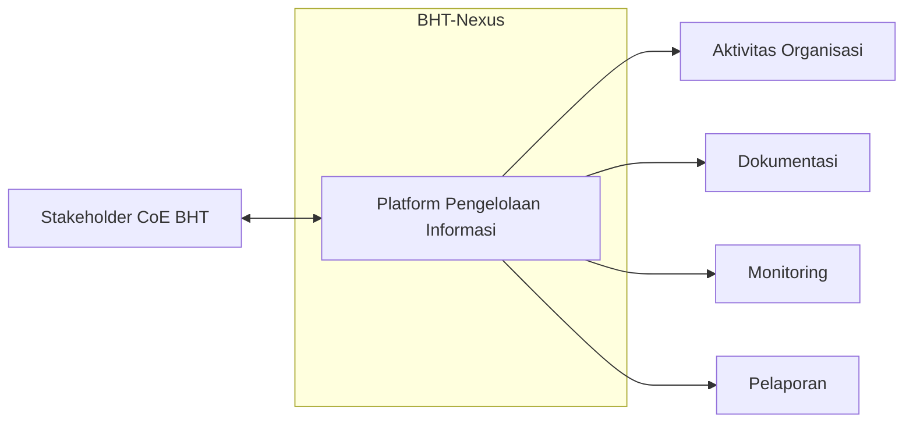
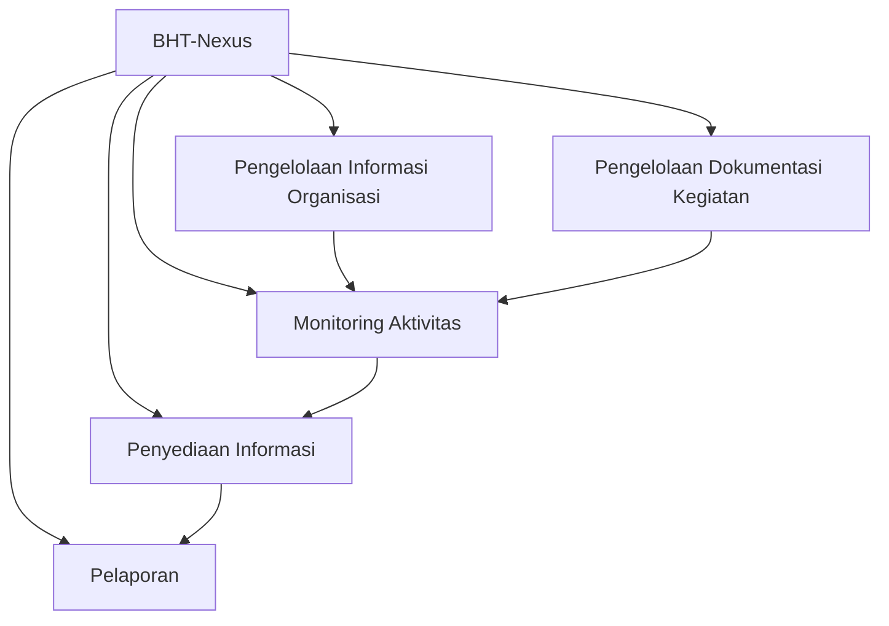
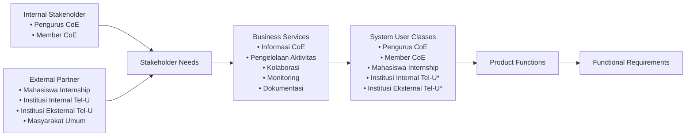

# Software Requirements Specification
## For {{project name}}

Version 0.1  
Prepared by {{author}}  
{{organization}}  
{{date_modified}}

## Table of Contents
<!-- TOC -->
* [1. Introduction](#1-introduction)
    * [1.1 Document Purpose](#11-document-purpose)
    * [1.2 Product Scope](#12-product-scope)
    * [1.3 Definitions, Acronyms, and Abbreviations](#13-definitions-acronyms-and-abbreviations)
    * [1.4 References](#14-references)
    * [1.5 Document Overview](#15-document-overview)
* [2. Product Overview](#2-product-overview)
    * [2.1 Product Perspective](#21-product-perspective)
    * [2.2 Product Functions](#22-product-functions)
    * [2.3 Product Constraints](#23-product-constraints)
    * [2.4 User Characteristics](#24-user-characteristics)
    * [2.5 Assumptions and Dependencies](#25-assumptions-and-dependencies)
    * [2.6 Apportioning of Requirements](#26-apportioning-of-requirements)
* [3. Requirements](#3-requirements)
    * [3.1 External Interfaces](#31-external-interfaces)
    * [3.2 Functional](#32-functional)
    * [3.3 Quality of Service](#33-quality-of-service)
    * [3.4 Compliance](#34-compliance)
    * [3.5 Design and Implementation](#35-design-and-implementation)
    * [3.6 AI/ML](#36-aiml)
* [4. Verification](#4-verification)
* [5. Appendixes](#5-appendixes)
<!-- TOC -->

## Revision History

| Name | Date | Reason For Changes | Version |
|------|------|--------------------|---------|
| Fa Ainama Caldera S   | 14 Juli 2026     | Pembuatan dokumen srs v1                    |  v1.0.0         |
|      |      |                    |         |

## 1. Introduction

Bab ini memberikan gambaran umum mengenai dokumen Software Requirements Specification (SRS) sebagai landasan dalam memahami tujuan, ruang lingkup, serta konteks pengembangan perangkat lunak BHT-Nexus. Selain menjelaskan tujuan penyusunan dokumen dan cakupan sistem yang didokumentasikan, bab ini juga menguraikan konvensi penulisan yang digunakan, pihak-pihak yang menjadi sasaran pembaca beserta panduan membaca dokumen, serta referensi yang menjadi acuan dalam penyusunan SRS. Melalui penyajian informasi tersebut, bab ini bertujuan membangun pemahaman yang konsisten bagi seluruh stakeholder sebelum memasuki pembahasan kebutuhan perangkat lunak secara lebih rinci pada bab-bab berikutnya.

### 1.1 Document Purpose

Dokumen *Software Requirements Specification* (SRS) ini mendefinisikan kebutuhan perangkat lunak **BHT-Nexus**, yaitu aplikasi web internal yang dikembangkan untuk mendukung pengelolaan data, kegiatan, serta informasi strategis di lingkungan *Center of Excellence Biomedical and Healthcare Technologies* (CoE BHT). Dokumen ini disusun sebagai acuan utama dalam proses pengembangan perangkat lunak dan digunakan sebagai referensi bersama oleh seluruh stakeholder selama siklus pengembangan sistem.

SRS ini mendokumentasikan kebutuhan perangkat lunak secara terstruktur, meliputi ruang lingkup sistem, kebutuhan fungsional, kebutuhan nonfungsional, karakteristik pengguna, batasan sistem, serta informasi lain yang diperlukan untuk memastikan seluruh stakeholder memiliki pemahaman yang konsisten terhadap sistem yang akan dibangun. Dokumen ini juga menjadi dasar dalam proses perancangan, implementasi, pengujian, validasi, serta evaluasi perangkat lunak sehingga setiap tahapan pengembangan dapat mengacu pada kebutuhan yang telah disepakati.

Cakupan dokumen ini terbatas pada spesifikasi kebutuhan perangkat lunak BHT-Nexus dan tidak membahas secara rinci aspek implementasi, desain arsitektur, struktur basis data, maupun prosedur operasional sistem. Pembahasan mengenai aspek tersebut disajikan pada dokumen teknis lain yang disusun sesuai kebutuhan selama proses pengembangan.

### 1.2 Product Scope

BHT-Nexus merupakan aplikasi web internal yang dikembangkan untuk mendukung pengelolaan informasi, dokumentasi kegiatan, serta pemantauan aktivitas di lingkungan *Center of Excellence Biomedical and Healthcare Technologies* (CoE BHT). Sistem ini dirancang sebagai pusat pengelolaan informasi yang mengintegrasikan data dari berbagai aktivitas organisasi sehingga informasi dapat dikelola secara lebih terstruktur, terdokumentasi, dan mudah diakses oleh stakeholder yang berwenang.

Pengembangan BHT-Nexus dilatarbelakangi oleh kebutuhan akan sistem yang mampu mengatasi pengelolaan data dan informasi yang masih tersebar pada berbagai media, sehingga proses dokumentasi, pemantauan, serta penyusunan laporan memerlukan konsolidasi secara manual. Kondisi tersebut berpotensi menimbulkan inkonsistensi data, meningkatkan beban administrasi, dan menyulitkan penyediaan informasi yang akurat sebagai dasar pengambilan keputusan.

Melalui BHT-Nexus, CoE BHT diharapkan memiliki platform terintegrasi yang mendukung pengelolaan informasi organisasi secara konsisten, meningkatkan kualitas dokumentasi kegiatan, serta menyediakan informasi yang lebih mudah diakses untuk kebutuhan monitoring, evaluasi, dan pelaporan. Kehadiran sistem ini juga mendukung pengelolaan data yang lebih terstruktur sehingga proses operasional dapat dilaksanakan secara lebih efektif dan berkelanjutan.

Pengembangan BHT-Nexus sejalan dengan upaya CoE BHT dalam memperkuat tata kelola informasi organisasi melalui pemanfaatan teknologi informasi. Dengan menyediakan sumber informasi yang terpusat dan terdokumentasi dengan baik, sistem ini mendukung pengambilan keputusan yang berbasis data serta menjadi fondasi bagi pengelolaan aktivitas organisasi yang lebih transparan, terdokumentasi, dan berkesinambungan.

### 1.3 Intended Audience and Reading Suggestions

Dokumen *Software Requirements Specification* (SRS) ini ditujukan bagi seluruh stakeholder yang terlibat dalam proses analisis, pengembangan, pengujian, validasi, dan pengelolaan perangkat lunak BHT-Nexus. Setiap stakeholder memiliki kebutuhan informasi yang berbeda sesuai dengan peran dan tanggung jawabnya. Oleh karena itu, dokumen ini disusun secara terstruktur agar setiap pembaca dapat mengakses bagian yang paling relevan tanpa kehilangan konteks terhadap keseluruhan sistem.

Seluruh pembaca disarankan untuk memulai dengan membaca **Bab 1 Introduction** guna memahami tujuan penyusunan dokumen, ruang lingkup perangkat lunak, serta konteks pengembangan BHT-Nexus. Setelah memahami gambaran umum tersebut, pembaca dapat melanjutkan ke bagian lain sesuai dengan kebutuhan dan tanggung jawabnya selama siklus pengembangan perangkat lunak. Pendekatan ini bertujuan membangun pemahaman yang konsisten antarstakeholder serta meminimalkan perbedaan interpretasi terhadap kebutuhan sistem.

| Stakeholder                       | Tujuan Membaca Dokumen                                                                                                                     | Bagian yang Direkomendasikan                                                                                 |
| --------------------------------- | ------------------------------------------------------------------------------------------------------------------------------------------ | ------------------------------------------------------------------------------------------------------------ |
| Project Supervisor                | Memastikan kebutuhan perangkat lunak telah sesuai dengan tujuan proyek dan kebutuhan organisasi.                                           | Seluruh dokumen, dengan fokus pada **Introduction**, **Overall Description**, dan **Specific Requirements**. |
| Project Manager / Koordinator Tim | Memahami ruang lingkup proyek, mengoordinasikan proses pengembangan, serta memastikan kebutuhan telah terdokumentasi secara lengkap.       | Seluruh dokumen.                                                                                             |
| System Analyst                    | Memverifikasi kelengkapan, konsistensi, dan keterlacakan kebutuhan perangkat lunak sebelum proses implementasi dimulai.                    | **Overall Description**, **Specific Requirements**, dan **Appendix** (apabila tersedia).                     |
| UI/UX Designer                    | Memahami karakteristik pengguna, kebutuhan sistem, dan batasan yang memengaruhi perancangan antarmuka pengguna.                            | **Overall Description** dan **Specific Requirements**.                                                       |
| Frontend Developer                | Menggunakan spesifikasi kebutuhan sebagai acuan dalam mengimplementasikan antarmuka dan interaksi pengguna sesuai dengan kebutuhan sistem. | **Specific Requirements** serta bagian yang berkaitan dengan antarmuka pengguna.                             |
| Backend Developer                 | Menggunakan spesifikasi kebutuhan sebagai acuan dalam mengimplementasikan logika bisnis, pengelolaan data, dan layanan sistem.             | **Overall Description** dan **Specific Requirements**.                                                       |
| Database Engineer                 | Memahami kebutuhan data serta batasan yang memengaruhi perancangan dan pengelolaan basis data.                                             | **Overall Description** dan **Specific Requirements** yang berkaitan dengan data.                            |
| Quality Assurance (QA)            | Menyusun skenario pengujian dan memvalidasi kesesuaian implementasi terhadap kebutuhan yang telah ditetapkan.                              | **Specific Requirements** dan kriteria yang berkaitan dengan kebutuhan sistem.                               |
| Technical Writer / Dokumentasi    | Menjaga konsistensi antara dokumentasi pengguna, dokumentasi teknis, dan kebutuhan perangkat lunak yang telah disepakati.                  | Seluruh dokumen sesuai kebutuhan dokumentasi.                                                                |
| Pengurus CoE BHT                  | Memastikan kebutuhan sistem telah merepresentasikan kebutuhan operasional organisasi dan menjadi dasar dalam proses validasi kebutuhan.    | **Introduction**, **Overall Description**, dan **Specific Requirements**.                                    |

### 1.4 Document Conventions

Dokumen *Software Requirements Specification* (SRS) ini disusun mengikuti struktur dan prinsip yang direkomendasikan oleh standar IEEE 29148 untuk memastikan informasi disajikan secara konsisten, mudah dipahami, dan dapat digunakan sebagai acuan bersama selama proses analisis, pengembangan, pengujian, dan validasi perangkat lunak. Seluruh isi dokumen menggunakan bahasa Indonesia yang mengacu pada Pedoman Umum Ejaan Bahasa Indonesia (PUEBI/ EYD Edisi V) dan Kamus Besar Bahasa Indonesia (KBBI) untuk menjaga kejelasan, konsistensi, dan ketepatan penggunaan istilah.

Konvensi penulisan diterapkan secara konsisten pada seluruh dokumen agar setiap stakeholder memiliki pemahaman yang sama terhadap struktur informasi dan interpretasi kebutuhan perangkat lunak. Selain meningkatkan keterbacaan dokumen, konvensi ini juga mendukung proses penelusuran kebutuhan (*requirement traceability*), pengelolaan perubahan dokumen, serta komunikasi antaranggota tim selama siklus pengembangan perangkat lunak.

| Elemen               | Konvensi                                                                                                                                                                                                  |
| -------------------- | --------------------------------------------------------------------------------------------------------------------------------------------------------------------------------------------------------- |
| Struktur dokumen     | Dokumen disusun secara hierarkis mengikuti struktur IEEE 29148. Setiap bab dan subbab menggunakan sistem penomoran bertingkat untuk menunjukkan hubungan antarbagian dokumen.                             |
| Istilah              | Istilah yang digunakan memiliki makna yang konsisten di seluruh dokumen. Istilah teknis, nama sistem, atau istilah asing ditulis secara seragam untuk menghindari perbedaan interpretasi.                 |
| **Bold**             | Digunakan untuk menekankan istilah, nama bagian, atau informasi penting yang perlu memperoleh perhatian khusus dari pembaca.                                                                              |
| *Italic*             | Digunakan untuk istilah asing, nama dokumen, atau istilah yang pertama kali diperkenalkan sesuai dengan kaidah penulisan bahasa Indonesia.                                                                |
| Tabel                | Digunakan untuk menyajikan informasi yang bersifat terstruktur, seperti klasifikasi, perbandingan, atau daftar kebutuhan. Seluruh tabel diberikan nomor dan judul sebagai identitas referensi.            |
| Gambar               | Digunakan untuk mendukung penjelasan apabila representasi visual memberikan pemahaman yang lebih baik dibandingkan uraian tekstual. Seluruh gambar diberikan nomor dan judul sebagai identitas referensi. |
| Pernyataan kebutuhan | Setiap kebutuhan perangkat lunak ditulis sebagai satu pernyataan yang jelas, spesifik, tidak ambigu, serta dapat diverifikasi melalui proses implementasi maupun pengujian.                               |
| Penomoran kebutuhan  | Setiap kebutuhan diberikan identitas atau penomoran yang unik sesuai struktur dokumen untuk memudahkan penelusuran, pengelolaan perubahan, dan keterkaitan dengan proses pengembangan maupun pengujian.   |

Konvensi yang ditetapkan pada dokumen ini berlaku untuk seluruh bagian SRS dan menjadi pedoman dalam penyusunan setiap kebutuhan perangkat lunak. Dengan menerapkan konvensi yang konsisten, setiap stakeholder diharapkan dapat memahami isi dokumen secara seragam, mengurangi potensi perbedaan interpretasi, serta mendukung proses pengembangan perangkat lunak yang terdokumentasi dengan baik.

### 1.5 References

Dokumen *Software Requirements Specification* (SRS) ini disusun dengan mengacu pada standar, pedoman, dan referensi resmi yang mendukung penyusunan spesifikasi kebutuhan perangkat lunak. Referensi berikut digunakan sebagai dasar dalam penyusunan struktur dokumen, penerapan konvensi penulisan, serta penggunaan istilah yang konsisten selama proses dokumentasi.

**[1]** ISO/IEC/IEEE. *ISO/IEC/IEEE 29148:2018 Systems and Software Engineering—Life Cycle Processes—Requirements Engineering*. First Edition, ISO/IEC/IEEE, 2018.

**[2]** IEEE Computer Society. *IEEE Recommended Practice for Software Requirements Specifications (IEEE Std 830-1998)*. IEEE, 1998. *(Digunakan sebagai referensi historis dan pelengkap terhadap IEEE 29148.)*

**[3]** Object Management Group (OMG). *Unified Modeling Language (UML) Specification*, Version 2.5.1. Object Management Group, 2017.

**[4]** Badan Pengembangan dan Pembinaan Bahasa. *Pedoman Umum Ejaan Bahasa Indonesia (PUEBI/ EYD Edisi V)*. Kementerian Pendidikan, Kebudayaan, Riset, dan Teknologi, Republik Indonesia.

**[5]** Badan Pengembangan dan Pembinaan Bahasa. *Kamus Besar Bahasa Indonesia (KBBI) Daring*. Kementerian Pendidikan, Kebudayaan, Riset, dan Teknologi, Republik Indonesia.

## 2. Product Overview
<!-- background and context that shape the product's requirements -->

### 2.1 Product Perspective

BHT-Nexus merupakan aplikasi web internal yang dikembangkan sebagai platform terintegrasi untuk mendukung pengelolaan informasi dan aktivitas operasional di lingkungan *Center of Excellence Biomedical and Healthcare Technologies* (CoE BHT). Sistem ini dirancang sebagai pusat pengelolaan informasi organisasi (*command center*) yang mengonsolidasikan berbagai data dan aktivitas ke dalam satu platform sehingga proses pengelolaan, pemantauan, dokumentasi, dan pelaporan dapat dilakukan secara lebih terstruktur dan konsisten.

Pengembangan BHT-Nexus dilatarbelakangi oleh kebutuhan akan sistem yang mampu mengintegrasikan pengelolaan informasi organisasi yang sebelumnya tersebar pada berbagai media dan proses administrasi. Berbeda dengan pendekatan tersebut, BHT-Nexus dikembangkan sebagai perangkat lunak baru (*new standalone product*) yang secara khusus dirancang untuk memenuhi kebutuhan operasional CoE BHT. Sistem ini tidak menggantikan aplikasi internal tertentu, tetapi menyediakan platform terpadu yang menjadi acuan utama dalam pengelolaan informasi organisasi sesuai dengan ruang lingkup proyek yang telah ditetapkan.

Dalam operasionalnya, BHT-Nexus berperan sebagai penghubung antara proses bisnis organisasi dengan kebutuhan pengelolaan informasi. Sistem ini mendukung dokumentasi aktivitas, pengelolaan data organisasi, serta penyediaan informasi yang diperlukan untuk kegiatan monitoring, evaluasi, dan pelaporan. Dengan menyediakan sumber informasi yang terpusat, BHT-Nexus membantu menjaga konsistensi data dan mendukung pengambilan keputusan berdasarkan informasi yang terdokumentasi secara baik.

Secara konseptual, BHT-Nexus berinteraksi dengan pengguna sebagai sumber utama pengelolaan informasi dan dapat memanfaatkan layanan pendukung, seperti layanan autentikasi, penyimpanan berkas, atau layanan notifikasi apabila diperlukan dalam implementasi sistem. Hubungan tersebut bersifat konseptual dan bertujuan menggambarkan posisi BHT-Nexus dalam lingkungan operasional tanpa menjelaskan mekanisme integrasi maupun implementasi teknis yang akan dibahas pada bagian lain dokumen.

Untuk memperjelas hubungan antara BHT-Nexus, pengguna, dan layanan pendukung dalam lingkungan operasional CoE BHT, gambaran konseptual tersebut dapat ditampilkan melalui diagram berikut.

### 2.2 Product Functions

BHT-Nexus menyediakan sekumpulan fungsi utama yang dirancang untuk mendukung pengelolaan informasi dan aktivitas operasional di lingkungan *Center of Excellence Biomedical and Healthcare Technologies* (CoE BHT). Fungsi-fungsi tersebut dikembangkan sebagai representasi kebutuhan bisnis organisasi sehingga mampu mendukung pengelolaan informasi secara terintegrasi, terdokumentasi, dan mudah diakses oleh stakeholder yang berwenang. Pada bagian ini, fungsi sistem dijelaskan pada tingkat konseptual sebagai gambaran umum mengenai kemampuan yang dimiliki BHT-Nexus, sedangkan penjelasan rinci mengenai kebutuhan fungsional akan diuraikan pada Bab 3 *Specific Requirements*.

| Fungsi Utama                         | Deskripsi Singkat                                                                                                                                                                    |
| ------------------------------------ | ------------------------------------------------------------------------------------------------------------------------------------------------------------------------------------ |
| **Pengelolaan Informasi Organisasi** | Mendukung pengelolaan informasi organisasi secara terpusat sehingga data dapat disimpan, diperbarui, dan diakses secara konsisten sesuai dengan kebutuhan operasional CoE BHT.       |
| **Pengelolaan Dokumentasi Kegiatan** | Mendukung proses dokumentasi berbagai kegiatan organisasi agar informasi yang dihasilkan terdokumentasi dengan baik dan dapat digunakan sebagai referensi pada kegiatan selanjutnya. |
| **Monitoring Aktivitas**             | Menyediakan kemampuan untuk memantau pelaksanaan aktivitas organisasi sehingga perkembangan kegiatan dapat diketahui secara lebih terstruktur dan terdokumentasi.                    |
| **Penyediaan Informasi**             | Menyajikan informasi yang relevan bagi stakeholder sesuai kebutuhan operasional sebagai dasar dalam pelaksanaan aktivitas, koordinasi, maupun pengambilan keputusan.                 |
| **Pelaporan**                        | Mendukung penyusunan dan penyajian informasi hasil kegiatan sebagai bahan evaluasi, dokumentasi, serta pelaporan organisasi.                                                         |

Kelima fungsi tersebut saling melengkapi dalam membentuk proses pengelolaan informasi yang terintegrasi di lingkungan CoE BHT. Hubungan antar fungsi tidak bersifat independen, melainkan saling mendukung untuk memastikan informasi dapat dikelola, didokumentasikan, dipantau, dimanfaatkan, dan disajikan secara konsisten sesuai dengan kebutuhan organisasi. Untuk memudahkan pemahaman mengenai keterkaitan antar fungsi tersebut, hubungan konseptualnya dapat divisualisasikan melalui diagram berikut.

Dengan demikian, setiap fungsi utama yang dijelaskan pada bagian ini menjadi landasan dalam penyusunan kebutuhan fungsional pada bab berikutnya. Pendekatan ini memastikan bahwa pengembangan BHT-Nexus tetap selaras dengan kebutuhan bisnis organisasi dan memiliki keterkaitan yang jelas antara kapabilitas sistem pada tingkat konseptual dan kebutuhan rinci pada tingkat spesifikasi.

Menurut saya, setelah kita melakukan beberapa kali verifikasi, **struktur 2.3 tidak lagi boleh dipandang sebagai sekadar daftar aktor**, tetapi harus menjadi **jembatan (*bridge*) antara organisasi CoE BHT dan kebutuhan fungsional BHT-Nexus**. Oleh karena itu, bagian ini harus menjelaskan bagaimana struktur stakeholder pada CoE BHT menghasilkan kebutuhan bisnis, bagaimana kebutuhan tersebut diterjemahkan menjadi layanan yang didukung oleh sistem, dan siapa saja yang kemudian menjadi pengguna BHT-Nexus. Dengan pendekatan tersebut, setiap *Functional Requirement* pada Bab 3 dapat ditelusuri kembali (*traceable*) hingga ke kebutuhan stakeholder yang mendasarinya.

---

### 2.3 User Classes and Characteristics

BHT-Nexus dikembangkan untuk mendukung proses bisnis *Center of Excellence Biomedical and Healthcare Technologies* (CoE BHT) yang melibatkan berbagai pihak dengan tingkat keterlibatan dan kebutuhan yang berbeda. Oleh karena itu, identifikasi pengguna sistem tidak dilakukan secara langsung berdasarkan peran aplikasi, melainkan diawali dengan pemetaan stakeholder organisasi, kebutuhan masing-masing stakeholder, serta layanan bisnis yang menjadi ruang lingkup BHT-Nexus. Pendekatan ini memastikan bahwa setiap pengguna sistem yang diidentifikasi memiliki hubungan yang jelas dengan proses bisnis CoE BHT sehingga kebutuhan fungsional yang dirumuskan pada dokumen ini tetap selaras dengan tujuan organisasi dan tidak keluar dari ruang lingkup sistem.

#### Stakeholder Identification

Berdasarkan Juklak CoE BHT, stakeholder yang berkaitan dengan BHT-Nexus dikelompokkan menjadi **Internal Stakeholder** dan **External Partner**. *Internal Stakeholder* merupakan pihak yang berperan dalam penyelenggaraan, pengelolaan, dan pelaksanaan aktivitas CoE BHT, sedangkan *External Partner* merupakan pihak di luar struktur organisasi yang berinteraksi dengan CoE BHT melalui kegiatan kolaborasi, penyediaan informasi, maupun kerja sama.

| Kategori                 | Stakeholder                   | Peran dalam Organisasi                                                                                                         |
| ------------------------ | ----------------------------- | ------------------------------------------------------------------------------------------------------------------------------ |
| **Internal Stakeholder** | **Pengurus CoE**              | Mengelola kebijakan, operasional, koordinasi, serta monitoring seluruh aktivitas CoE BHT.                                      |
|                          | **Member CoE**                | Dosen Telkom University yang melaksanakan aktivitas riset dan kolaborasi pada bidang *Biomedical and Healthcare Technologies*. |
| **External Partner**     | **Mahasiswa Internship**      | Berpartisipasi dalam kegiatan magang, penelitian, maupun aktivitas pendukung CoE BHT.                                          |
|                          | **Institusi Internal Tel-U**  | Unit atau institusi di lingkungan Telkom University yang berkolaborasi dengan CoE BHT.                                         |
|                          | **Institusi Eksternal Tel-U** | Organisasi, perguruan tinggi, industri, atau lembaga di luar Telkom University yang menjalin kerja sama dengan CoE BHT.        |
|                          | **Masyarakat Umum**           | Pihak yang memperoleh informasi mengenai aktivitas, capaian, maupun layanan yang disediakan oleh CoE BHT.                      |

#### Stakeholder Needs

Setiap stakeholder memiliki kebutuhan yang berbeda sesuai dengan peran dan keterlibatannya terhadap CoE BHT. Kebutuhan tersebut menjadi dasar dalam menentukan ruang lingkup layanan yang perlu didukung oleh BHT-Nexus dan belum merepresentasikan kebutuhan fungsional sistem.

| Stakeholder                   | Kebutuhan Utama                                                                                                                  |
| ----------------------------- | -------------------------------------------------------------------------------------------------------------------------------- |
| **Pengurus CoE**              | Mendukung pengelolaan, monitoring, dan koordinasi seluruh aktivitas CoE BHT, baik teknis maupun nonteknis.                       |
| **Member CoE**                | Mendukung aktivitas kolaborasi riset, dokumentasi kegiatan, dan pengelolaan informasi penelitian.                                |
| **Mahasiswa Internship**      | Mendukung pelaksanaan kegiatan magang, memperoleh informasi, serta berpartisipasi dalam aktivitas yang berkaitan dengan CoE BHT. |
| **Institusi Internal Tel-U**  | Memperoleh informasi dan mendukung pelaksanaan kolaborasi akademik maupun penelitian.                                            |
| **Institusi Eksternal Tel-U** | Memperoleh informasi mengenai CoE BHT serta memfasilitasi pengajuan dan pelaksanaan kerja sama.                                  |
| **Masyarakat Umum**           | Mengakses informasi mengenai profil, aktivitas, dan capaian CoE BHT sebagai bentuk diseminasi informasi kepada publik.           |

#### Business Services

Berdasarkan kebutuhan stakeholder dan hasil analisis kebutuhan BHT-Nexus, sistem dikembangkan untuk mendukung sejumlah layanan bisnis utama CoE BHT. Layanan tersebut berfungsi sebagai penghubung antara kebutuhan organisasi dan fungsi yang nantinya diwujudkan dalam bentuk kebutuhan fungsional pada Bab 3.

| Business Service                  | Tujuan                                                                                       |
| --------------------------------- | -------------------------------------------------------------------------------------------- |
| **Layanan Informasi CoE**         | Menyediakan informasi mengenai profil, aktivitas, berita, dan capaian CoE BHT.               |
| **Layanan Pengelolaan Aktivitas** | Mendukung pengelolaan kegiatan organisasi, penelitian, dan aktivitas operasional CoE BHT.    |
| **Layanan Kolaborasi**            | Mendukung proses kolaborasi antara CoE BHT dengan member maupun mitra eksternal.             |
| **Layanan Monitoring**            | Mendukung pemantauan perkembangan aktivitas, program, dan kinerja organisasi.                |
| **Layanan Dokumentasi**           | Mendukung pengelolaan dokumen, arsip, dan informasi yang berkaitan dengan aktivitas CoE BHT. |

#### System User Classes

Tidak seluruh stakeholder berinteraksi secara langsung dengan BHT-Nexus. Oleh karena itu, *System User Classes* didefinisikan sebagai kelompok pengguna yang memanfaatkan sistem untuk mendukung pelaksanaan tugas maupun kebutuhan yang berkaitan dengan layanan bisnis CoE BHT.

| User Class                                                 | Berasal dari         | Prioritas |
| ---------------------------------------------------------- | -------------------- | --------- |
| **Pengurus CoE**                                           | Internal Stakeholder | Primary   |
| **Member CoE**                                             | Internal Stakeholder | Primary   |
| **Mahasiswa Internship**                                   | External Partner     | Secondary |
| **Institusi Internal Tel-U** *(sesuai kebutuhan layanan)*  | External Partner     | Secondary |
| **Institusi Eksternal Tel-U** *(sesuai kebutuhan layanan)* | External Partner     | Secondary |

> **Catatan:** Masyarakat umum tidak diklasifikasikan sebagai *System User* karena hanya memanfaatkan layanan informasi publik tanpa berinteraksi dengan fungsi operasional sistem.

#### User Characteristics

Karakteristik setiap pengguna disusun berdasarkan tujuan penggunaan sistem, tingkat keterlibatan terhadap proses bisnis CoE BHT, serta kebutuhan layanan yang didukung oleh BHT-Nexus.

| User Class                    | Tujuan Penggunaan                                 | Frekuensi       | Tingkat Teknis  | Fokus Interaksi                                               |
| ----------------------------- | ------------------------------------------------- | --------------- | --------------- | ------------------------------------------------------------- |
| **Pengurus CoE**              | Mengelola dan memonitor seluruh aktivitas CoE BHT | Tinggi          | Menengah–Tinggi | Pengelolaan aktivitas, monitoring, dokumentasi, dan pelaporan |
| **Member CoE**                | Mendukung aktivitas riset dan kolaborasi          | Menengah–Tinggi | Menengah        | Pengelolaan aktivitas penelitian dan dokumentasi              |
| **Mahasiswa Internship**      | Mendukung pelaksanaan kegiatan magang             | Menengah        | Dasar–Menengah  | Pelaksanaan aktivitas dan akses informasi                     |
| **Institusi Internal Tel-U**  | Mendukung kolaborasi akademik                     | Rendah–Menengah | Menengah        | Akses informasi dan kolaborasi                                |
| **Institusi Eksternal Tel-U** | Mendukung kerja sama eksternal                    | Rendah          | Menengah        | Informasi dan pengajuan kerja sama                            |

Bagian ini menunjukkan bahwa identifikasi pengguna BHT-Nexus tidak hanya mempertimbangkan struktur organisasi CoE BHT, tetapi juga hubungan antara kebutuhan stakeholder, layanan bisnis yang didukung sistem, serta karakteristik masing-masing pengguna. Dengan demikian, setiap kebutuhan fungsional yang akan dijelaskan pada Bab 3 dapat ditelusuri secara jelas dari kebutuhan organisasi hingga pengguna yang memanfaatkan fungsi tersebut.

Untuk memperjelas hubungan antara stakeholder, kebutuhan bisnis, layanan yang didukung oleh sistem, dan pengguna BHT-Nexus, Gambar 2.x menyajikan diagram konseptual *Stakeholder–Service–User Traceability*. Diagram ini tidak menggambarkan implementasi teknis maupun mekanisme hak akses, melainkan menunjukkan alur penurunan kebutuhan organisasi menjadi pengguna sistem sebagai landasan penyusunan *Functional Requirements*.

### 2.4 Operating Environment

BHT-Nexus dirancang sebagai sistem informasi berbasis web yang beroperasi pada lingkungan *client-server* dan dapat diakses oleh pengguna melalui jaringan internet sesuai dengan hak akses yang dimiliki. Lingkungan operasional ini dipilih untuk mendukung kebutuhan akses yang fleksibel bagi berbagai kelompok pengguna, baik yang berada di lingkungan Telkom University maupun pihak eksternal yang terlibat dalam aktivitas CoE BHT. Dengan pendekatan tersebut, sistem diharapkan mampu menyediakan layanan secara terpusat sehingga pengelolaan informasi, aktivitas, dan dokumentasi dapat dilakukan secara konsisten oleh seluruh pengguna yang berwenang.

Lingkungan operasional BHT-Nexus terdiri atas beberapa komponen utama yang saling mendukung agar sistem dapat berjalan dengan baik. Komponen tersebut meliputi lingkungan pengguna (*client environment*), lingkungan aplikasi (*application environment*), lingkungan jaringan (*network environment*), serta lingkungan server (*server environment*). Masing-masing lingkungan memiliki fungsi yang berbeda, namun secara bersama-sama membentuk ekosistem operasional yang mendukung pelaksanaan layanan BHT-Nexus.

#### Client Environment

Lingkungan pengguna merupakan perangkat yang digunakan untuk mengakses BHT-Nexus. Sistem dirancang agar dapat diakses melalui *web browser* modern pada berbagai jenis perangkat tanpa memerlukan instalasi aplikasi khusus.

| Komponen                | Deskripsi                                                                                                         |
| ----------------------- | ----------------------------------------------------------------------------------------------------------------- |
| **Perangkat Pengguna**  | Desktop, laptop, tablet, atau smartphone yang mendukung akses melalui peramban web.                               |
| **Media Akses**         | Peramban (*web browser*) modern yang mendukung standar web terkini.                                               |
| **Karakteristik Akses** | Mendukung akses lintas perangkat (*cross-platform*) dengan antarmuka yang responsif sesuai ukuran layar pengguna. |

#### Application Environment

BHT-Nexus dikembangkan sebagai aplikasi berbasis web yang menggunakan pendekatan *client-server*, sehingga seluruh proses pengelolaan data dilakukan secara terpusat dan dapat diakses oleh banyak pengguna secara bersamaan.

| Komponen                   | Deskripsi                                           |
| -------------------------- | --------------------------------------------------- |
| **Jenis Aplikasi**         | Sistem informasi berbasis web.                      |
| **Arsitektur Operasional** | Client-server.                                      |
| **Karakteristik Sistem**   | Multi-user dengan pengelolaan data secara terpusat. |

#### Network Environment

Akses terhadap BHT-Nexus dilakukan melalui jaringan yang mendukung komunikasi data antara pengguna dan server aplikasi. Ketersediaan koneksi jaringan yang stabil diperlukan untuk menjaga kelancaran proses pertukaran data selama sistem digunakan.

| Komponen              | Deskripsi                                                                                      |
| --------------------- | ---------------------------------------------------------------------------------------------- |
| **Media Jaringan**    | Internet.                                                                                      |
| **Komunikasi Data**   | Mendukung komunikasi data secara aman antara pengguna dan sistem.                              |
| **Kebutuhan Koneksi** | Memerlukan koneksi jaringan yang stabil agar seluruh layanan sistem dapat diakses dengan baik. |

#### Server Environment

Lingkungan server menyediakan layanan yang diperlukan agar BHT-Nexus dapat beroperasi sebagai sistem informasi terpusat. Pada tahap ini, lingkungan server dijelaskan secara konseptual tanpa mengacu pada teknologi maupun platform implementasi tertentu.

| Komponen               | Deskripsi                                                                       |
| ---------------------- | ------------------------------------------------------------------------------- |
| **Application Server** | Menjalankan logika bisnis dan layanan aplikasi.                                 |
| **Database Server**    | Menyimpan serta mengelola data yang digunakan oleh sistem.                      |
| **Media Penyimpanan**  | Menyediakan ruang penyimpanan untuk data dan dokumen yang dikelola oleh sistem. |

Lingkungan operasional tersebut menjadi dasar bagi pelaksanaan seluruh fungsi BHT-Nexus yang telah dijelaskan pada bagian sebelumnya. Dengan lingkungan operasional yang bersifat terpusat, berbasis web, dan mendukung akses melalui jaringan internet, sistem diharapkan mampu memberikan layanan yang konsisten kepada seluruh pengguna sesuai dengan peran dan kewenangannya. Spesifikasi teknis yang berkaitan dengan teknologi implementasi, perangkat lunak pendukung, maupun infrastruktur pengembangan tidak dibahas pada bagian ini karena akan disesuaikan dengan keputusan desain dan implementasi yang ditetapkan pada tahap pengembangan sistem.

### 2.5 Design and Implementation Constraints

> **Catatan:** **PADA BAGIAN INI BELUM SEPENUHNYA FIX, INI BERDASARKAN HASIL ANALISIS YANG DIBERIKAN OLEH ZAENAL**

BHT-Nexus dikembangkan dengan mempertimbangkan sejumlah batasan desain dan implementasi yang telah ditetapkan selama proses analisis kebutuhan sistem. Batasan tersebut berfungsi sebagai acuan bagi tim pengembang dalam menentukan teknologi, standar pengembangan, serta pendekatan implementasi yang digunakan selama siklus pengembangan perangkat lunak. Dengan adanya batasan ini, proses implementasi diharapkan tetap konsisten, mudah dipelihara, serta selaras dengan kebutuhan operasional CoE BHT.

Batasan yang dijelaskan pada bagian ini tidak dimaksudkan untuk menjelaskan arsitektur perangkat lunak secara rinci, melainkan mendefinisikan teknologi dan standar yang menjadi dasar dalam proses pengembangan BHT-Nexus. Perubahan terhadap teknologi yang digunakan dimungkinkan apabila terdapat kebutuhan pengembangan di masa mendatang, namun perubahan tersebut harus tetap mempertimbangkan kompatibilitas terhadap kebutuhan sistem yang telah didefinisikan dalam dokumen ini.

#### Development Framework

Framework yang digunakan pada BHT-Nexus dipilih untuk mendukung pengembangan aplikasi web modern yang terstruktur, mudah dipelihara, dan mendukung pengembangan berkelanjutan.

| Komponen | Teknologi | Alasan Menjadi Constraint |
|-----------|-----------|---------------------------|
| **Frontend Framework** | Next.js | Digunakan sebagai kerangka kerja utama untuk membangun antarmuka pengguna berbasis web yang mendukung pengembangan modern, *routing*, serta optimasi performa aplikasi. |
| **Backend Framework** | NestJS | Digunakan sebagai kerangka kerja backend untuk membangun layanan aplikasi yang modular, terstruktur, dan mudah dikembangkan sesuai kebutuhan sistem. |

#### Programming Language

Bahasa pemrograman yang digunakan ditetapkan untuk menjaga konsistensi implementasi pada seluruh komponen sistem.

| Komponen | Teknologi | Alasan Menjadi Constraint |
|-----------|-----------|---------------------------|
| **Programming Language** | TypeScript | Digunakan sebagai bahasa pemrograman utama karena mendukung *static typing*, meningkatkan konsistensi pengembangan, serta memudahkan proses pemeliharaan perangkat lunak. |

#### Database and Persistence

Komponen penyimpanan data ditentukan untuk mendukung pengelolaan data yang terstruktur, konsisten, dan mudah dipelihara.

| Komponen | Teknologi | Alasan Menjadi Constraint |
|-----------|-----------|---------------------------|
| **Database Management System** | PostgreSQL | Digunakan sebagai sistem manajemen basis data relasional untuk mendukung pengelolaan data yang konsisten serta memenuhi kebutuhan transaksi pada BHT-Nexus. |
| **Object Relational Mapping (ORM)** | Prisma ORM | Digunakan untuk mempermudah proses akses data, pengelolaan skema basis data, serta migrasi struktur basis data secara terkontrol. |

> **Catatan:** Apabila hasil implementasi akhir menetapkan ORM yang berbeda berdasarkan keputusan tim pengembang, maka bagian ini harus disesuaikan dengan keputusan tersebut.

#### API and System Integration

Komunikasi antar komponen sistem dilakukan menggunakan mekanisme yang telah ditetapkan sebagai standar implementasi aplikasi.

| Komponen | Teknologi / Standar | Alasan Menjadi Constraint |
|-----------|---------------------|---------------------------|
| **API Architecture** | REST API | Digunakan sebagai mekanisme komunikasi antara frontend dan backend karena sederhana, mudah diintegrasikan, serta sesuai dengan kebutuhan sistem. |
| **Data Format** | JSON | Digunakan sebagai format pertukaran data antar layanan untuk menjaga interoperabilitas sistem. |

#### File Storage

Pengelolaan dokumen dan berkas dilakukan menggunakan media penyimpanan yang mendukung penyimpanan terpusat dan mudah diakses oleh aplikasi.

| Komponen | Teknologi | Alasan Menjadi Constraint |
|-----------|-----------|---------------------------|
| **Object Storage** | Object Storage Service | Digunakan untuk menyimpan dokumen maupun berkas digital yang dikelola oleh sistem secara terpusat dan terpisah dari basis data utama. |

> **Catatan:** Jenis layanan penyimpanan (*cloud object storage* maupun penyimpanan lokal) akan disesuaikan dengan keputusan implementasi tanpa mengubah kebutuhan fungsional sistem.

#### Development Tools

Proses pengembangan perangkat lunak menggunakan sejumlah alat bantu yang mendukung kolaborasi, konsistensi kode, serta otomatisasi proses pengembangan.

| Komponen | Teknologi | Alasan Menjadi Constraint |
|-----------|-----------|---------------------------|
| **Version Control** | Git | Digunakan untuk mengelola perubahan kode sumber secara kolaboratif. |
| **Containerization** | Docker | Digunakan untuk menjaga konsistensi lingkungan pengembangan dan proses distribusi aplikasi. |
| **Code Formatter** | Prettier | Digunakan untuk menjaga konsistensi format penulisan kode pada seluruh proyek. |
| **Linter** | ESLint | Digunakan untuk memastikan kualitas kode sesuai standar yang telah ditetapkan. |

#### Development Standards

Selain teknologi yang digunakan, pengembangan BHT-Nexus juga mengikuti sejumlah standar implementasi untuk menjaga konsistensi desain perangkat lunak selama proses pengembangan.

| Standar | Deskripsi |
|----------|-----------|
| **Application Architecture** | Pengembangan sistem mengikuti arsitektur aplikasi yang modular sehingga setiap komponen memiliki tanggung jawab yang jelas dan mudah dipelihara. |
| **Naming Convention** | Penamaan komponen, variabel, fungsi, maupun struktur data mengikuti konvensi yang disepakati oleh tim pengembang agar konsisten pada seluruh proyek. |
| **Source Code Documentation** | Dokumentasi kode dilakukan secara konsisten untuk mempermudah proses pengembangan maupun pemeliharaan sistem. |
| **API Documentation** | Seluruh layanan API didokumentasikan menggunakan standar dokumentasi yang telah ditetapkan agar memudahkan proses integrasi dan pengujian. |

Batasan desain dan implementasi tersebut menjadi acuan selama proses pengembangan BHT-Nexus untuk memastikan seluruh komponen perangkat lunak dikembangkan secara konsisten, mudah dipelihara, serta mampu mendukung kebutuhan operasional CoE BHT. Detail mengenai arsitektur perangkat lunak, struktur komponen, konfigurasi lingkungan pengembangan, maupun mekanisme implementasi akan dijelaskan lebih lanjut pada dokumen *Software Architecture Document (SAD)* dan dokumentasi teknis yang berkaitan dengan proses pengembangan sistem.

### 2.6 Assumnptions and Dependencies

## 3. Requirements
<!-- identifiable, verifiable, testable requirements; avoid implementation details -->

### 3.1 External Interfaces
<!-- inputs/outputs (formats, protocols, timing, etc); reference interface schemas where available. -->

#### 3.1.1 User Interfaces
<!-- user interactions (UI elements, dialogs, flows); reference design/style guides -->

#### 3.1.2 Hardware Interfaces
<!-- interactions with physical devices (types, signals, etc) -->

#### 3.1.3 Software Interfaces

BHT-Nexus berinteraksi dengan sejumlah sistem perangkat lunak eksternal dalam proses pengumpulan data akademik dan penelitian yang dibutuhkan untuk mendukung operasional sistem. Interaksi tersebut dilakukan melalui mekanisme akses berbasis HTTP terhadap halaman publik yang disediakan oleh masing-masing platform, tanpa menggunakan mekanisme autentikasi resmi. Pendekatan ini dipilih karena data yang dibutuhkan tersedia secara publik sehingga integrasi dapat dilakukan tanpa memerlukan izin akses khusus.

Namun demikian, ketersediaan dan kelengkapan data yang dapat diperoleh bergantung pada kebijakan dan mekanisme akses yang diterapkan oleh masing-masing platform. Pada sistem yang menerapkan pembatasan akses seperti verifikasi CAPTCHA atau mekanisme *sign-in*, proses pengumpulan data dilakukan secara *best-effort* dan kegagalan akses dianggap sebagai perilaku yang diharapkan (*expected behavior*).

| Sistem Eksternal | Deskripsi | Mekanisme Akses | Catatan |
| ---------------- | --------- | --------------- | ------- |
| **SINTA** (*Science and Technology Index*) | Portal nasional ilmu pengetahuan dan teknologi Indonesia yang dikelola Kementerian Pendidikan, Kebudayaan, Riset, dan Teknologi, menyediakan informasi profil peneliti dan publikasi akademik secara publik | HTTP GET ke halaman profil publik | Tidak memerlukan autentikasi; data dapat diakses tanpa pembatasan |
| **Google Scholar** | Mesin pencari akademik milik Google yang menyediakan informasi profil peneliti dan metadata publikasi ilmiah | HTTP GET ke halaman profil dan pencarian publik | *Best-effort*; rentan terhadap pemblokiran CAPTCHA dan pengalihan ke halaman *sign-in*; kegagalan akses merupakan *expected behavior* |

Integrasi dengan SINTA merupakan integrasi primer yang dapat diandalkan untuk pengumpulan data peneliti dan publikasi CoE BHT, sedangkan integrasi dengan Google Scholar bersifat sekunder dan tidak dijamin ketersediaannya. Ketergantungan terhadap kedua sistem eksternal tersebut harus dipertimbangkan agar sistem tetap dapat beroperasi meskipun salah satu sumber data tidak dapat diakses.

- ID: REQ-INT-001
- Title: Akses Publik SINTA
- Statement: Sistem wajib mengakses halaman profil publik SINTA melalui HTTP GET tanpa menggunakan mekanisme autentikasi.
- Rationale: SINTA menyediakan data profil peneliti dan publikasi secara publik sehingga integrasi dapat dilakukan tanpa autentikasi, menyederhanakan proses integrasi dan mengurangi risiko kegagalan akibat perubahan kredensial.
- Acceptance Criteria:
  - Sistem berhasil mengambil data dari halaman profil SINTA tanpa menggunakan token autentikasi atau kredensial apa pun.
  - Sistem mengembalikan data yang sesuai dengan halaman profil yang diakses.
- Verification Method: Test
- More Information: -

- ID: REQ-INT-002
- Title: Akses *Best-Effort* Google Scholar
- Statement: Sistem wajib berupaya mengakses halaman profil dan pencarian Google Scholar melalui HTTP GET; kegagalan akibat pemblokiran CAPTCHA atau pengalihan halaman *sign-in* wajib dicatat sebagai *attempt log* dan tidak menyebabkan kegagalan sistem secara keseluruhan.
- Rationale: Google Scholar dapat melengkapi data dari SINTA, namun platform tersebut menerapkan mekanisme pembatasan akses yang dapat mengakibatkan kegagalan pengumpulan data sewaktu-waktu. Integrasi dirancang sebagai upaya terbaik tanpa menjamin keberhasilan akses.
- Acceptance Criteria:
  - Sistem mencatat setiap percobaan akses ke Google Scholar beserta statusnya dalam *attempt log*.
  - Kegagalan akses ke Google Scholar tidak mengakibatkan kegagalan proses pengumpulan data dari SINTA.
  - Sistem tidak mencoba mem-*bypass* mekanisme CAPTCHA atau autentikasi Google Scholar.
- Verification Method: Test
- More Information: -

### 3.2 Functions

Bagian ini mendefinisikan kebutuhan fungsional BHT-Nexus yang berkaitan dengan dua fitur utama yang saat ini sedang dikembangkan, yaitu pengumpulan data akademik (*academic data scraper*) dan tanya jawab dokumen berbasis *Retrieval-Augmented Generation* (RAG). Kedua fitur tersebut bersifat saling melengkapi: *scraper* berperan sebagai komponen pengumpul data dari sumber eksternal, sedangkan RAG berperan sebagai komponen yang memungkinkan pengguna memperoleh informasi dari dokumen internal melalui kueri *natural language*.

Kebutuhan fungsional pada bagian ini disusun berdasarkan perilaku sistem yang dapat diobservasi dari luar (*externally observable behavior*) dan tidak menjelaskan mekanisme implementasi internal. Setiap kebutuhan diformulasikan sebagai pernyataan yang dapat diverifikasi dan ditelusuri kembali (*traceable*) ke kebutuhan bisnis yang telah diidentifikasi pada Bab 2.

#### Pengumpulan Data Akademik

Komponen pengumpulan data akademik bertanggung jawab mengambil metadata profil peneliti dan publikasi dari sumber eksternal yang telah ditetapkan, menyimpan hasilnya dalam format yang dapat digunakan kembali, serta mencatat seluruh percobaan pengumpulan data untuk keperluan audit dan penanganan kegagalan.

- ID: REQ-FUNC-001
- Title: Pengumpulan Metadata Profil dari SINTA
- Statement: Sistem wajib mengumpulkan metadata profil *author* dari halaman publik SINTA, meliputi nama, *source ID*, institusi, departemen, dan URL profil.
- Rationale: Informasi profil peneliti dari SINTA diperlukan untuk mengidentifikasi dan menghubungkan data publikasi dengan anggota CoE BHT secara akurat.
- Acceptance Criteria:
  - Sistem berhasil mengekstrak nama, *source ID*, institusi, departemen, dan URL profil dari halaman profil SINTA yang valid.
  - Data yang diekstrak disimpan dalam format yang telah ditetapkan (CSV, JSONL, atau SQLite).
- Verification Method: Test
- More Information: Lihat REQ-INT-001 untuk spesifikasi mekanisme akses SINTA.

- ID: REQ-FUNC-002
- Title: Pengumpulan Metadata Publikasi dari SINTA
- Statement: Sistem wajib mengumpulkan metadata publikasi dari halaman publik SINTA, meliputi judul, tahun, tipe karya, *venue*, daftar *author*, *external ID*, *source URL*, URL resmi apabila dapat diselesaikan, DOI apabila dapat diselesaikan, dan jumlah sitasi apabila tersedia.
- Rationale: Metadata publikasi diperlukan untuk menyusun daftar karya ilmiah anggota CoE BHT yang akurat dan dapat digunakan sebagai referensi dalam sistem.
- Acceptance Criteria:
  - Sistem berhasil mengekstrak seluruh *field* metadata publikasi yang tersedia dari halaman SINTA yang valid.
  - *Field* yang tidak tersedia pada halaman yang diakses disimpan sebagai nilai kosong tanpa menyebabkan kegagalan proses.
- Verification Method: Test
- More Information: Lihat REQ-INT-001 untuk spesifikasi mekanisme akses SINTA.

- ID: REQ-FUNC-003
- Title: Pengumpulan *Best-Effort* dari Google Scholar
- Statement: Sistem wajib berupaya mengumpulkan metadata profil dan publikasi dari Google Scholar; apabila akses gagal akibat pemblokiran CAPTCHA atau pengalihan halaman *sign-in*, kegagalan tersebut wajib dicatat dalam *attempt log* dan tidak menghentikan proses pengumpulan data secara keseluruhan.
- Rationale: Google Scholar dapat melengkapi data dari SINTA, namun ketersediaannya tidak dapat dijamin akibat mekanisme pembatasan akses yang diterapkan platform. Kegagalan akses dianggap sebagai *expected behavior* dan tidak boleh menyebabkan kegagalan sistem.
- Acceptance Criteria:
  - Sistem mencatat setiap percobaan akses ke Google Scholar beserta statusnya (berhasil atau gagal beserta alasan kegagalan) dalam *attempt log*.
  - Kegagalan akses ke Google Scholar tidak mengakibatkan penghentian proses pengumpulan data dari SINTA.
  - Sistem tidak mencoba mem-*bypass* mekanisme CAPTCHA atau autentikasi Google Scholar.
- Verification Method: Test
- More Information: Lihat REQ-INT-002 untuk spesifikasi mekanisme akses Google Scholar.

- ID: REQ-FUNC-004
- Title: Penyimpanan Hasil Pengumpulan Data Secara Lokal
- Statement: Sistem wajib menyimpan hasil pengumpulan data ke penyimpanan lokal dalam format CSV, JSONL, SQLite, dan *Markdown summary*.
- Rationale: Penyimpanan dalam berbagai format memungkinkan hasil pengumpulan data digunakan kembali untuk berbagai keperluan, termasuk analisis manual, integrasi ke sistem lain, dan penelusuran riwayat pengumpulan data.
- Acceptance Criteria:
  - Setelah proses pengumpulan data selesai, sistem menghasilkan setidaknya satu berkas CSV, satu berkas JSONL, satu basis data SQLite, dan satu berkas *Markdown summary*.
  - Seluruh berkas dapat dibuka dan dibaca tanpa kesalahan format.
- Verification Method: Test
- More Information: -

- ID: REQ-FUNC-005
- Title: Pencatatan *Attempt Log*
- Statement: Sistem wajib mencatat log setiap percobaan pengumpulan data, meliputi sumber data yang diakses, waktu percobaan, dan hasil percobaan (berhasil atau gagal beserta alasan kegagalan).
- Rationale: *Attempt log* diperlukan untuk mendukung proses audit, penanganan kegagalan, dan pemantauan kualitas data yang dikumpulkan oleh sistem.
- Acceptance Criteria:
  - Setiap percobaan pengumpulan data menghasilkan entri log yang mencatat sumber, waktu, dan status percobaan.
  - Log dapat diakses dan dibaca setelah proses pengumpulan data selesai.
- Verification Method: Test
- More Information: -

- ID: REQ-FUNC-006
- Title: Eksekusi Manual melalui CLI
- Statement: Sistem wajib mendukung eksekusi proses pengumpulan data secara manual melalui antarmuka *command-line interface* (CLI); penjadwalan otomatis tidak disyaratkan pada tahap ini.
- Rationale: Pada tahap pengembangan saat ini, proses pengumpulan data dilakukan secara *on-demand* sesuai kebutuhan tim sehingga antarmuka CLI sudah mencukupi tanpa memerlukan mekanisme penjadwalan otomatis.
- Acceptance Criteria:
  - Sistem dapat dijalankan melalui perintah CLI dengan parameter yang mendefinisikan sumber data dan target profil.
  - Sistem menghasilkan *output* yang dapat dibaca di terminal selama proses berjalan.
- Verification Method: Demonstration
- More Information: -

#### Tanya Jawab Dokumen Berbasis RAG

Komponen *Retrieval-Augmented Generation* (RAG) memungkinkan pengguna mengajukan pertanyaan dalam bahasa natural terhadap dokumen internal CoE BHT dan memperoleh jawaban yang disertai referensi dokumen sebagai bukti. Komponen ini beroperasi sepenuhnya secara lokal tanpa memerlukan koneksi ke layanan eksternal pada tahap *proof of concept* (POC).

- ID: REQ-FUNC-007
- Title: Pengindeksan Dokumen PDF Internal
- Statement: Sistem wajib mengindeks dokumen PDF internal ke dalam *vector store* lokal untuk mendukung proses pencarian berbasis kemiripan semantik.
- Rationale: Pengindeksan diperlukan agar sistem dapat mengambil potongan dokumen yang relevan secara efisien berdasarkan kueri pengguna tanpa memindai seluruh dokumen pada setiap kueri.
- Acceptance Criteria:
  - Sistem berhasil memproses dan mengindeks dokumen PDF yang diberikan ke dalam *vector store* lokal.
  - Dokumen yang telah diindeks dapat dicari menggunakan kueri berbasis teks.
- Verification Method: Test
- More Information: Lihat REQ-ML-001 dan REQ-ML-002 untuk spesifikasi model yang digunakan.

- ID: REQ-FUNC-008
- Title: Dukungan Kueri Bahasa Indonesia dan Inggris
- Statement: Sistem wajib mendukung kueri yang diajukan dalam Bahasa Indonesia maupun Bahasa Inggris dan mengembalikan jawaban yang relevan untuk kedua bahasa tersebut.
- Rationale: Dokumen internal CoE BHT dan pertanyaan yang diajukan oleh pengguna dapat menggunakan Bahasa Indonesia maupun Bahasa Inggris, sehingga sistem harus mampu menangani kedua bahasa tanpa memerlukan konfigurasi tambahan.
- Acceptance Criteria:
  - Kueri dalam Bahasa Indonesia menghasilkan jawaban yang relevan dari dokumen yang diindeks.
  - Kueri dalam Bahasa Inggris menghasilkan jawaban yang relevan dari dokumen yang diindeks.
- Verification Method: Test
- More Information: Lihat REQ-ML-002 untuk spesifikasi model *embedding* multilingual yang digunakan.

- ID: REQ-FUNC-009
- Title: Pengambilan Potongan Dokumen Relevan
- Statement: Sistem wajib mengambil potongan dokumen yang relevan berdasarkan kemiripan semantik antara kueri pengguna dan konten dokumen yang telah diindeks.
- Rationale: Pengambilan potongan dokumen yang relevan merupakan tahap kritis dalam *pipeline* RAG untuk memastikan jawaban yang dihasilkan didasarkan pada informasi yang tepat dari dokumen sumber.
- Acceptance Criteria:
  - Sistem mengembalikan potongan dokumen yang secara semantis relevan dengan kueri yang diajukan.
  - Potongan dokumen yang dikembalikan dapat diidentifikasi berdasarkan dokumen sumber dan nomor halaman.
- Verification Method: Test
- More Information: -

- ID: REQ-FUNC-010
- Title: Generasi Jawaban dengan Referensi Dokumen
- Statement: Sistem wajib menghasilkan jawaban atas kueri pengguna yang menyertakan referensi dokumen sumber dan nomor halaman sebagai bukti.
- Rationale: Referensi dokumen diperlukan agar pengguna dapat memverifikasi kebenaran jawaban secara langsung dari sumber, sesuai dengan prinsip transparansi sistem berbasis AI.
- Acceptance Criteria:
  - Setiap jawaban yang dihasilkan menyertakan nama dokumen sumber dan nomor halaman yang menjadi dasar jawaban.
  - Jawaban yang tidak memiliki dukungan dokumen dinyatakan secara eksplisit oleh sistem.
- Verification Method: Test
- More Information: Lihat REQ-ML-001 untuk spesifikasi model generasi jawaban.

- ID: REQ-FUNC-011
- Title: Cakupan Topik Kueri
- Statement: Sistem wajib dapat menjawab pertanyaan mengenai pendanaan, judul proyek atau penelitian, keterlibatan anggota, tanggal pelaksanaan, luaran, judul *paper*, nama jurnal, DOI, dan ringkasan dokumen berdasarkan konten dokumen yang telah diindeks.
- Rationale: Jenis pertanyaan tersebut merupakan kebutuhan informasi utama yang diidentifikasi berdasarkan kebutuhan operasional CoE BHT dalam mengelola dan mengakses informasi penelitian dan proyek.
- Acceptance Criteria:
  - Sistem menghasilkan jawaban yang relevan untuk setiap jenis pertanyaan di atas apabila informasi tersebut terdapat dalam dokumen yang diindeks.
  - Apabila informasi tidak ditemukan dalam dokumen, sistem menyatakan hal tersebut secara eksplisit.
- Verification Method: Demonstration
- More Information: -

- ID: REQ-FUNC-012
- Title: Antarmuka CLI untuk Tahap POC
- Statement: Sistem wajib menyediakan antarmuka CLI sebagai titik interaksi pengguna pada tahap POC; antarmuka berbasis web atau API tidak disyaratkan pada tahap ini.
- Rationale: Antarmuka CLI mencukupi untuk validasi fungsionalitas RAG pada tahap POC. Modul yang sama dirancang untuk dapat melayani API internal pada tahap pengembangan selanjutnya tanpa perubahan signifikan pada logika inti.
- Acceptance Criteria:
  - Pengguna dapat mengajukan kueri dan menerima jawaban melalui antarmuka CLI.
  - Sistem menampilkan jawaban beserta referensi dokumen di terminal.
- Verification Method: Demonstration
- More Information: -

### 3.3 Quality of Service
<!-- measurable non-functional attributes section -->

#### 3.3.1 Performance
<!-- time (latency, throughput, etc.) and space (memory, storage, bandwidth, etc.) -->

#### 3.3.2 Security
<!-- protection of data, identities, and operations (transit/rest, auth, encryption, etc); safety, confidentiality, privacy, integrity, and availability -->

#### 3.3.3 Reliability
<!-- ability to consistently perform as specified (MTBF, redundancy/failover, caches, etc) -->

#### 3.3.4 Availability
<!-- readiness to deliver service (target SLAs, maintenance windows, recovery/restore, etc) -->

#### 3.3.5 Observability
<!--  logs, metrics, traces, alerting and dashboards -->

### 3.4 Compliance
<!-- laws, standards, contracts, or policies; cite the authority and verifiable criteria. -->

### 3.5 Design and Implementation
<!-- constraints and mandates on design, deployment, and maintenance section -->

#### 3.5.1 Installation
<!-- ensure software runs smoothly in its target environments (supported platforms, prerequisites, configuration, etc) -->

#### 3.5.2 Build and Delivery
<!-- controls for building and delivering (dependency management, automation, integrity/traceability, etc) -->

#### 3.5.3 Distribution
<!-- distributed deployments, data, and devices (topologies, replication/placement, etc) -->

#### 3.5.4 Maintainability
<!-- measurable attributes that make the software easier to modify, fix, and evolve (modularity, standards, documentation, observability, etc) -->

#### 3.5.5 Reusability
<!-- components intended for reuse -->

#### 3.5.6 Portability
<!-- ability to run on multiple environments (supported OSs/runtimes, cloud providers, etc) -->

#### 3.5.7 Cost
<!-- targets/budgets that influence design or implementation (cloud spend, per-transaction, licensing, etc) -->

#### 3.5.8 Deadline
<!-- milestones, delivery dates, and readiness criteria -->

#### 3.5.9 Proof of Concept
<!-- objectives, scope, timebox, and success criteria for any POC -->

#### 3.5.10 Change Management
<!-- how changes are introduced and communicated (categories, required artifacts and workflow, etc) -->

### 3.6 AI/ML
<!-- ML-specific requirements section -->

#### 3.6.1 Model Specification

Komponen RAG pada BHT-Nexus menggunakan dua model utama yang beroperasi sepenuhnya secara lokal tanpa memerlukan koneksi ke layanan AI eksternal. Pendekatan lokal ini dipilih untuk menjaga privasi dokumen internal, mengurangi ketergantungan terhadap layanan pihak ketiga, dan memastikan sistem dapat beroperasi dalam lingkungan jaringan yang terbatas.

| Komponen | Model | Tujuan |
| -------- | ----- | ------ |
| **Generasi Jawaban** | `llama3.2:3b` melalui Ollama | Menghasilkan jawaban *natural language* berdasarkan konteks yang diambil dari dokumen |
| ***Embedding*** | `sentence-transformers/paraphrase-multilingual-mpnet-base-v2` | Menghasilkan representasi vektor dari teks untuk mendukung pencarian berbasis kemiripan semantik dalam Bahasa Indonesia dan Bahasa Inggris |
| ***Vector Store* (POC)** | FAISS lokal dengan metadata SQLite | Menyimpan dan mengindeks vektor dokumen untuk pencarian efisien pada tahap POC |
| ***Vector Store* (Target)** | PostgreSQL dengan ekstensi `pgvector` | Target migrasi setelah kualitas POC terbukti memenuhi kebutuhan operasional |

- ID: REQ-ML-001
- Title: Model Generasi Jawaban Lokal
- Statement: Sistem wajib menggunakan model `llama3.2:3b` melalui Ollama untuk generasi jawaban; sistem tidak boleh menggunakan layanan AI eksternal atau berbasis *cloud* untuk generasi jawaban.
- Rationale: Penggunaan model lokal memastikan dokumen internal CoE BHT tidak dikirimkan ke layanan pihak ketiga, menjaga kerahasiaan informasi penelitian dan operasional organisasi.
- Acceptance Criteria:
  - Sistem menghasilkan jawaban menggunakan model `llama3.2:3b` yang berjalan melalui Ollama di lingkungan lokal.
  - Tidak ada koneksi jaringan keluar yang dilakukan selama proses generasi jawaban.
- Verification Method: Test
- More Information: -

- ID: REQ-ML-002
- Title: Model *Embedding* Multibahasa
- Statement: Sistem wajib menggunakan model `sentence-transformers/paraphrase-multilingual-mpnet-base-v2` untuk menghasilkan representasi vektor dari teks kueri dan potongan dokumen.
- Rationale: Model ini mendukung Bahasa Indonesia dan Bahasa Inggris sehingga sesuai dengan kebutuhan multilingual yang telah ditetapkan pada REQ-FUNC-008.
- Acceptance Criteria:
  - Sistem berhasil menghasilkan vektor *embedding* untuk teks dalam Bahasa Indonesia dan Bahasa Inggris.
  - Vektor *embedding* yang dihasilkan dapat digunakan untuk menghitung kemiripan semantik antar teks.
- Verification Method: Test
- More Information: Lihat REQ-FUNC-008 untuk kebutuhan dukungan multibahasa.

- ID: REQ-ML-003
- Title: *Vector Store* Lokal untuk Tahap POC
- Statement: Sistem wajib menggunakan FAISS sebagai *vector store* dengan SQLite sebagai penyimpanan metadata pada tahap POC; migrasi ke PostgreSQL dengan ekstensi `pgvector` dilakukan pada tahap selanjutnya setelah kualitas POC terbukti memenuhi kebutuhan.
- Rationale: FAISS lokal dengan SQLite dipilih untuk tahap POC karena tidak memerlukan infrastruktur basis data tambahan, memungkinkan pengembangan dan validasi yang lebih cepat.
- Acceptance Criteria:
  - Sistem mengindeks dan mengambil vektor dokumen menggunakan FAISS lokal.
  - Metadata dokumen (nama berkas, nomor halaman, dan teks potongan) disimpan dan dapat diakses melalui SQLite.
- Verification Method: Test
- More Information: -

#### 3.6.2 Data Management

Pengelolaan data pada komponen RAG dan *scraper* BHT-Nexus mempertimbangkan asal-usul data, mekanisme pengumpulan, proses validasi, serta alur data dari sumber hingga digunakan dalam proses inferensi. Pada tahap saat ini, sumber data primer untuk komponen RAG adalah dokumen PDF internal CoE BHT, sedangkan data hasil *scraper* belum diintegrasikan secara langsung ke dalam *pipeline* RAG dan disimpan sebagai *staging data* yang memerlukan proses *review* sebelum dapat digunakan.

| Aspek | Keterangan |
| ----- | ---------- |
| **Sumber Data Primer RAG** | Dokumen PDF internal penelitian dan proyek CoE BHT |
| **Sumber Data Sekunder RAG** *(future)* | Metadata HTML yang telah disetujui dari *scraper*, seperti metadata Google Scholar; belum aktif pada tahap POC |
| **Status Data *Scraper*** | Disimpan secara lokal sebagai *staging data*; tidak ditulis langsung ke tabel produksi atau *pipeline* RAG pada tahap ini |
| **Alur Data *Scraper* ke RAG** | Data *scraper* melewati proses *review* sebelum digunakan sebagai input RAG (*reviewed source adapter*) |

- ID: REQ-ML-004
- Title: Sumber Data Primer RAG
- Statement: Sistem wajib menggunakan dokumen PDF internal CoE BHT sebagai sumber data primer untuk pengindeksan dan pengambilan informasi pada komponen RAG.
- Rationale: Dokumen PDF internal merupakan sumber informasi yang telah tervalidasi dan dapat dipercaya untuk kebutuhan tanya jawab operasional CoE BHT.
- Acceptance Criteria:
  - Sistem berhasil memproses dan mengindeks dokumen PDF internal yang diberikan sebagai input.
  - Jawaban yang dihasilkan didasarkan pada konten dokumen PDF internal yang telah diindeks.
- Verification Method: Test
- More Information: Lihat REQ-FUNC-007 untuk kebutuhan pengindeksan dokumen.

- ID: REQ-ML-005
- Title: Isolasi Data *Scraper* sebagai *Staging*
- Statement: Sistem wajib menyimpan data hasil *scraper* sebagai *staging data* di penyimpanan lokal; data tersebut tidak boleh ditulis langsung ke tabel produksi BHT-Nexus maupun digunakan sebagai input *pipeline* RAG tanpa melalui proses *review* yang telah ditetapkan.
- Rationale: Data yang dikumpulkan dari sumber eksternal memerlukan validasi untuk memastikan akurasi dan relevansinya sebelum digunakan dalam sistem produksi. Pendekatan *staging* ini mencegah data yang belum tervalidasi memengaruhi kualitas jawaban yang dihasilkan oleh komponen RAG.
- Acceptance Criteria:
  - Data hasil *scraper* disimpan dalam format lokal (CSV, JSONL, SQLite) tanpa penulisan otomatis ke basis data produksi.
  - Tidak ada mekanisme yang memungkinkan data *scraper* masuk ke *pipeline* RAG secara langsung tanpa proses *review*.
- Verification Method: Inspection
- More Information: Lihat REQ-FUNC-004 untuk spesifikasi format penyimpanan hasil *scraper*.

#### 3.6.3 Guardrails
<!-- controls that the system operates within approved boundaries (validation/sanitation, output filtering, action limits, etc) -->

#### 3.6.4 Ethics
<!-- fairness, transparency, and accountability metrics/enforcement -->

#### 3.6.5 Human-in-the-Loop
<!-- human oversight (review points, escalations, feedback, etc) -->

#### 3.6.6 Model Lifecycle and Operations
<!-- deployment, monitoring, retraining, and retiring -->

## 4. Verification

| Requirement ID | Verification Method | Test/Artifact Link | Status | Evidence |
|----------------|---------------------|--------------------|--------|----------|
|                |                     |                    |        |          |
|                |                     |                    |        |          |

## 5. Appendixes