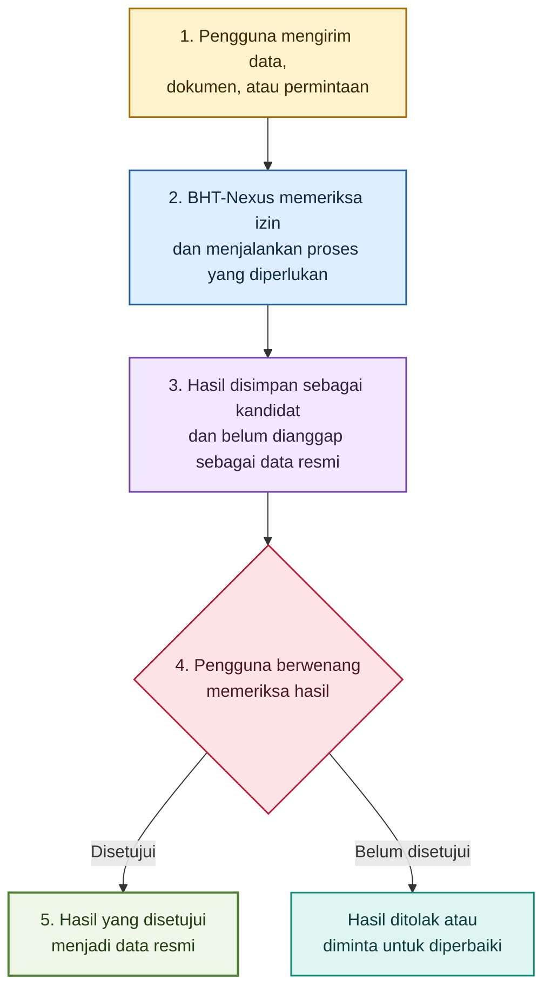
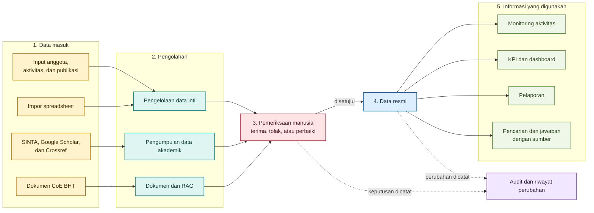
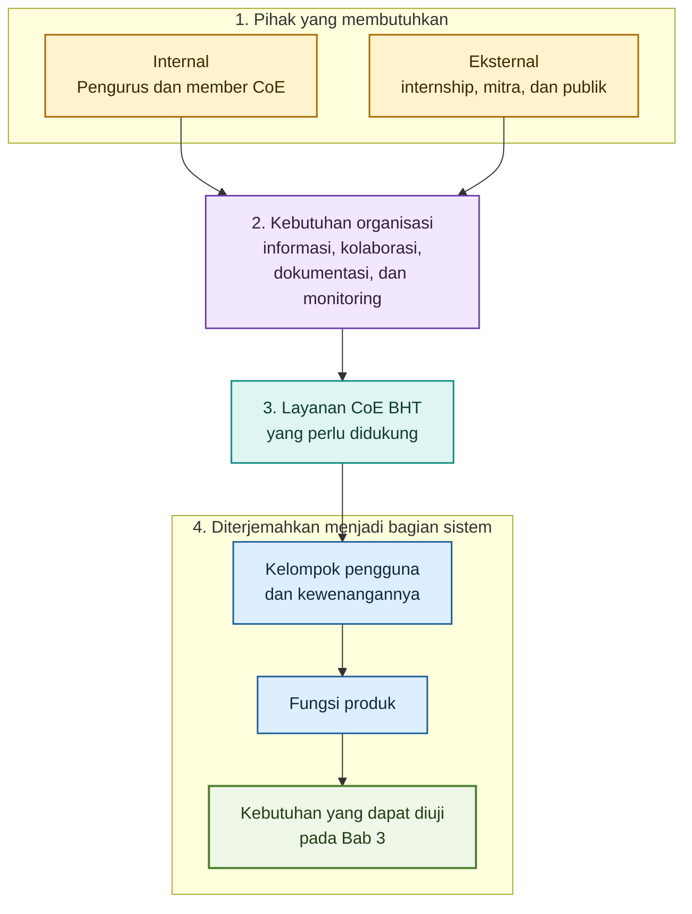

# Software Requirements Specification
## BHT-Nexus

Version 1.2.0\
Disiapkan oleh Muhammad Zaenal Abidin A.\
Center of Excellence Biomedical and Healthcare Technologies, Telkom University\
22 Juli 2026

## Table of Contents
<!-- TOC -->
* [1. Introduction](#1-introduction)
    * [1.1 Document Purpose](#11-document-purpose)
    * [1.2 Product Scope](#12-product-scope)
    * [1.3 Intended Audience and Reading Suggestions](#13-intended-audience-and-reading-suggestions)
    * [1.4 Document Conventions](#14-document-conventions)
    * [1.5 References](#15-references)
* [2. Product Overview](#2-product-overview)
    * [2.1 Product Perspective](#21-product-perspective)
    * [2.2 Product Functions](#22-product-functions)
    * [2.3 User Classes and Characteristics](#23-user-classes-and-characteristics)
    * [2.4 Operating Environment](#24-operating-environment)
    * [2.5 Design and Implementation Constraints](#25-design-and-implementation-constraints)
    * [2.6 Assumptions and Dependencies](#26-assumptions-and-dependencies)
    * [2.7 Release Priorities](#27-release-priorities)
* [3. Requirements](#3-requirements)
    * [3.1 External Interfaces](#31-external-interfaces)
    * [3.2 Functions](#32-functions)
    * [3.3 Quality of Service](#33-quality-of-service)
    * [3.4 Compliance](#34-compliance)
    * [3.5 Design and Implementation](#35-design-and-implementation)
    * [3.6 AI/ML](#36-aiml)
* [4. Verification](#4-verification)
* [5. Appendixes](#5-appendixes)
<!-- TOC -->

## Revision History

| Name | Date | Reason For Changes | Version |
|------|------|--------------------|---------|
| Fa Ainama Caldera S   | 14 Juli 2026     | Pembuatan dokumen srs v1                    |  v1.0.0         |
| M. Rifqi Dzaky Azhad | 18 Juli 2026 | Revisi alur scraper dan RAG terkelola | v1.1.0 |
| Muhammad Zaenal Abidin A. | 22 Juli 2026 | Melengkapi kebutuhan sistem, matriks verifikasi, dan lampiran. | v1.2.0 |

## 1. Introduction

Bab ini memberikan gambaran umum mengenai dokumen Software Requirements Specification (SRS) sebagai landasan dalam memahami tujuan, ruang lingkup, serta konteks pengembangan perangkat lunak BHT-Nexus. Selain menjelaskan tujuan penyusunan dokumen dan cakupan sistem yang didokumentasikan, bab ini juga menguraikan konvensi penulisan yang digunakan, pihak-pihak yang menjadi sasaran pembaca beserta panduan membaca dokumen, serta referensi yang menjadi acuan dalam penyusunan SRS. Melalui penyajian informasi tersebut, bab ini bertujuan membangun pemahaman yang konsisten bagi seluruh stakeholder sebelum memasuki pembahasan kebutuhan perangkat lunak secara lebih rinci pada bab-bab berikutnya.

### 1.1 Document Purpose

Dokumen *Software Requirements Specification* (SRS) ini mendefinisikan kebutuhan perangkat lunak **BHT-Nexus**, yaitu aplikasi web internal yang dikembangkan untuk mendukung pengelolaan data, kegiatan, serta informasi strategis di lingkungan *Center of Excellence Biomedical and Healthcare Technologies* (CoE BHT). Dokumen ini disusun sebagai acuan utama dalam proses pengembangan perangkat lunak dan digunakan sebagai referensi bersama oleh seluruh stakeholder selama siklus pengembangan sistem.

SRS ini mendokumentasikan kebutuhan perangkat lunak secara terstruktur, meliputi ruang lingkup sistem, kebutuhan fungsional, kebutuhan nonfungsional, karakteristik pengguna, batasan sistem, serta informasi lain yang diperlukan untuk memastikan seluruh stakeholder memiliki pemahaman yang konsisten terhadap sistem yang akan dibangun. Dokumen ini juga menjadi dasar dalam proses perancangan, implementasi, pengujian, validasi, serta evaluasi perangkat lunak sehingga setiap tahapan pengembangan dapat mengacu pada kebutuhan yang telah disepakati.

Cakupan dokumen ini terbatas pada spesifikasi kebutuhan perangkat lunak BHT-Nexus dan tidak membahas secara rinci aspek implementasi, desain arsitektur, struktur basis data, maupun prosedur operasional sistem. Pembahasan mengenai aspek tersebut disajikan pada dokumen teknis lain yang disusun sesuai kebutuhan selama proses pengembangan.

### 1.2 Product Scope

BHT-Nexus merupakan aplikasi web internal yang dikembangkan untuk mendukung pengelolaan informasi, dokumentasi kegiatan, serta pemantauan aktivitas di lingkungan *Center of Excellence Biomedical and Healthcare Technologies* (CoE BHT). Sistem ini dirancang sebagai pusat pengelolaan informasi yang mengintegrasikan data dari berbagai aktivitas organisasi sehingga informasi dapat dikelola secara lebih terstruktur, terdokumentasi, dan mudah diakses oleh stakeholder yang berwenang.

Pengembangan BHT-Nexus dilatarbelakangi oleh kebutuhan akan sistem yang mampu mengatasi pengelolaan data dan informasi yang masih tersebar pada berbagai media, sehingga proses dokumentasi, pemantauan, serta penyusunan laporan memerlukan konsolidasi secara manual. Kondisi tersebut berpotensi menimbulkan inkonsistensi data, meningkatkan beban administrasi, dan menyulitkan penyediaan informasi yang akurat sebagai dasar pengambilan keputusan.

Melalui BHT-Nexus, CoE BHT diharapkan memiliki platform terintegrasi yang mendukung pengelolaan informasi organisasi secara konsisten, meningkatkan kualitas dokumentasi kegiatan, serta menyediakan informasi yang lebih mudah diakses untuk kebutuhan monitoring, evaluasi, dan pelaporan. Kehadiran sistem ini juga mendukung pengelolaan data yang lebih terstruktur sehingga proses operasional dapat dilaksanakan secara lebih efektif dan berkelanjutan.

Pengembangan BHT-Nexus sejalan dengan upaya CoE BHT dalam memperkuat tata kelola informasi organisasi melalui pemanfaatan teknologi informasi. Dengan menyediakan sumber informasi yang terpusat dan terdokumentasi dengan baik, sistem ini mendukung pengambilan keputusan yang berbasis data serta menjadi fondasi bagi pengelolaan aktivitas organisasi yang lebih transparan, terdokumentasi, dan berkesinambungan.

Dalam batasan sistem, *scraper* dan RAG adalah worker Python terpisah yang dipanggil melalui API BHT-Nexus, bukan fitur yang diakses browser secara langsung. Hasilnya disimpan sebagai kandidat pada *staging*, ditinjau oleh pengguna berwenang, dan hanya dipromosikan menjadi data resmi melalui API setelah persetujuan.

Ruang lingkup rilis awal tidak mencakup aplikasi seluler *native*, arsitektur *microservice*, integrasi Looker Studio, pengambilan data yang melewati CAPTCHA atau autentikasi sumber, AI yang mengubah data resmi tanpa persetujuan manusia, *chatbot* publik untuk dokumen internal, maupun analitik waktu nyata yang membutuhkan *streaming*. Batas tersebut menjaga agar pengembangan tetap berfokus pada kebutuhan utama yang dapat diuji dan dioperasikan oleh tim.

### 1.3 Intended Audience and Reading Suggestions

Dokumen *Software Requirements Specification* (SRS) ini ditujukan bagi seluruh stakeholder yang terlibat dalam proses analisis, pengembangan, pengujian, validasi, dan pengelolaan perangkat lunak BHT-Nexus. Setiap stakeholder memiliki kebutuhan informasi yang berbeda sesuai dengan peran dan tanggung jawabnya. Oleh karena itu, dokumen ini disusun secara terstruktur agar setiap pembaca dapat mengakses bagian yang paling relevan tanpa kehilangan konteks terhadap keseluruhan sistem.

Seluruh pembaca disarankan untuk memulai dengan membaca **Bab 1 Introduction** guna memahami tujuan penyusunan dokumen, ruang lingkup perangkat lunak, serta konteks pengembangan BHT-Nexus. Setelah memahami gambaran umum tersebut, pembaca dapat melanjutkan ke bagian lain sesuai dengan kebutuhan dan tanggung jawabnya selama siklus pengembangan perangkat lunak. Pendekatan ini bertujuan membangun pemahaman yang konsisten antarstakeholder serta meminimalkan perbedaan interpretasi terhadap kebutuhan sistem.

| Stakeholder                       | Tujuan Membaca Dokumen                                                                                                                     | Bagian yang Direkomendasikan                                                                                 |
| --------------------------------- | ------------------------------------------------------------------------------------------------------------------------------------------ | ------------------------------------------------------------------------------------------------------------ |
| Project Supervisor                | Memastikan kebutuhan perangkat lunak telah sesuai dengan tujuan proyek dan kebutuhan organisasi.                                           | Seluruh dokumen, dengan fokus pada **Introduction**, **Overall Description**, dan **Specific Requirements**. |
| Project Manager / Koordinator Tim | Memahami ruang lingkup proyek, mengoordinasikan proses pengembangan, serta memastikan kebutuhan telah terdokumentasi secara lengkap.       | Seluruh dokumen.                                                                                             |
| System Analyst                    | Memverifikasi kelengkapan, konsistensi, dan keterlacakan kebutuhan perangkat lunak sebelum proses implementasi dimulai.                    | **Overall Description**, **Specific Requirements**, dan **Appendix** (apabila tersedia).                     |
| UI/UX Designer                    | Memahami karakteristik pengguna, kebutuhan sistem, dan batasan yang memengaruhi perancangan antarmuka pengguna.                            | **Overall Description** dan **Specific Requirements**.                                                       |
| Frontend Developer                | Menggunakan spesifikasi kebutuhan sebagai acuan dalam mengimplementasikan antarmuka dan interaksi pengguna sesuai dengan kebutuhan sistem. | **Specific Requirements** serta bagian yang berkaitan dengan antarmuka pengguna.                             |
| Backend Developer                 | Menggunakan spesifikasi kebutuhan sebagai acuan dalam mengimplementasikan logika bisnis, pengelolaan data, dan layanan sistem.             | **Overall Description** dan **Specific Requirements**.                                                       |
| Database Engineer                 | Memahami kebutuhan data serta batasan yang memengaruhi perancangan dan pengelolaan basis data.                                             | **Overall Description** dan **Specific Requirements** yang berkaitan dengan data.                            |
| Quality Assurance (QA)            | Menyusun skenario pengujian dan memvalidasi kesesuaian implementasi terhadap kebutuhan yang telah ditetapkan.                              | **Specific Requirements** dan kriteria yang berkaitan dengan kebutuhan sistem.                               |
| Technical Writer / Dokumentasi    | Menjaga konsistensi antara dokumentasi pengguna, dokumentasi teknis, dan kebutuhan perangkat lunak yang telah disepakati.                  | Seluruh dokumen sesuai kebutuhan dokumentasi.                                                                |
| Pengurus CoE BHT                  | Memastikan kebutuhan sistem telah merepresentasikan kebutuhan operasional organisasi dan menjadi dasar dalam proses validasi kebutuhan.    | **Introduction**, **Overall Description**, dan **Specific Requirements**.                                    |

### 1.4 Document Conventions

Dokumen *Software Requirements Specification* (SRS) ini disusun mengikuti struktur dan prinsip yang direkomendasikan oleh standar IEEE 29148 untuk memastikan informasi disajikan secara konsisten, mudah dipahami, dan dapat digunakan sebagai acuan bersama selama proses analisis, pengembangan, pengujian, dan validasi perangkat lunak. Seluruh isi dokumen menggunakan bahasa Indonesia yang mengacu pada Pedoman Umum Ejaan Bahasa Indonesia (PUEBI/ EYD Edisi V) dan Kamus Besar Bahasa Indonesia (KBBI) untuk menjaga kejelasan, konsistensi, dan ketepatan penggunaan istilah.

Konvensi penulisan diterapkan secara konsisten pada seluruh dokumen agar setiap stakeholder memiliki pemahaman yang sama terhadap struktur informasi dan interpretasi kebutuhan perangkat lunak. Selain meningkatkan keterbacaan dokumen, konvensi ini juga mendukung proses penelusuran kebutuhan (*requirement traceability*), pengelolaan perubahan dokumen, serta komunikasi antaranggota tim selama siklus pengembangan perangkat lunak.

| Elemen               | Konvensi                                                                                                                                                                                                  |
| -------------------- | --------------------------------------------------------------------------------------------------------------------------------------------------------------------------------------------------------- |
| Struktur dokumen     | Dokumen disusun secara hierarkis mengikuti struktur IEEE 29148. Setiap bab dan subbab menggunakan sistem penomoran bertingkat untuk menunjukkan hubungan antarbagian dokumen.                             |
| Istilah              | Istilah yang digunakan memiliki makna yang konsisten di seluruh dokumen. Istilah teknis, nama sistem, atau istilah asing ditulis secara seragam untuk menghindari perbedaan interpretasi.                 |
| **Bold**             | Digunakan untuk menekankan istilah, nama bagian, atau informasi penting yang perlu memperoleh perhatian khusus dari pembaca.                                                                              |
| *Italic*             | Digunakan untuk istilah asing, nama dokumen, atau istilah yang pertama kali diperkenalkan sesuai dengan kaidah penulisan bahasa Indonesia.                                                                |
| Tabel                | Digunakan untuk menyajikan informasi yang bersifat terstruktur, seperti klasifikasi, perbandingan, atau daftar kebutuhan. Seluruh tabel diberikan nomor dan judul sebagai identitas referensi.            |
| Gambar               | Digunakan untuk mendukung penjelasan apabila representasi visual memberikan pemahaman yang lebih baik dibandingkan uraian tekstual. Seluruh gambar diberikan nomor dan judul sebagai identitas referensi. |
| Pernyataan kebutuhan | Setiap kebutuhan perangkat lunak ditulis sebagai satu pernyataan yang jelas, spesifik, tidak ambigu, serta dapat diverifikasi melalui proses implementasi maupun pengujian.                               |
| Penomoran kebutuhan  | Setiap kebutuhan diberikan identitas atau penomoran yang unik sesuai struktur dokumen untuk memudahkan penelusuran, pengelolaan perubahan, dan keterkaitan dengan proses pengembangan maupun pengujian.   |

Konvensi yang ditetapkan pada dokumen ini berlaku untuk seluruh bagian SRS dan menjadi pedoman dalam penyusunan setiap kebutuhan perangkat lunak. Dengan menerapkan konvensi yang konsisten, setiap stakeholder diharapkan dapat memahami isi dokumen secara seragam, mengurangi potensi perbedaan interpretasi, serta mendukung proses pengembangan perangkat lunak yang terdokumentasi dengan baik.

### 1.5 References

Dokumen *Software Requirements Specification* (SRS) ini disusun dengan mengacu pada standar, pedoman, dan referensi resmi yang mendukung penyusunan spesifikasi kebutuhan perangkat lunak. Referensi berikut digunakan sebagai dasar dalam penyusunan struktur dokumen, penerapan konvensi penulisan, serta penggunaan istilah yang konsisten selama proses dokumentasi.

**[1]** ISO/IEC/IEEE. *ISO/IEC/IEEE 29148:2018 Systems and Software Engineering—Life Cycle Processes—Requirements Engineering*. First Edition, ISO/IEC/IEEE, 2018.

**[2]** IEEE Computer Society. *IEEE Recommended Practice for Software Requirements Specifications (IEEE Std 830-1998)*. IEEE, 1998. *(Digunakan sebagai referensi historis dan pelengkap terhadap IEEE 29148.)*

**[3]** Object Management Group (OMG). *Unified Modeling Language (UML) Specification*, Version 2.5.1. Object Management Group, 2017.

**[4]** Badan Pengembangan dan Pembinaan Bahasa. *Pedoman Umum Ejaan Bahasa Indonesia (PUEBI/ EYD Edisi V)*. Kementerian Pendidikan, Kebudayaan, Riset, dan Teknologi, Republik Indonesia.

**[5]** Badan Pengembangan dan Pembinaan Bahasa. *Kamus Besar Bahasa Indonesia (KBBI) Daring*. Kementerian Pendidikan, Kebudayaan, Riset, dan Teknologi, Republik Indonesia.

**[6]** Tim Dashboard Automation Specialist CoE BHT. [*BHT-Nexus Final Stack, SRS Revision, and WhatsApp TL;DR*](<2026-07-18_bht_nexus_final_stack_srs_revision_and_whatsapp_tldr(1).md>). 18 Juli 2026.

**[7]** Tim Dashboard Automation Specialist CoE BHT. [*BHT-Nexus API*](https://github.com/TelU-CoE-BHT-Command-Center-Internship/bht-nexus-api). Fondasi implementasi NestJS dan dokumentasi teknis pada organisasi GitHub proyek.

**[8]** Tim Dashboard Automation Specialist CoE BHT. [*Proof of Concept Scraper Google Scholar dan SINTA*](https://github.com/TelU-CoE-BHT-Command-Center-Internship/scrapper-google-scholar-sinta) serta [*Proof of Concept RAG Document*](https://github.com/TelU-CoE-BHT-Command-Center-Internship/rag-document). Digunakan sebagai referensi kemampuan awal, bukan sebagai bukti kesiapan produksi.

## 2. Product Overview
<!-- background and context that shape the product's requirements -->

### 2.1 Product Perspective

BHT-Nexus merupakan aplikasi web internal yang dikembangkan sebagai platform terintegrasi untuk mendukung pengelolaan informasi dan aktivitas operasional di lingkungan *Center of Excellence Biomedical and Healthcare Technologies* (CoE BHT). Sistem ini dirancang sebagai pusat pengelolaan informasi organisasi (*command center*) yang mengonsolidasikan berbagai data dan aktivitas ke dalam satu platform sehingga proses pengelolaan, pemantauan, dokumentasi, dan pelaporan dapat dilakukan secara lebih terstruktur dan konsisten.

Pengembangan BHT-Nexus dilatarbelakangi oleh kebutuhan akan sistem yang mampu mengintegrasikan pengelolaan informasi organisasi yang sebelumnya tersebar pada berbagai media dan proses administrasi. Berbeda dengan pendekatan tersebut, BHT-Nexus dikembangkan sebagai perangkat lunak baru (*new standalone product*) yang secara khusus dirancang untuk memenuhi kebutuhan operasional CoE BHT. Sistem ini tidak menggantikan aplikasi internal tertentu, tetapi menyediakan platform terpadu yang menjadi acuan utama dalam pengelolaan informasi organisasi sesuai dengan ruang lingkup proyek yang telah ditetapkan.

Dalam operasionalnya, BHT-Nexus berperan sebagai penghubung antara proses bisnis organisasi dengan kebutuhan pengelolaan informasi. Sistem ini mendukung dokumentasi aktivitas, pengelolaan data organisasi, serta penyediaan informasi yang diperlukan untuk kegiatan monitoring, evaluasi, dan pelaporan. Dengan menyediakan sumber informasi yang terpusat, BHT-Nexus membantu menjaga konsistensi data dan mendukung pengambilan keputusan berdasarkan informasi yang terdokumentasi secara baik.

Secara konseptual, BHT-Nexus berinteraksi dengan pengguna sebagai sumber utama pengelolaan informasi dan dapat memanfaatkan layanan pendukung, seperti layanan autentikasi, penyimpanan berkas, atau layanan notifikasi apabila diperlukan dalam implementasi sistem. Hubungan tersebut bersifat konseptual dan bertujuan menggambarkan posisi BHT-Nexus dalam lingkungan operasional tanpa menjelaskan mekanisme integrasi maupun implementasi teknis yang akan dibahas pada bagian lain dokumen.

Untuk memperjelas hubungan antara BHT-Nexus, pengguna, dan layanan pendukung dalam lingkungan operasional CoE BHT, gambaran konseptual tersebut dapat ditampilkan melalui diagram berikut.

Diagram dibaca dari atas ke bawah mengikuti nomor 1 sampai 5. Bagian terpentingnya adalah hasil otomatis selalu berstatus kandidat terlebih dahulu; data baru menjadi resmi setelah diperiksa dan disetujui pengguna yang berwenang.

### 2.2 Product Functions

BHT-Nexus menyediakan sekumpulan fungsi utama yang dirancang untuk mendukung pengelolaan informasi dan aktivitas operasional di lingkungan *Center of Excellence Biomedical and Healthcare Technologies* (CoE BHT). Fungsi-fungsi tersebut dikembangkan sebagai representasi kebutuhan bisnis organisasi sehingga mampu mendukung pengelolaan informasi secara terintegrasi, terdokumentasi, dan mudah diakses oleh stakeholder yang berwenang. Pada bagian ini, fungsi sistem dijelaskan pada tingkat konseptual sebagai gambaran umum mengenai kemampuan yang dimiliki BHT-Nexus, sedangkan penjelasan rinci mengenai kebutuhan fungsional akan diuraikan pada Bab 3 *Specific Requirements*.

| Fungsi Utama                         | Deskripsi Singkat                                                                                                                                                                    |
| ------------------------------------ | ------------------------------------------------------------------------------------------------------------------------------------------------------------------------------------ |
| **Pengelolaan Informasi Organisasi** | Mendukung pengelolaan informasi organisasi secara terpusat sehingga data dapat disimpan, diperbarui, dan diakses secara konsisten sesuai dengan kebutuhan operasional CoE BHT.       |
| **Pengelolaan Dokumentasi Kegiatan** | Mendukung proses dokumentasi berbagai kegiatan organisasi agar informasi yang dihasilkan terdokumentasi dengan baik dan dapat digunakan sebagai referensi pada kegiatan selanjutnya. |
| **Monitoring Aktivitas**             | Menyediakan kemampuan untuk memantau pelaksanaan aktivitas organisasi sehingga perkembangan kegiatan dapat diketahui secara lebih terstruktur dan terdokumentasi.                    |
| **Penyediaan Informasi**             | Menyajikan informasi yang relevan bagi stakeholder sesuai kebutuhan operasional sebagai dasar dalam pelaksanaan aktivitas, koordinasi, maupun pengambilan keputusan.                 |
| **Pelaporan**                        | Mendukung penyusunan dan penyajian informasi hasil kegiatan sebagai bahan evaluasi, dokumentasi, serta pelaporan organisasi.                                                         |
| **Pengumpulan Data Akademik**        | Mengumpulkan kandidat profil dan publikasi dari SINTA, Google Scholar, dan Crossref tanpa mengubah data resmi secara otomatis.                                                       |
| **Pemeriksaan Data**                 | Menyediakan pratinjau, perbandingan, serta persetujuan manusia sebelum kandidat menjadi data resmi.                                                                                 |
| **Pengelolaan Dokumen dan RAG**      | Mengelola dokumen berversi serta menyediakan pencarian dan tanya jawab yang menyertakan bukti sumber.                                                                               |
| **KPI dan Dashboard**                | Menyajikan indikator kinerja yang dapat ditelusuri hingga definisi, periode, sumber, dan data pembentuknya.                                                                          |
| **Audit**                            | Mencatat perubahan penting, keputusan pemeriksaan, dan pekerjaan otomatis agar proses dapat ditelusuri.                                                                             |

Fungsi-fungsi tersebut saling melengkapi dalam membentuk proses pengelolaan informasi yang terintegrasi di lingkungan CoE BHT. Hubungan antar fungsi tidak bersifat independen, melainkan saling mendukung untuk memastikan informasi dapat dikumpulkan, diperiksa, dikelola, didokumentasikan, dipantau, dimanfaatkan, dan disajikan secara konsisten sesuai dengan kebutuhan organisasi. Untuk memudahkan pemahaman mengenai keterkaitan antar fungsi tersebut, hubungan konseptualnya dapat divisualisasikan melalui diagram berikut.

Diagram dibaca dari kiri ke kanan. Data masuk melalui beberapa jalur, diolah sesuai jenisnya, diperiksa manusia, kemudian hasil yang disetujui dipakai untuk monitoring, KPI, pelaporan, serta pencarian dengan sumber.

Dengan demikian, setiap fungsi utama yang dijelaskan pada bagian ini menjadi landasan dalam penyusunan kebutuhan fungsional pada bab berikutnya. Pendekatan ini memastikan bahwa pengembangan BHT-Nexus tetap selaras dengan kebutuhan bisnis organisasi dan memiliki keterkaitan yang jelas antara kapabilitas sistem pada tingkat konseptual dan kebutuhan rinci pada tingkat spesifikasi.

Setelah dilakukan verifikasi terhadap konteks organisasi dan kebutuhan sistem, struktur pada Bagian 2.3 tidak hanya dipandang sebagai daftar aktor, tetapi juga sebagai penghubung antara organisasi CoE BHT dan kebutuhan fungsional BHT-Nexus. Oleh karena itu, bagian ini menjelaskan bagaimana struktur stakeholder menghasilkan kebutuhan bisnis, bagaimana kebutuhan tersebut diterjemahkan menjadi layanan yang didukung oleh sistem, serta siapa saja yang kemudian menjadi pengguna BHT-Nexus. Dengan pendekatan tersebut, setiap *Functional Requirement* pada Bab 3 dapat ditelusuri kembali (*traceable*) hingga ke kebutuhan stakeholder yang mendasarinya.

---

### 2.3 User Classes and Characteristics

BHT-Nexus dikembangkan untuk mendukung proses bisnis *Center of Excellence Biomedical and Healthcare Technologies* (CoE BHT) yang melibatkan berbagai pihak dengan tingkat keterlibatan dan kebutuhan yang berbeda. Oleh karena itu, identifikasi pengguna sistem tidak dilakukan secara langsung berdasarkan peran aplikasi, melainkan diawali dengan pemetaan stakeholder organisasi, kebutuhan masing-masing stakeholder, serta layanan bisnis yang menjadi ruang lingkup BHT-Nexus. Pendekatan ini memastikan bahwa setiap pengguna sistem yang diidentifikasi memiliki hubungan yang jelas dengan proses bisnis CoE BHT sehingga kebutuhan fungsional yang dirumuskan pada dokumen ini tetap selaras dengan tujuan organisasi dan tidak keluar dari ruang lingkup sistem.

#### Stakeholder Identification

Berdasarkan Juklak CoE BHT, stakeholder yang berkaitan dengan BHT-Nexus dikelompokkan menjadi **Internal Stakeholder** dan **External Partner**. *Internal Stakeholder* merupakan pihak yang berperan dalam penyelenggaraan, pengelolaan, dan pelaksanaan aktivitas CoE BHT, sedangkan *External Partner* merupakan pihak di luar struktur organisasi yang berinteraksi dengan CoE BHT melalui kegiatan kolaborasi, penyediaan informasi, maupun kerja sama.

| Kategori                 | Stakeholder                   | Peran dalam Organisasi                                                                                                         |
| ------------------------ | ----------------------------- | ------------------------------------------------------------------------------------------------------------------------------ |
| **Internal Stakeholder** | **Pengurus CoE**              | Mengelola kebijakan, operasional, koordinasi, serta monitoring seluruh aktivitas CoE BHT.                                      |
|                          | **Member CoE**                | Dosen Telkom University yang melaksanakan aktivitas riset dan kolaborasi pada bidang *Biomedical and Healthcare Technologies*. |
| **External Partner**     | **Mahasiswa Internship**      | Berpartisipasi dalam kegiatan magang, penelitian, maupun aktivitas pendukung CoE BHT.                                          |
|                          | **Institusi Internal Tel-U**  | Unit atau institusi di lingkungan Telkom University yang berkolaborasi dengan CoE BHT.                                         |
|                          | **Institusi Eksternal Tel-U** | Organisasi, perguruan tinggi, industri, atau lembaga di luar Telkom University yang menjalin kerja sama dengan CoE BHT.        |
|                          | **Masyarakat Umum**           | Pihak yang memperoleh informasi mengenai aktivitas, capaian, maupun layanan yang disediakan oleh CoE BHT.                      |

#### Stakeholder Needs

Setiap stakeholder memiliki kebutuhan yang berbeda sesuai dengan peran dan keterlibatannya terhadap CoE BHT. Kebutuhan tersebut menjadi dasar dalam menentukan ruang lingkup layanan yang perlu didukung oleh BHT-Nexus dan belum merepresentasikan kebutuhan fungsional sistem.

| Stakeholder                   | Kebutuhan Utama                                                                                                                  |
| ----------------------------- | -------------------------------------------------------------------------------------------------------------------------------- |
| **Pengurus CoE**              | Mendukung pengelolaan, monitoring, dan koordinasi seluruh aktivitas CoE BHT, baik teknis maupun nonteknis.                       |
| **Member CoE**                | Mendukung aktivitas kolaborasi riset, dokumentasi kegiatan, dan pengelolaan informasi penelitian.                                |
| **Mahasiswa Internship**      | Mendukung pelaksanaan kegiatan magang, memperoleh informasi, serta berpartisipasi dalam aktivitas yang berkaitan dengan CoE BHT. |
| **Institusi Internal Tel-U**  | Memperoleh informasi dan mendukung pelaksanaan kolaborasi akademik maupun penelitian.                                            |
| **Institusi Eksternal Tel-U** | Memperoleh informasi mengenai CoE BHT serta memfasilitasi pengajuan dan pelaksanaan kerja sama.                                  |
| **Masyarakat Umum**           | Mengakses informasi mengenai profil, aktivitas, dan capaian CoE BHT sebagai bentuk diseminasi informasi kepada publik.           |

#### Business Services

Berdasarkan kebutuhan stakeholder dan hasil analisis kebutuhan BHT-Nexus, sistem dikembangkan untuk mendukung sejumlah layanan bisnis utama CoE BHT. Layanan tersebut berfungsi sebagai penghubung antara kebutuhan organisasi dan fungsi yang nantinya diwujudkan dalam bentuk kebutuhan fungsional pada Bab 3.

| Business Service                  | Tujuan                                                                                       |
| --------------------------------- | -------------------------------------------------------------------------------------------- |
| **Layanan Informasi CoE**         | Menyediakan informasi mengenai profil, aktivitas, berita, dan capaian CoE BHT.               |
| **Layanan Pengelolaan Aktivitas** | Mendukung pengelolaan kegiatan organisasi, penelitian, dan aktivitas operasional CoE BHT.    |
| **Layanan Kolaborasi**            | Mendukung proses kolaborasi antara CoE BHT dengan member maupun mitra eksternal.             |
| **Layanan Monitoring**            | Mendukung pemantauan perkembangan aktivitas, program, dan kinerja organisasi.                |
| **Layanan Dokumentasi**           | Mendukung pengelolaan dokumen, arsip, dan informasi yang berkaitan dengan aktivitas CoE BHT. |

#### System User Classes

Tidak seluruh stakeholder berinteraksi secara langsung dengan BHT-Nexus. Oleh karena itu, *System User Classes* didefinisikan sebagai kelompok pengguna yang memanfaatkan sistem untuk mendukung pelaksanaan tugas maupun kebutuhan yang berkaitan dengan layanan bisnis CoE BHT.

| User Class                                                 | Berasal dari         | Prioritas |
| ---------------------------------------------------------- | -------------------- | --------- |
| **Pengurus CoE**                                           | Internal Stakeholder | Primary   |
| **Member CoE**                                             | Internal Stakeholder | Primary   |
| **Mahasiswa Internship**                                   | External Partner     | Secondary |
| **Institusi Internal Tel-U** *(sesuai kebutuhan layanan)*  | External Partner     | Secondary |
| **Institusi Eksternal Tel-U** *(sesuai kebutuhan layanan)* | External Partner     | Secondary |

> **Catatan:** Masyarakat umum tidak diklasifikasikan sebagai *System User* karena hanya memanfaatkan layanan informasi publik tanpa berinteraksi dengan fungsi operasional sistem.

#### User Characteristics

Karakteristik setiap pengguna disusun berdasarkan tujuan penggunaan sistem, tingkat keterlibatan terhadap proses bisnis CoE BHT, serta kebutuhan layanan yang didukung oleh BHT-Nexus.

| User Class                    | Tujuan Penggunaan                                 | Frekuensi       | Tingkat Teknis  | Fokus Interaksi                                               |
| ----------------------------- | ------------------------------------------------- | --------------- | --------------- | ------------------------------------------------------------- |
| **Pengurus CoE**              | Mengelola dan memonitor seluruh aktivitas CoE BHT | Tinggi          | Menengah–Tinggi | Pengelolaan aktivitas, monitoring, dokumentasi, dan pelaporan |
| **Member CoE**                | Mendukung aktivitas riset dan kolaborasi          | Menengah–Tinggi | Menengah        | Pengelolaan aktivitas penelitian dan dokumentasi              |
| **Mahasiswa Internship**      | Mendukung pelaksanaan kegiatan magang             | Menengah        | Dasar–Menengah  | Pelaksanaan aktivitas dan akses informasi                     |
| **Institusi Internal Tel-U**  | Mendukung kolaborasi akademik                     | Rendah–Menengah | Menengah        | Akses informasi dan kolaborasi                                |
| **Institusi Eksternal Tel-U** | Mendukung kerja sama eksternal                    | Rendah          | Menengah        | Informasi dan pengajuan kerja sama                            |

Bagian ini menunjukkan bahwa identifikasi pengguna BHT-Nexus tidak hanya mempertimbangkan struktur organisasi CoE BHT, tetapi juga hubungan antara kebutuhan stakeholder, layanan bisnis yang didukung sistem, serta karakteristik masing-masing pengguna. Dengan demikian, setiap kebutuhan fungsional yang akan dijelaskan pada Bab 3 dapat ditelusuri secara jelas dari kebutuhan organisasi hingga pengguna yang memanfaatkan fungsi tersebut.

Untuk memperjelas hubungan antara stakeholder, kebutuhan bisnis, layanan yang didukung oleh sistem, dan pengguna BHT-Nexus, diagram berikut menyajikan alur keterlacakan dari stakeholder hingga kebutuhan sistem. Diagram ini tidak menggambarkan implementasi teknis maupun mekanisme hak akses, melainkan menunjukkan alur penurunan kebutuhan organisasi menjadi pengguna sistem sebagai landasan penyusunan *Functional Requirements*.

Diagram dibaca dari atas ke bawah. Tujuannya menunjukkan bahwa kebutuhan pada Bab 3 tidak muncul begitu saja, melainkan berasal dari pihak yang membutuhkan, kebutuhan organisasi, dan layanan yang perlu didukung.

### 2.4 Operating Environment

BHT-Nexus dirancang sebagai sistem informasi berbasis web yang beroperasi pada lingkungan *client-server* dan dapat diakses oleh pengguna melalui jaringan internet sesuai dengan hak akses yang dimiliki. Lingkungan operasional ini dipilih untuk mendukung kebutuhan akses yang fleksibel bagi berbagai kelompok pengguna, baik yang berada di lingkungan Telkom University maupun pihak eksternal yang terlibat dalam aktivitas CoE BHT. Dengan pendekatan tersebut, sistem diharapkan mampu menyediakan layanan secara terpusat sehingga pengelolaan informasi, aktivitas, dan dokumentasi dapat dilakukan secara konsisten oleh seluruh pengguna yang berwenang.

Lingkungan operasional BHT-Nexus terdiri atas beberapa komponen utama yang saling mendukung agar sistem dapat berjalan dengan baik. Komponen tersebut meliputi lingkungan pengguna (*client environment*), lingkungan aplikasi (*application environment*), lingkungan jaringan (*network environment*), serta lingkungan server (*server environment*). Masing-masing lingkungan memiliki fungsi yang berbeda, namun secara bersama-sama membentuk ekosistem operasional yang mendukung pelaksanaan layanan BHT-Nexus.

#### Client Environment

Lingkungan pengguna merupakan perangkat yang digunakan untuk mengakses BHT-Nexus. Sistem dirancang agar dapat diakses melalui *web browser* modern pada berbagai jenis perangkat tanpa memerlukan instalasi aplikasi khusus.

| Komponen                | Deskripsi                                                                                                         |
| ----------------------- | ----------------------------------------------------------------------------------------------------------------- |
| **Perangkat Pengguna**  | Desktop, laptop, tablet, atau smartphone yang mendukung akses melalui peramban web.                               |
| **Media Akses**         | Peramban (*web browser*) modern yang mendukung standar web terkini.                                               |
| **Karakteristik Akses** | Mendukung akses lintas perangkat (*cross-platform*) dengan antarmuka yang responsif sesuai ukuran layar pengguna. |

#### Application Environment

BHT-Nexus dikembangkan sebagai aplikasi berbasis web yang menggunakan pendekatan *client-server*, sehingga seluruh proses pengelolaan data dilakukan secara terpusat dan dapat diakses oleh banyak pengguna secara bersamaan.

| Komponen                   | Deskripsi                                           |
| -------------------------- | --------------------------------------------------- |
| **Jenis Aplikasi**         | Sistem informasi berbasis web.                      |
| **Arsitektur Operasional** | Client-server.                                      |
| **Karakteristik Sistem**   | Multi-user dengan pengelolaan data secara terpusat. |

#### Network Environment

Akses terhadap BHT-Nexus dilakukan melalui jaringan yang mendukung komunikasi data antara pengguna dan server aplikasi. Ketersediaan koneksi jaringan yang stabil diperlukan untuk menjaga kelancaran proses pertukaran data selama sistem digunakan.

| Komponen              | Deskripsi                                                                                      |
| --------------------- | ---------------------------------------------------------------------------------------------- |
| **Media Jaringan**    | Internet.                                                                                      |
| **Komunikasi Data**   | Mendukung komunikasi data secara aman antara pengguna dan sistem.                              |
| **Kebutuhan Koneksi** | Memerlukan koneksi jaringan yang stabil agar seluruh layanan sistem dapat diakses dengan baik. |

#### Server Environment

Lingkungan server menyediakan layanan yang diperlukan agar BHT-Nexus dapat beroperasi sebagai sistem informasi terpusat. Pada tahap ini, lingkungan server dijelaskan secara konseptual tanpa mengacu pada teknologi maupun platform implementasi tertentu.

| Komponen               | Deskripsi                                                                       |
| ---------------------- | ------------------------------------------------------------------------------- |
| **Application Server** | Menjalankan logika bisnis dan layanan aplikasi.                                 |
| **Database Server**    | Menyimpan serta mengelola data yang digunakan oleh sistem.                      |
| **Media Penyimpanan**  | Menyediakan ruang penyimpanan untuk data dan dokumen yang dikelola oleh sistem. |

Lingkungan operasional tersebut menjadi dasar bagi pelaksanaan seluruh fungsi BHT-Nexus yang telah dijelaskan pada bagian sebelumnya. Dengan lingkungan operasional yang bersifat terpusat, berbasis web, dan mendukung akses melalui jaringan internet, sistem diharapkan mampu memberikan layanan yang konsisten kepada seluruh pengguna sesuai dengan peran dan kewenangannya. Spesifikasi teknis yang berkaitan dengan teknologi implementasi, perangkat lunak pendukung, maupun infrastruktur pengembangan tidak dibahas pada bagian ini karena akan disesuaikan dengan keputusan desain dan implementasi yang ditetapkan pada tahap pengembangan sistem.

### 2.5 Design and Implementation Constraints

BHT-Nexus dikembangkan dengan mempertimbangkan sejumlah batasan desain dan implementasi yang telah ditetapkan selama proses analisis kebutuhan sistem. Batasan tersebut berfungsi sebagai acuan bagi tim pengembang dalam menentukan teknologi, standar pengembangan, serta pendekatan implementasi yang digunakan selama siklus pengembangan perangkat lunak. Dengan adanya batasan ini, proses implementasi diharapkan tetap konsisten, mudah dipelihara, serta selaras dengan kebutuhan operasional CoE BHT.

Batasan yang dijelaskan pada bagian ini tidak dimaksudkan untuk menjelaskan arsitektur perangkat lunak secara rinci, melainkan mendefinisikan teknologi dan standar yang menjadi dasar dalam proses pengembangan BHT-Nexus. Perubahan terhadap teknologi yang digunakan dimungkinkan apabila terdapat kebutuhan pengembangan di masa mendatang, namun perubahan tersebut harus tetap mempertimbangkan kompatibilitas terhadap kebutuhan sistem yang telah didefinisikan dalam dokumen ini.

#### Development Framework

Framework yang digunakan pada BHT-Nexus dipilih untuk mendukung pengembangan aplikasi web modern yang terstruktur, mudah dipelihara, dan mendukung pengembangan berkelanjutan.

| Komponen | Teknologi | Alasan Menjadi Constraint |
|-----------|-----------|---------------------------|
| **Frontend Framework** | Next.js 16.2 | Antarmuka web dan satu-satunya klien browser. |
| **Backend Framework** | NestJS 11 dengan Express bawaan | Satu pintu API publik, otorisasi, orkestrasi *job*, dan promosi data resmi. |

#### Programming Language

Bahasa pemrograman yang digunakan ditetapkan untuk menjaga konsistensi implementasi pada seluruh komponen sistem.

| Komponen | Teknologi | Alasan Menjadi Constraint |
|-----------|-----------|---------------------------|
| **API dan web** | Node.js 24 LTS dan TypeScript | Runtime dan bahasa untuk aplikasi web serta API. |
| **Worker** | Python 3.12 | Runtime untuk *scraper*, pemrosesan dokumen, *embedding*, dan RAG. |

#### Database and Persistence

Komponen penyimpanan data ditentukan untuk mendukung pengelolaan data yang terstruktur, konsisten, dan mudah dipelihara.

| Komponen | Teknologi | Alasan Menjadi Constraint |
|-----------|-----------|---------------------------|
| **Database Management System** | PostgreSQL 18 | Basis data utama untuk data resmi, *job*, *staging*, *review*, provenance, dan audit. |
| **Object Relational Mapping (ORM)** | Drizzle ORM | Akses data dan migrasi skema pada API. |
| **Antrean awal** | Tabel *job* PostgreSQL | Antrean terkelola tanpa Redis pada tahap awal. |
| **Pencarian vektor produksi** | PostgreSQL dengan ekstensi `pgvector` | Menyimpan metadata, *chunk*, hak akses, dan indeks RAG. |

#### API and System Integration

Komunikasi antar komponen sistem dilakukan menggunakan mekanisme yang telah ditetapkan sebagai standar implementasi aplikasi.

| Komponen | Teknologi / Standar | Alasan Menjadi Constraint |
|-----------|---------------------|---------------------------|
| **API Architecture** | REST API | Digunakan sebagai mekanisme komunikasi antara frontend dan backend karena sederhana, mudah diintegrasikan, serta sesuai dengan kebutuhan sistem. |
| **Data Format** | JSON | Digunakan sebagai format pertukaran data antar layanan untuk menjaga interoperabilitas sistem. |
| **Dokumentasi API** | OpenAPI/Swagger | Mendokumentasikan kontrak API yang dipakai web dan worker. |

#### File Storage

Pengelolaan dokumen dan berkas dilakukan menggunakan media penyimpanan yang mendukung penyimpanan terpusat dan mudah diakses oleh aplikasi.

| Komponen | Teknologi | Alasan Menjadi Constraint |
|-----------|-----------|---------------------------|
| **Penyimpanan awal** | Volume server melalui *storage adapter* | Menyimpan berkas dan artefak besar di luar basis data; metadata dan hak akses disimpan di PostgreSQL. |

#### Development Tools

Proses pengembangan perangkat lunak menggunakan sejumlah alat bantu yang mendukung kolaborasi, konsistensi kode, serta otomatisasi proses pengembangan.

| Komponen | Teknologi | Alasan Menjadi Constraint |
|-----------|-----------|---------------------------|
| **Version Control** | Git | Digunakan untuk mengelola perubahan kode sumber secara kolaboratif. |
| **Containerization** | Docker | Digunakan untuk menjaga konsistensi lingkungan pengembangan dan proses distribusi aplikasi. |
| **Code Formatter** | Prettier | Digunakan untuk menjaga konsistensi format penulisan kode pada seluruh proyek. |
| **Linter** | ESLint | Digunakan untuk memastikan kualitas kode sesuai standar yang telah ditetapkan. |

#### Development Standards

Selain teknologi yang digunakan, pengembangan BHT-Nexus juga mengikuti sejumlah standar implementasi untuk menjaga konsistensi desain perangkat lunak selama proses pengembangan.

| Standar | Deskripsi |
|----------|-----------|
| **Application Architecture** | Pengembangan sistem mengikuti arsitektur aplikasi yang modular sehingga setiap komponen memiliki tanggung jawab yang jelas dan mudah dipelihara. |
| **Naming Convention** | Penamaan komponen, variabel, fungsi, maupun struktur data mengikuti konvensi yang disepakati oleh tim pengembang agar konsisten pada seluruh proyek. |
| **Source Code Documentation** | Dokumentasi kode dilakukan secara konsisten untuk mempermudah proses pengembangan maupun pemeliharaan sistem. |
| **API Documentation** | Seluruh layanan API didokumentasikan menggunakan standar dokumentasi yang telah ditetapkan agar memudahkan proses integrasi dan pengujian. |

Batasan desain dan implementasi tersebut menjadi acuan selama proses pengembangan BHT-Nexus untuk memastikan seluruh komponen perangkat lunak dikembangkan secara konsisten, mudah dipelihara, serta mampu mendukung kebutuhan operasional CoE BHT. Detail mengenai arsitektur perangkat lunak, struktur komponen, konfigurasi lingkungan pengembangan, maupun mekanisme implementasi akan dijelaskan lebih lanjut pada dokumen *Software Architecture Document (SAD)* dan dokumentasi teknis yang berkaitan dengan proses pengembangan sistem.

### 2.6 Assumptions and Dependencies

| Asumsi atau ketergantungan | Dampak jika tidak tersedia | Mitigasi |
| --- | --- | --- |
| SINTA, Google Scholar, dan Crossref dapat berubah atau membatasi akses. | *Job* sumber tertentu gagal atau tidak lengkap. | Perlakukan sebagai *best-effort*, catat kegagalan per sumber, dan sediakan impor manual. |
| PostgreSQL, volume server, dan worker tersedia. | *Job* tidak dapat diproses atau hasil tidak tersimpan. | Pantau antrean, status worker, dan gunakan pemulihan *job*. |
| Reviewer berwenang tersedia. | Kandidat tidak dapat menjadi data resmi atau sumber RAG. | Tampilkan antrean review dan catat keputusan audit. |

### 2.7 Release Priorities

Pengembangan BHT-Nexus dilakukan secara bertahap agar setiap kemampuan baru dibangun di atas fondasi yang telah diuji. Urutan berikut merupakan prioritas rilis, bukan jadwal tanggal tetap. Suatu tahap hanya dapat dilanjutkan apabila syarat pada tahap sebelumnya telah terpenuhi dan bukti pengujiannya dapat ditinjau oleh tim.

| Tahap | Cakupan Utama | Syarat untuk Melanjutkan |
| --- | --- | --- |
| **1. Fondasi** | Autentikasi, peran, izin, audit, PostgreSQL, kontrak API, serta pemeriksaan otomatis. | Instalasi, build, test, migrasi, dan pemulihan dasar berhasil. |
| **2. Data inti** | Anggota, aktivitas, publikasi, impor, deduplikasi, pemeriksaan, dan promosi data. | Satu alur data dapat berjalan dari masukan hingga data resmi tanpa perubahan diam-diam. |
| **3. Otomatisasi** | Antrean *job*, scraper, snapshot, provenance, retry, dan pemantauan pekerjaan. | Hasil worker selalu menjadi kandidat dan kegagalan sumber tidak merusak data resmi. |
| **4. Dokumen dan RAG** | Unggah, versi, karantina, OCR, indeks, pencarian, sitasi, dan evaluasi. | Hak akses, kualitas sitasi, serta penolakan jawaban tanpa bukti telah diuji. |
| **5. Rilis pilot** | KPI, dashboard, ekspor, penguatan keamanan, deployment, backup, UAT, dan handover. | Seluruh kriteria penerimaan pada Appendix A terpenuhi. |

## 3. Requirements
<!-- identifiable, verifiable, testable requirements; avoid implementation details -->

### 3.1 External Interfaces
<!-- inputs/outputs (formats, protocols, timing, etc); reference interface schemas where available. -->

#### 3.1.1 User Interfaces

Antarmuka BHT-Nexus digunakan melalui peramban dan dirancang untuk pengguna dengan tingkat kemampuan teknis yang beragam. Setiap alur utama perlu memberikan informasi mengenai apa yang sedang diproses, hasil yang berhasil disimpan, kesalahan yang terjadi, dan tindakan yang perlu dilakukan berikutnya.

- ID: REQ-UI-001
- Title: Antarmuka Web Responsif dan Mudah Dipahami
- Statement: Sistem wajib menyediakan antarmuka web yang dapat digunakan pada desktop dan perangkat seluler, dapat dioperasikan dengan papan ketik, serta tidak mengandalkan warna sebagai satu-satunya penanda status.
- Rationale: Pengguna BHT-Nexus memiliki perangkat dan tingkat kemampuan teknis yang beragam sehingga fungsi utama harus tetap dapat dipahami dan digunakan secara konsisten.
- Acceptance Criteria:
  - Alur login, impor, pemeriksaan, pencarian, dan pelaporan dapat digunakan mulai lebar layar 360 piksel.
  - Setiap bidang formulir memiliki label dan pesan kesalahan yang menjelaskan bagian yang perlu diperbaiki.
  - Keadaan memuat, kosong, berhasil, gagal, dan tidak memiliki izin ditampilkan secara jelas.
  - Seluruh fungsi utama dapat digunakan tanpa tetikus.
- Verification Method: Usability Test, Accessibility Test, dan Demonstration
- More Information: Rincian komponen visual ditetapkan pada dokumen desain antarmuka.

#### 3.1.2 Hardware Interfaces

BHT-Nexus tidak membutuhkan perangkat keras khusus. Pengguna cukup menggunakan desktop, laptop, tablet, atau *smartphone* yang dapat menjalankan peramban modern. Pemrosesan OCR, *embedding*, dan model AI dilakukan pada server atau worker yang telah ditetapkan sehingga kemampuan tersebut tidak bergantung pada perangkat pengguna.

- ID: REQ-HW-001
- Title: Tidak Bergantung pada Perangkat Khusus
- Statement: Sistem tidak boleh mewajibkan perangkat khusus pada sisi pengguna dan wajib menempatkan kebutuhan komputasi berat pada server atau worker yang dikelola tim.
- Rationale: Pengguna harus dapat mengakses sistem dari perangkat yang umum tersedia tanpa menyiapkan GPU, model AI, atau perangkat pemrosesan dokumen sendiri.
- Acceptance Criteria:
  - Seluruh fungsi pengguna tersedia melalui peramban modern tanpa instalasi aplikasi tambahan.
  - OCR, *scraping*, *embedding*, dan pengindeksan tidak dijalankan pada perangkat pengguna.
  - Kebutuhan komputasi server dicatat pada dokumentasi deployment dan dapat ditingkatkan tanpa mengubah kontrak antarmuka pengguna.
- Verification Method: Inspection dan Deployment Test
- More Information: -

#### 3.1.3 Software Interfaces

BHT-Nexus berinteraksi dengan sejumlah sistem perangkat lunak eksternal dalam proses pengumpulan data akademik dan penelitian yang dibutuhkan untuk mendukung operasional sistem. Interaksi tersebut dilakukan melalui mekanisme akses berbasis HTTP terhadap halaman publik yang disediakan oleh masing-masing platform, tanpa menggunakan mekanisme autentikasi resmi. Pendekatan ini dipilih karena data yang dibutuhkan tersedia secara publik sehingga integrasi dapat dilakukan tanpa memerlukan izin akses khusus.

Namun demikian, ketersediaan dan kelengkapan data yang dapat diperoleh bergantung pada kebijakan dan mekanisme akses yang diterapkan oleh masing-masing platform. Pada sistem yang menerapkan pembatasan akses seperti verifikasi CAPTCHA atau mekanisme *sign-in*, proses pengumpulan data dilakukan secara *best-effort* dan kegagalan akses dianggap sebagai perilaku yang diharapkan (*expected behavior*).

| Sistem atau komponen | Deskripsi | Mekanisme Akses | Catatan |
| ------------------- | --------- | --------------- | ------- |
| **SINTA** (*Science and Technology Index*) | Sumber publik profil peneliti dan publikasi akademik. | HTTP GET sesuai ketentuan akses sumber. | *Best-effort*; ketersediaan tidak dijamin. |
| **Google Scholar** | Sumber publik profil peneliti dan metadata publikasi ilmiah. | HTTP GET sesuai ketentuan akses sumber. | *Best-effort*; CAPTCHA dan *sign-in* merupakan kegagalan yang diharapkan. |
| **Crossref** | Sumber metadata DOI untuk pencocokan dan pelengkapan kandidat publikasi. | API HTTP dengan *contact user-agent*, *cache*, dan pembatasan laju. | Dipakai secara terukur; bukan sumber data resmi otomatis. |
| **Worker Python** | Worker *scraper* dan RAG yang memproses *job* dari PostgreSQL. | Kontrak *job* dan *staging* pada PostgreSQL. | Tidak diakses langsung oleh browser dan tidak menulis tabel bisnis resmi. |

SINTA, Google Scholar, dan Crossref semuanya merupakan sumber publik *best-effort*. Kegagalan satu sumber tidak membatalkan hasil sumber lain. NestJS API menerima permintaan, membuat *job*, menyediakan statusnya, dan mengendalikan promosi kandidat hasil worker ke data resmi.

- ID: REQ-INT-003
- Title: Kontrak API Terpadu
- Statement: Sistem wajib menyediakan REST API berversi melalui jalur `/api/v1` dan mendokumentasikan parameter, autentikasi, bentuk permintaan, bentuk respons, kode status, serta contoh penggunaan aman melalui OpenAPI/Swagger.
- Rationale: Web dan worker memerlukan satu kontrak komunikasi yang dapat dibaca, diuji, serta ditelusuri perubahannya tanpa bergantung pada struktur internal aplikasi.
- Acceptance Criteria:
  - Browser berkomunikasi dengan API dan tidak mengakses PostgreSQL, worker, atau penyimpanan berkas secara langsung.
  - Setiap endpoint mendefinisikan autentikasi, izin, parameter, respons berhasil, respons gagal, dan `request_id`.
  - Perubahan yang tidak kompatibel tidak dilakukan diam-diam pada versi API yang sama.
- Verification Method: Contract Test dan Inspection
- More Information: OpenAPI merupakan kontrak HTTP, bukan pengganti SRS atau ADR.

- ID: REQ-INT-001-2
- Title: Akses Sumber Publik
- Statement: Sistem wajib mengakses SINTA, Google Scholar, dan Crossref sesuai ketentuan akses sumber, tanpa melewati CAPTCHA atau memaksa autentikasi.
- Rationale: Sumber eksternal dapat berubah, tidak tersedia, atau membatasi akses; sistem harus menjaga kepatuhan dan asal-usul data.
- Acceptance Criteria:
  - CAPTCHA atau *sign-in* dicatat sebagai kegagalan wajar.
  - Setiap permintaan mencatat URL sumber, waktu, versi parser, hash respons, dan status.
  - Tidak ada hasil *scraper* yang langsung menjadi data resmi.
- Verification Method: Test dan Inspection
- More Information: Crossref memakai *contact user-agent*, *cache*, dan pembatasan laju.

- ID: REQ-INT-002
- Title: Akses *Best-Effort* Google Scholar
- Statement: Sistem wajib berupaya mengakses halaman profil dan pencarian Google Scholar melalui HTTP GET; kegagalan akibat pemblokiran CAPTCHA atau pengalihan halaman *sign-in* wajib dicatat sebagai *attempt log* dan tidak menyebabkan kegagalan sistem secara keseluruhan.
- Rationale: Google Scholar dapat melengkapi data dari SINTA, namun platform tersebut menerapkan mekanisme pembatasan akses yang dapat mengakibatkan kegagalan pengumpulan data sewaktu-waktu. Integrasi dirancang sebagai upaya terbaik tanpa menjamin keberhasilan akses.
- Acceptance Criteria:
  - Sistem mencatat setiap percobaan akses ke Google Scholar beserta statusnya dalam *attempt log*.
  - Kegagalan akses ke Google Scholar tidak mengakibatkan kegagalan proses pengumpulan data dari SINTA.
  - Sistem tidak mencoba mem-*bypass* mekanisme CAPTCHA atau autentikasi Google Scholar.
- Verification Method: Test
- More Information: -

### 3.2 Functions

Bagian ini mendefinisikan kebutuhan fungsional BHT-Nexus yang mencakup pengelolaan data inti, pemeriksaan data, pelaporan, serta dua kemampuan otomatisasi yang saat ini telah memiliki POC, yaitu pengumpulan data akademik (*academic data scraper*) dan tanya jawab dokumen berbasis *Retrieval-Augmented Generation* (RAG). *Scraper* berperan sebagai komponen pengumpul kandidat data dari sumber eksternal, sedangkan RAG memungkinkan pengguna memperoleh informasi dari dokumen internal melalui pertanyaan dalam bahasa sehari-hari. Keduanya tetap berada di belakang API dan tidak dapat mengubah data resmi tanpa pemeriksaan pengguna berwenang.

Kebutuhan fungsional pada bagian ini disusun berdasarkan perilaku sistem yang dapat diobservasi dari luar (*externally observable behavior*) dan tidak menjelaskan mekanisme implementasi internal. Setiap kebutuhan diformulasikan sebagai pernyataan yang dapat diverifikasi dan ditelusuri kembali (*traceable*) ke kebutuhan bisnis yang telah diidentifikasi pada Bab 2.

#### Pengelolaan Data Inti dan Akses

Kebutuhan pada bagian ini menjadi fondasi bagi seluruh fitur lain. Sistem harus terlebih dahulu mengetahui identitas pengguna, tindakan yang diizinkan, data yang dikelola, serta riwayat perubahan sebelum hasil scraper atau RAG dapat digunakan secara aman.

- ID: REQ-FUNC-018
- Title: Autentikasi dan Sesi Pengguna
- Statement: Sistem wajib mengautentikasi pengguna, membuat sesi yang dapat dicabut, dan mengakhiri sesi ketika pengguna keluar, tidak aktif terlalu lama, atau mencapai batas masa berlaku.
- Rationale: Akses internal harus dapat dihentikan tanpa menyimpan token jangka panjang yang sulit dicabut.
- Acceptance Criteria:
  - Kata sandi diverifikasi menggunakan Argon2id dan tidak pernah disimpan sebagai teks biasa.
  - Token sesi mentah hanya dikirim melalui *cookie* `Secure`, `HttpOnly`, dan `SameSite` yang sesuai.
  - Basis data hanya menyimpan *hash* token sesi.
  - Login gagal, pembatasan percobaan, pencabutan sesi, waktu tidak aktif, dan kedaluwarsa dapat diuji.
- Verification Method: Unit Test, Integration Test, dan Security Test
- More Information: Implementasi awal menggunakan strategi lokal Passport dan sesi berbasis basis data.

- ID: REQ-FUNC-019
- Title: Peran dan Izin per Data
- Statement: Sistem wajib memeriksa peran, izin tindakan, dan izin terhadap data tertentu pada setiap operasi yang dilindungi.
- Rationale: Pengguna dengan peran yang sama tidak selalu berhak melihat atau mengubah seluruh anggota, dokumen, aktivitas, atau kandidat perubahan.
- Acceptance Criteria:
  - Pengguna tanpa izin menerima penolakan yang konsisten tanpa memperoleh isi data.
  - Izin baca, buat, ubah, periksa, setujui, ekspor, dan kelola dapat dibedakan.
  - Perubahan peran atau izin dicatat sebagai peristiwa audit.
  - Hak akses dokumen diperiksa sebelum pengindeksan dan sebelum hasil pencarian dikirim.
- Verification Method: Authorization Matrix Test dan Security E2E Test
- More Information: -

- ID: REQ-FUNC-020
- Title: Pengelolaan Anggota CoE BHT
- Statement: Sistem wajib mengelola profil anggota, status keanggotaan, unit, bidang keahlian, dan pengenal eksternal seperti ORCID, SINTA ID, atau Google Scholar ID.
- Rationale: Identitas anggota menjadi penghubung aktivitas, publikasi, dokumen, kolaborasi, dan pelaporan.
- Acceptance Criteria:
  - Profil anggota dapat dibuat, diperbarui, dicari, difilter, dan dinonaktifkan sesuai izin.
  - Pengenal eksternal disimpan terpisah dan memiliki aturan keunikan yang sesuai.
  - Perubahan data penting menyimpan pelaku, waktu, dan sumber perubahan.
  - Data anggota yang tidak disetujui untuk publik tidak muncul pada keluaran publik.
- Verification Method: Unit Test, Integration Test, dan Access-control Test
- More Information: -

- ID: REQ-FUNC-021
- Title: Pengelolaan Aktivitas dan Bukti
- Statement: Sistem wajib mengelola aktivitas CoE BHT beserta jenis, periode, status, pihak terlibat, luaran, dan bukti pendukungnya.
- Rationale: Aktivitas perlu terdokumentasi agar perkembangan, tanggung jawab, dan hasilnya dapat dipantau serta dilaporkan.
- Acceptance Criteria:
  - Aktivitas dapat dibuat, diperbarui, dicari, difilter, dan ditutup sesuai izin.
  - Anggota dan mitra dapat dihubungkan dengan peran yang jelas pada aktivitas.
  - Bukti mengacu pada versi dokumen atau tautan sumber yang dapat ditelusuri.
  - Perubahan status penting menghasilkan peristiwa audit.
- Verification Method: Integration Test dan Demonstration
- More Information: -

- ID: REQ-FUNC-022
- Title: Pengelolaan Publikasi dan Deduplikasi
- Statement: Sistem wajib mengelola metadata publikasi, penulis, sumber, *venue*, tahun, tipe karya, DOI, pengenal eksternal, dan kandidat duplikat.
- Rationale: Publikasi dapat berasal dari beberapa sumber dan berisiko tercatat lebih dari satu kali.
- Acceptance Criteria:
  - DOI dinormalisasi dan tidak dapat menghasilkan dua publikasi resmi yang sama.
  - Pengenal sumber disimpan bersama URL dan waktu pengambilan.
  - Kandidat tanpa DOI dibandingkan menggunakan judul, tahun, dan penulis.
  - Penggabungan rekam menyimpan keputusan serta riwayat asal data.
- Verification Method: Unit Test, Integration Test, dan Reconciliation Test
- More Information: -

- ID: REQ-FUNC-023
- Title: Pratinjau Impor Spreadsheet
- Statement: Sistem wajib menampilkan hasil validasi, data baru, perubahan, duplikat, dan kesalahan sebelum data impor dipromosikan menjadi data resmi.
- Rationale: Pengguna harus memahami dampak berkas XLSX atau CSV sebelum data resmi berubah.
- Acceptance Criteria:
  - Tidak ada unggahan yang langsung mengubah data resmi.
  - Kesalahan menyebut baris, kolom, nilai aman, alasan, dan saran perbaikan.
  - Ringkasan jumlah baris valid, gagal, baru, berubah, dan duplikat tersedia.
  - Pengguna dapat mengunduh laporan kesalahan yang tidak memuat data di luar izinnya.
- Verification Method: Integration Test dan Usability Test
- More Information: -

- ID: REQ-FUNC-024
- Title: Pemeriksaan dan Promosi Kandidat
- Statement: Sistem wajib menyediakan antrean pemeriksaan yang memungkinkan pengguna berwenang membandingkan sumber, kandidat perubahan, data resmi saat ini, dan bukti pendukung sebelum menerima, menolak, atau meminta perbaikan.
- Rationale: Hasil impor, scraper, dan AI belum dapat dipercaya sebagai data resmi sebelum diperiksa.
- Acceptance Criteria:
  - Keputusan pemeriksaan menyimpan pelaku, waktu, alasan, sumber, dan versi kandidat.
  - Pembuat tidak dapat menyetujui sendiri perubahan sensitif yang ditetapkan kebijakan.
  - Persetujuan mempromosikan perubahan melalui API dalam satu transaksi.
  - Penolakan tidak menghapus sumber, kandidat, atau riwayat keputusan sebelum masa retensi berakhir.
- Verification Method: Authorization Test, Integration Test, dan Demonstration
- More Information: -

- ID: REQ-FUNC-025
- Title: KPI yang Dapat Ditelusuri
- Statement: Sistem wajib menyimpan definisi, rumus, periode, filter, sumber, versi, pemilik, waktu perhitungan, dan bukti data pembentuk untuk setiap KPI.
- Rationale: Angka tanpa definisi dan sumber dapat ditafsirkan secara berbeda serta sulit diverifikasi.
- Acceptance Criteria:
  - Pengguna dapat membuka KPI hingga daftar data pembentuknya sesuai izin.
  - Perubahan definisi membuat versi baru tanpa mengubah riwayat angka lama.
  - Data terlambat atau tidak lengkap ditandai secara jelas.
  - KPI berstatus draf tidak ditampilkan sebagai angka resmi.
- Verification Method: Calculation Test, Reconciliation Test, dan Inspection
- More Information: -

- ID: REQ-FUNC-026
- Title: Dashboard, Filter, dan Ekspor
- Statement: Sistem wajib menyediakan ringkasan, daftar, filter, rincian, serta ekspor untuk data yang diizinkan kepada pengguna.
- Rationale: Pengguna memerlukan gambaran cepat sekaligus kemampuan menelusuri dan menggunakan kembali data yang mendasarinya.
- Acceptance Criteria:
  - Daftar menggunakan pagination agar jumlah data besar tidak dimuat sekaligus.
  - Filter aktif, periode, satuan, sumber, dan waktu pembaruan terlihat pada hasil.
  - Grafik memiliki ringkasan angka atau tabel alternatif.
  - Ekspor mencatat pengguna, waktu, jenis data, dan filter tanpa menyimpan isi sensitif pada log.
- Verification Method: E2E Test, Accessibility Test, dan Demonstration
- More Information: -

- ID: REQ-FUNC-027
- Title: Audit Perubahan Penting
- Statement: Sistem wajib mencatat peristiwa penting yang memengaruhi akses, data resmi, pemeriksaan, ekspor, konfigurasi, pekerjaan otomatis, dan model.
- Rationale: Organisasi memerlukan riwayat yang dapat digunakan untuk penelusuran, pemeriksaan, dan penanganan insiden.
- Acceptance Criteria:
  - Audit memuat pelaku, waktu UTC, tindakan, objek, hasil, sumber, serta `request_id` atau `job_id` apabila relevan.
  - Perubahan data menyimpan ringkasan sebelum dan sesudah yang aman.
  - Pengguna biasa tidak dapat mengubah atau menghapus audit.
  - Kata sandi, token, dan isi dokumen rahasia tidak dicatat pada audit.
- Verification Method: Integration Test, Database Permission Test, dan Inspection
- More Information: -

#### Pengumpulan Data Akademik

Komponen pengumpulan data akademik bertanggung jawab mengambil metadata profil peneliti dan publikasi dari sumber eksternal yang telah ditetapkan, menyimpan hasilnya dalam format yang dapat digunakan kembali, serta mencatat seluruh percobaan pengumpulan data untuk keperluan audit dan penanganan kegagalan.

- ID: REQ-FUNC-001
- Title: Pengumpulan Metadata Profil dari SINTA
- Statement: Sistem wajib mengumpulkan metadata profil *author* dari halaman publik SINTA, meliputi nama, *source ID*, institusi, departemen, dan URL profil.
- Rationale: Informasi profil peneliti dari SINTA diperlukan untuk mengidentifikasi dan menghubungkan data publikasi dengan anggota CoE BHT secara akurat.
- Acceptance Criteria:
  - Sistem berhasil mengekstrak nama, *source ID*, institusi, departemen, dan URL profil dari halaman profil SINTA yang valid.
  - Data yang diekstrak disimpan sebagai kandidat pada *staging* PostgreSQL dengan provenance.
- Verification Method: Test
- More Information: Lihat REQ-INT-001-2 untuk spesifikasi mekanisme akses SINTA.

- ID: REQ-FUNC-002
- Title: Pengumpulan Metadata Publikasi dari SINTA
- Statement: Sistem wajib mengumpulkan metadata publikasi dari halaman publik SINTA, meliputi judul, tahun, tipe karya, *venue*, daftar *author*, *external ID*, *source URL*, URL resmi apabila dapat diselesaikan, DOI apabila dapat diselesaikan, dan jumlah sitasi apabila tersedia.
- Rationale: Metadata publikasi diperlukan untuk menyusun daftar karya ilmiah anggota CoE BHT yang akurat dan dapat digunakan sebagai referensi dalam sistem.
- Acceptance Criteria:
  - Sistem berhasil mengekstrak seluruh *field* metadata publikasi yang tersedia dari halaman SINTA yang valid.
  - *Field* yang tidak tersedia pada halaman yang diakses disimpan sebagai nilai kosong tanpa menyebabkan kegagalan proses.
- Verification Method: Test
- More Information: Lihat REQ-INT-001-2 untuk spesifikasi mekanisme akses SINTA.

- ID: REQ-FUNC-003
- Title: Pengumpulan *Best-Effort* dari Google Scholar
- Statement: Sistem wajib berupaya mengumpulkan metadata profil dan publikasi dari Google Scholar; apabila akses gagal akibat pemblokiran CAPTCHA atau pengalihan halaman *sign-in*, kegagalan tersebut wajib dicatat dalam *attempt log* dan tidak menghentikan proses pengumpulan data secara keseluruhan.
- Rationale: Google Scholar dapat melengkapi data dari SINTA, namun ketersediaannya tidak dapat dijamin akibat mekanisme pembatasan akses yang diterapkan platform. Kegagalan akses dianggap sebagai *expected behavior* dan tidak boleh menyebabkan kegagalan sistem.
- Acceptance Criteria:
  - Sistem mencatat setiap percobaan akses ke Google Scholar beserta statusnya (berhasil atau gagal beserta alasan kegagalan) dalam *attempt log*.
  - Kegagalan akses ke Google Scholar tidak mengakibatkan penghentian proses pengumpulan data dari SINTA.
  - Sistem tidak mencoba mem-*bypass* mekanisme CAPTCHA atau autentikasi Google Scholar.
- Verification Method: Test
- More Information: Lihat REQ-INT-002 untuk spesifikasi mekanisme akses Google Scholar.

- ID: REQ-FUNC-004-3
- Title: Staging Hasil Pengumpulan Data
- Statement: Pada alur worker produksi, *scraper* wajib menyimpan snapshot mentah dan kandidat data terstruktur pada *staging* PostgreSQL dengan provenance dan status *review*.
- Rationale: Data sumber eksternal adalah kandidat, bukan fakta resmi, sehingga perlu deduplikasi, penelusuran, dan persetujuan.
- Acceptance Criteria:
  - Kandidat menyimpan URL sumber, waktu pengambilan, versi parser, hash respons, *source key*, ID *job*, ID *attempt*, dan kunci idempotensi.
  - Kunci unik atau idempotensi mencegah pembuatan kandidat ganda.
  - Worker tidak memiliki izin tulis ke tabel bisnis resmi.
  - Crossref memakai pembungkus *retry* dan pembatasan laju yang sama dengan sumber lain.
  - Snapshot mentah mengikuti kebijakan retensi dan pembersihan.
- Verification Method: Integration Test
- More Information: SQLite, CSV, dan deduplikasi dalam memori hanya boleh menjadi artefak POC.

- ID: REQ-FUNC-005
- Title: Pencatatan *Attempt Log*
- Statement: Sistem wajib mencatat log setiap percobaan pengumpulan data, meliputi sumber data yang diakses, waktu percobaan, dan hasil percobaan (berhasil atau gagal beserta alasan kegagalan).
- Rationale: *Attempt log* diperlukan untuk mendukung proses audit, penanganan kegagalan, dan pemantauan kualitas data yang dikumpulkan oleh sistem.
- Acceptance Criteria:
  - Setiap percobaan pengumpulan data menghasilkan entri log yang mencatat sumber, waktu, dan status percobaan.
  - Log dapat diakses dan dibaca setelah proses pengumpulan data selesai.
- Verification Method: Test
- More Information: -

- ID: REQ-FUNC-013-1
- Title: Orkestrasi Job Asinkron
- Statement: Sistem wajib membuat *job* ber-ID ketika pengguna meminta *scraping*, pengindeksan dokumen, atau kueri RAG yang memerlukan proses berat; worker Python wajib mengambil dan memperbarui status *job* tersebut.
- Rationale: Pekerjaan berat tidak boleh memblokir API atau bergantung pada CLI sebagai jalur produk.
- Acceptance Criteria:
  - API mengembalikan `job_id` dan status awal.
  - Status minimum adalah `queued`, `running`, `succeeded`, `failed`, `retrying`, dan `failed_permanently`.
  - Frontend memperoleh status hanya melalui NestJS API.
- Verification Method: Integration Test
- More Information: CLI tetap dapat dipakai sebagai alat pengembangan atau POC, bukan antarmuka produksi.

- ID: REQ-FUNC-015
- Title: Normalisasi Masukan Scraper
- Statement: Sistem wajib menerima nama orang atau URL profil SINTA atau Google Scholar ber-HTTPS pada host yang disetujui, menyimpan masukan mentah, dan membuat nilai pencarian ternormalisasi.
- Rationale: Normalisasi dan validasi mengurangi salah identifikasi serta mencegah worker mengakses URL yang tidak disetujui.
- Acceptance Criteria:
  - Normalisasi menghapus gelar atau sufiks akademik, menormalkan spasi dan huruf besar-kecil.
  - URL yang tidak ber-HTTPS atau bukan host yang disetujui ditolak.
  - Masukan mentah dan nilai ternormalisasi tercatat pada *job* atau *attempt*.
- Verification Method: Test
- More Information: -

- ID: REQ-FUNC-016
- Title: Resolusi Identitas dan Pengumpulan Bertahap
- Statement: Sistem wajib memilih identitas otomatis hanya untuk kecocokan nama ternormalisasi yang tepat dengan konfirmasi institusi apabila tersedia, dan wajib mengembalikan `person_not_found` atau `ambiguous_person` tanpa menyimpan kandidat apabila identitas tidak dapat dipastikan.
- Rationale: Hasil dari profil peneliti yang salah tidak boleh masuk ke alur *staging*.
- Acceptance Criteria:
  - SINTA mengumpulkan seluruh halaman karya untuk identitas yang telah dikonfirmasi.
  - Kegagalan atau pemblokiran satu sumber menghasilkan `partial_success` apabila sumber lain menghasilkan data valid.
  - Kegagalan Google Scholar tidak membatalkan hasil SINTA dan berlaku sebaliknya.
  - POC menggunakan batas unik dan satu transaksi SQLite untuk menghindari duplikasi.
- Verification Method: Test dan Integration Test
- More Information: -

#### Tanya Jawab Dokumen Berbasis RAG

Komponen *Retrieval-Augmented Generation* (RAG) memungkinkan pengguna mengajukan pertanyaan dalam bahasa natural terhadap dokumen internal CoE BHT dan memperoleh jawaban yang disertai referensi dokumen sebagai bukti. Komponen ini beroperasi sepenuhnya secara lokal tanpa memerlukan koneksi ke layanan eksternal pada tahap *proof of concept* (POC).

- ID: REQ-FUNC-014-1
- Title: RAG Terkontrol
- Statement: Sistem wajib mengindeks hanya dokumen yang diizinkan melalui *job* asinkron dan menghasilkan jawaban atau kandidat ekstraksi yang dapat ditelusuri ke dokumen, versi, halaman, dan potongan sumber.
- Rationale: RAG bukan sumber kebenaran dan tidak boleh mengubah data resmi secara otomatis.
- Acceptance Criteria:
  - Pengindeksan berjalan sebagai *job*.
  - Jawaban tanpa bukti cukup ditolak dengan pesan eksplisit.
  - Ekstraksi hanya membuat kandidat perubahan untuk *review*.
  - Setiap jawaban menyertakan sitasi yang dapat dibuka reviewer.
- Verification Method: Integration Test dan Evaluation Test
- More Information: Lihat REQ-ML-004-2 untuk pengelolaan dokumen terotorisasi.

- ID: REQ-FUNC-017
- Title: Profil Ekstraksi RAG Terkendali
- Statement: Sistem wajib menyediakan profil ekstraksi yang dipilih dari daftar terkelola, berversi, dan telah ditinjau; setiap profil menentukan instruksi serta skema hasil yang telah ditetapkan.
- Rationale: Ekstraksi perlu konsisten, dapat diuji, dan dapat diaudit tanpa instruksi bebas dari pengguna pada saat eksekusi.
- Acceptance Criteria:
  - Pengguna memilih satu profil dari daftar yang disediakan sistem.
  - Profil menyimpan versi, instruksi, dan skema validasi hasil.
  - Instruksi bebas tidak dapat menggantikan instruksi profil saat eksekusi.
- Verification Method: Inspection dan Integration Test
- More Information: Contoh profil mencakup hibah, publikasi, dan audit.

- ID: REQ-FUNC-008
- Title: Dukungan Kueri Bahasa Indonesia dan Inggris
- Statement: Sistem wajib mendukung kueri yang diajukan dalam Bahasa Indonesia maupun Bahasa Inggris dan mengembalikan jawaban yang relevan untuk kedua bahasa tersebut.
- Rationale: Dokumen internal CoE BHT dan pertanyaan yang diajukan oleh pengguna dapat menggunakan Bahasa Indonesia maupun Bahasa Inggris, sehingga sistem harus mampu menangani kedua bahasa tanpa memerlukan konfigurasi tambahan.
- Acceptance Criteria:
  - Kueri dalam Bahasa Indonesia menghasilkan jawaban yang relevan dari dokumen yang diindeks.
  - Kueri dalam Bahasa Inggris menghasilkan jawaban yang relevan dari dokumen yang diindeks.
- Verification Method: Test
- More Information: Lihat REQ-ML-002-2 untuk evaluasi model *embedding* multibahasa.

- ID: REQ-FUNC-009
- Title: Pengambilan Potongan Dokumen Relevan
- Statement: Sistem wajib mengambil potongan dokumen yang relevan berdasarkan kemiripan semantik antara kueri pengguna dan konten dokumen yang telah diindeks.
- Rationale: Pengambilan potongan dokumen yang relevan merupakan tahap kritis dalam *pipeline* RAG untuk memastikan jawaban yang dihasilkan didasarkan pada informasi yang tepat dari dokumen sumber.
- Acceptance Criteria:
  - Sistem mengembalikan potongan dokumen yang secara semantis relevan dengan kueri yang diajukan.
  - Potongan dokumen yang dikembalikan dapat diidentifikasi berdasarkan dokumen sumber dan nomor halaman.
- Verification Method: Test
- More Information: -

- ID: REQ-FUNC-010
- Title: Generasi Jawaban dengan Referensi Dokumen
- Statement: Sistem wajib menghasilkan jawaban atas kueri pengguna yang menyertakan referensi dokumen sumber dan nomor halaman sebagai bukti.
- Rationale: Referensi dokumen diperlukan agar pengguna dapat memverifikasi kebenaran jawaban secara langsung dari sumber, sesuai dengan prinsip transparansi sistem berbasis AI.
- Acceptance Criteria:
  - Setiap jawaban yang dihasilkan menyertakan nama dokumen sumber dan nomor halaman yang menjadi dasar jawaban.
  - Jawaban yang tidak memiliki dukungan dokumen dinyatakan secara eksplisit oleh sistem.
- Verification Method: Test
- More Information: Lihat REQ-ML-001-2 untuk evaluasi model generasi jawaban.

- ID: REQ-FUNC-011
- Title: Cakupan Topik Kueri
- Statement: Sistem wajib dapat menjawab pertanyaan mengenai pendanaan, judul proyek atau penelitian, keterlibatan anggota, tanggal pelaksanaan, luaran, judul *paper*, nama jurnal, DOI, dan ringkasan dokumen berdasarkan konten dokumen yang telah diindeks.
- Rationale: Jenis pertanyaan tersebut merupakan kebutuhan informasi utama yang diidentifikasi berdasarkan kebutuhan operasional CoE BHT dalam mengelola dan mengakses informasi penelitian dan proyek.
- Acceptance Criteria:
  - Sistem menghasilkan jawaban yang relevan untuk setiap jenis pertanyaan di atas apabila informasi tersebut terdapat dalam dokumen yang diindeks.
  - Apabila informasi tidak ditemukan dalam dokumen, sistem menyatakan hal tersebut secara eksplisit.
- Verification Method: Demonstration
- More Information: -

- ID: REQ-FUNC-012-2
- Title: CLI sebagai Alat POC
- Statement: Sistem boleh menyediakan CLI untuk pengembangan dan POC RAG, tetapi browser dan pengguna produk wajib memakai NestJS API.
- Rationale: CLI membantu validasi lokal tanpa menggantikan batas layanan produksi.
- Acceptance Criteria:
  - CLI tidak menjadi satu-satunya jalur untuk *scraping*, pengindeksan, atau kueri produk.
  - Kontrak API dan *job* dipakai oleh integrasi produk.
- Verification Method: Inspection
- More Information: -

### 3.3 Quality of Service
<!-- measurable non-functional attributes section -->

#### 3.3.1 Performance
<!-- time (latency, throughput, etc.) and space (memory, storage, bandwidth, etc.) -->

- ID: REQ-PERF-001-1
- Title: Pekerjaan Berat Asinkron
- Statement: Sistem wajib menjalankan OCR, *scraping*, *embedding*, dan pengindeksan sebagai *job* asinkron; endpoint API biasa wajib memenuhi p95 kurang dari 500 ms pada 50 permintaan bersamaan.
- Rationale: Durasi sumber eksternal dan pemrosesan AI tidak boleh menurunkan respons antarmuka pengguna.
- Acceptance Criteria:
  - Tidak ada permintaan API yang menunggu *scraping*, OCR, atau *embedding* selesai.
  - Status *job* dapat diakses selama worker berjalan.
  - Konkurensi worker dapat dibatasi dan *job* tertunda tetap terukur.
- Verification Method: Load Test dan Integration Test
- More Information: Berlaku untuk REQ-FUNC-013-1 dan REQ-FUNC-014-1.

#### 3.3.2 Security
<!-- protection of data, identities, and operations (transit/rest, auth, encryption, etc); safety, confidentiality, privacy, integrity, and availability -->

- ID: REQ-SEC-001-1
- Title: Akses Dokumen dan RAG
- Statement: Sistem wajib memeriksa izin akses dokumen sebelum pengindeksan dan pencarian, serta mengarantina unggahan sebelum diproses.
- Rationale: Dokumen internal atau terbatas tidak boleh bocor melalui indeks, sitasi, atau jawaban RAG.
- Acceptance Criteria:
  - Pengguna tanpa izin tidak dapat mengindeks, mencari, atau menerima sitasi dokumen.
  - Dokumen yang gagal pemeriksaan keamanan tidak diindeks.
  - Dataset uji tidak menghasilkan kebocoran dokumen tanpa izin.
- Verification Method: Security E2E Test
- More Information: -

- ID: REQ-SEC-002
- Title: Keamanan Unggahan Dokumen
- Statement: Sistem wajib menempatkan unggahan pada karantina, memeriksa ukuran, tipe berkas sebenarnya, *hash*, duplikasi, dan malware sebelum dokumen dapat diproses atau diunduh oleh pihak lain.
- Rationale: Nama dan tipe berkas dari peramban dapat dipalsukan sehingga dokumen yang berbahaya atau rusak tidak boleh masuk ke alur OCR dan RAG.
- Acceptance Criteria:
  - Nama fisik berkas dibuat oleh sistem dan tidak dapat digunakan untuk *path traversal*.
  - Berkas yang gagal, terlalu besar, rusak, terenkripsi tanpa izin, atau mencurigakan ditolak dengan pesan yang aman.
  - Worker hanya menerima lokasi berkas yang telah lolos pemeriksaan.
  - Pengunduhan kembali memeriksa izin pengguna dan menggunakan nama tampilan yang aman.
- Verification Method: Security Test dan Malicious-file Test
- More Information: -

- ID: REQ-SEC-003
- Title: Perlindungan Rahasia dan Keluaran
- Statement: Sistem tidak boleh menyimpan kata sandi, token, *cookie*, nilai konfigurasi rahasia, data produksi mentah, atau isi dokumen rahasia pada Git, pesan kesalahan, log, audit, maupun telemetri.
- Rationale: Kebocoran dapat terjadi melalui alat pengembangan dan operasional, bukan hanya melalui antarmuka aplikasi.
- Acceptance Criteria:
  - Konfigurasi rahasia berasal dari lingkungan atau pengelola rahasia yang disetujui.
  - Repository dan CI menjalankan pemeriksaan rahasia yang tersedia.
  - Pesan kesalahan pengguna tidak memuat *stack trace* produksi atau nilai sensitif.
  - Log dan hasil ekspor diuji terhadap daftar field yang dilarang.
- Verification Method: Secret Scan, Log Inspection, dan Security Test
- More Information: -

#### 3.3.3 Reliability
<!-- ability to consistently perform as specified (MTBF, redundancy/failover, caches, etc) -->

- ID: REQ-REL-001-1
- Title: Pemulihan Job
- Statement: Sistem wajib menerapkan *lease*, *retry* dengan *backoff*, idempotensi, dan status *dead-letter* untuk *job* worker.
- Rationale: Kegagalan jaringan, sumber publik, atau worker tidak boleh menghilangkan pekerjaan atau membuat data ganda.
- Acceptance Criteria:
  - *Job* dengan *lease* kedaluwarsa dapat diproses ulang dengan aman.
  - Kegagalan setelah batas *retry* menjadi `failed_permanently`.
  - *Job* gagal tidak mempromosikan data ke tabel resmi.
- Verification Method: Failure-recovery Test
- More Information: -

- ID: REQ-REL-002
- Title: Backup dan Pemulihan
- Statement: Sistem wajib mencadangkan PostgreSQL dan berkas ke lokasi di luar host aplikasi serta menguji proses pemulihan secara berkala.
- Rationale: Backup yang belum pernah dipulihkan belum membuktikan bahwa data dapat diselamatkan ketika terjadi kegagalan.
- Acceptance Criteria:
  - Jadwal awal mencakup backup harian, retensi tujuh harian, empat mingguan, dan enam bulanan.
  - Backup dienkripsi dan aksesnya dibatasi.
  - Uji pemulihan dilakukan setidaknya satu kali per bulan selama masa pilot dan hasilnya dicatat.
  - Target awal adalah RPO 24 jam dan RTO 4 jam, yaitu batas kehilangan data dan waktu pemulihan maksimum yang disepakati untuk pilot.
- Verification Method: Restore Drill dan Inspection
- More Information: Target dapat diperketat setelah pola penggunaan produksi tersedia.

#### 3.3.4 Availability
<!-- readiness to deliver service (target SLAs, maintenance windows, recovery/restore, etc) -->

- ID: REQ-AVL-001
- Title: Ketersediaan dan Pemeriksaan Kesehatan
- Statement: Layanan pilot wajib menargetkan ketersediaan 99,5% per bulan di luar pemeliharaan terjadwal dan menyediakan pemeriksaan kesehatan untuk proses aplikasi serta ketergantungan wajib.
- Rationale: Sistem perlu membedakan proses yang hidup dari layanan yang benar-benar siap menerima permintaan.
- Acceptance Criteria:
  - Endpoint `live` memeriksa proses aplikasi dan endpoint `ready` memeriksa ketergantungan wajib.
  - Pemeliharaan terjadwal diumumkan dan dicatat.
  - Kegagalan kesiapan menghentikan penerimaan lalu lintas baru tanpa menampilkan rincian rahasia.
  - Waktu henti dan penyebabnya diringkas setiap bulan.
- Verification Method: Availability Report dan Failure Test
- More Information: Target berlaku pada rilis pilot dan ditinjau kembali setelah data operasional tersedia.

#### 3.3.5 Observability
<!--  logs, metrics, traces, alerting and dashboards -->

- ID: REQ-OBS-001-1
- Title: Keterlacakan Job
- Statement: Sistem wajib mencatat `request_id`, `correlation_id`, `job_id`, worker, durasi, dan hasil tanpa menyimpan isi dokumen atau token pada log.
- Rationale: Keterlacakan diperlukan untuk audit dan diagnosis kegagalan dengan tetap melindungi isi dokumen.
- Acceptance Criteria:
  - Log menghubungkan permintaan, *job*, *attempt*, dan kasus *review*.
  - Metrik mencakup latensi, error, kegagalan *job*, dan kedalaman antrean.
  - Log tidak memuat isi dokumen atau token.
- Verification Method: Inspection
- More Information: -

### 3.4 Compliance

- ID: REQ-COMP-001
- Title: Batas Kepatuhan Sumber Publik
- Statement: Sistem tidak boleh melewati CAPTCHA, memaksa login, atau mengirim dokumen rahasia ke layanan AI eksternal tanpa persetujuan yang berlaku.
- Rationale: Sistem harus melindungi kepatuhan akses sumber publik dan privasi institusi.
- Acceptance Criteria:
  - CAPTCHA dan *sign-in* menghasilkan kegagalan terkontrol.
  - Konfigurasi mencegah dokumen rahasia diproses oleh layanan AI eksternal tanpa persetujuan.
  - Audit mencatat sumber, klasifikasi data, dan keputusan *review* tanpa isi dokumen.
- Verification Method: Inspection dan Security Test
- More Information: Menguatkan REQ-INT-001-2 dan REQ-SEC-001-1.

### 3.5 Design and Implementation
<!-- constraints and mandates on design, deployment, and maintenance section -->

#### 3.5.1 Installation
<!-- ensure software runs smoothly in its target environments (supported platforms, prerequisites, configuration, etc) -->

- ID: REQ-INST-001
- Title: Instalasi yang Dapat Diulang
- Statement: Sistem wajib menyediakan petunjuk instalasi yang dapat diikuti pada lingkungan pengembangan baru tanpa bergantung pada konfigurasi yang hanya tersimpan di komputer anggota tertentu.
- Rationale: Anggota tim perlu memperoleh hasil instalasi yang sama dan dapat melanjutkan pekerjaan tanpa menebak konfigurasi lokal pembuat awal.
- Acceptance Criteria:
  - Versi runtime, prasyarat, variabel lingkungan, migrasi, dan data contoh aman didokumentasikan.
  - Berkas contoh konfigurasi tidak memuat rahasia maupun data produksi.
  - Instalasi bersih dapat menjalankan format, lint, typecheck, test, build, dan pemeriksaan kesehatan.
- Verification Method: Clean-install Test dan Documentation Review
- More Information: -

#### 3.5.2 Build and Delivery
<!-- controls for building and delivering (dependency management, automation, integrity/traceability, etc) -->

- ID: REQ-BUILD-001
- Title: Build dan Pemeriksaan Otomatis
- Statement: Setiap repository wajib mengunci dependency dan menjalankan pemeriksaan otomatis untuk format, lint, typecheck, test, build, serta keamanan dasar sebelum perubahan dapat dinyatakan siap digabungkan.
- Rationale: Hasil build dan pengujian harus konsisten pada komputer anggota maupun CI.
- Acceptance Criteria:
  - Satu repository Node menggunakan satu *package manager* dan satu *lockfile* aktif yang disepakati melalui ADR.
  - Worker Python menggunakan `pyproject.toml` serta mekanisme penguncian dependency yang disetujui.
  - CI memasang dependency dari *lockfile* tanpa memperbaruinya diam-diam.
  - Artefak rilis dapat ditelusuri ke commit SHA.
- Verification Method: Clean-build Test dan CI Inspection
- More Information: SRS tidak menetapkan npm atau pnpm; keputusan tersebut dicatat pada ADR dan berlaku konsisten per repository.

#### 3.5.3 Distribution
<!-- distributed deployments, data, and devices (topologies, replication/placement, etc) -->

- ID: REQ-DIST-001
- Title: Batas Distribusi Worker
- Statement: Sistem wajib memisahkan API NestJS dan worker Python sebagai proses yang dapat dijalankan terpisah, tetapi menggunakan PostgreSQL utama dan *storage adapter* yang sama.
- Rationale: Pemisahan proses melindungi respons API, sedangkan satu alur penyimpanan menjaga konsistensi, *backup*, dan audit.
- Acceptance Criteria:
  - Browser tidak berkomunikasi langsung dengan worker.
  - Worker membaca *job* dan menulis hasil hanya ke area *staging* yang diizinkan.
  - Tidak ada basis data server terpisah yang diwajibkan untuk *scraper* atau RAG.
- Verification Method: Inspection dan Integration Test
- More Information: -

#### 3.5.4 Maintainability
<!-- measurable attributes that make the software easier to modify, fix, and evolve (modularity, standards, documentation, observability, etc) -->

- ID: REQ-MAINT-001
- Title: Struktur Modular yang Dapat Dipelihara
- Statement: API wajib dikembangkan sebagai *modular monolith*, yaitu satu aplikasi yang dibagi berdasarkan tanggung jawab bisnis dengan batas yang jelas, test pada aturan penting, dan keputusan arsitektur yang tercatat.
- Rationale: Banyaknya fitur dan pergantian anggota dapat membuat kode sulit dipahami apabila pola berubah tanpa catatan.
- Acceptance Criteria:
  - Aturan bisnis tidak ditempatkan langsung pada lapisan transport HTTP.
  - Perubahan arsitektur penting memiliki ADR yang menjelaskan konteks, keputusan, dan dampak.
  - OpenAPI, migrasi, test, dan dokumentasi diperbarui bersama perubahan terkait.
  - Nama repository dan pola folder rinci tidak dikunci oleh SRS dan ditetapkan melalui keputusan tim.
- Verification Method: Code Review dan Documentation Inspection
- More Information: *Modular monolith* bukan *microservice* dan tidak mewajibkan folder model-controller-view global.

#### 3.5.5 Reusability
<!-- components intended for reuse -->

- ID: REQ-REUSE-001
- Title: Kontrak dan Komponen Bersama
- Statement: Sistem wajib menggunakan kontrak API, skema validasi, format kesalahan, aturan izin, dan adapter penyimpanan yang konsisten pada fitur yang membutuhkannya.
- Rationale: Pengulangan aturan penting pada banyak tempat meningkatkan risiko perbedaan perilaku dan menyulitkan pengujian.
- Acceptance Criteria:
  - Respons API dan kesalahan mengikuti konvensi yang terdokumentasi.
  - Pemeriksaan izin menggunakan kebijakan bersama dan tidak disalin dengan variasi yang tidak tercatat.
  - Worker memakai kontrak *job* berversi yang dapat diuji tanpa membuka akses langsung kepada browser.
- Verification Method: Architecture Inspection dan Contract Test
- More Information: Komponen bersama hanya dibuat apabila telah digunakan oleh lebih dari satu bagian dan memiliki tanggung jawab yang jelas.

#### 3.5.6 Portability
<!-- ability to run on multiple environments (supported OSs/runtimes, cloud providers, etc) -->

- ID: REQ-PORT-001
- Title: Portabilitas Lingkungan
- Statement: Sistem wajib dapat dijalankan melalui container pada server Linux dan tidak boleh bergantung pada jalur berkas, layanan, atau konfigurasi yang hanya tersedia pada satu komputer pengembang.
- Rationale: Lingkungan pengembangan, staging, produksi, pemulihan, dan pemindahan host perlu menggunakan cara kerja yang konsisten.
- Acceptance Criteria:
  - Aplikasi, worker, PostgreSQL, penyimpanan persisten, dan reverse proxy dapat dijalankan melalui Docker Compose pada lingkungan yang disetujui.
  - Konfigurasi pengembangan, staging, dan produksi dipisahkan tanpa menanamkan rahasia ke dalam image.
  - Pemindahan host dapat dilakukan dengan prosedur backup, restore, verifikasi, dan rollback yang terdokumentasi.
- Verification Method: Deployment Test dan Runbook Review
- More Information: -

#### 3.5.7 Cost
<!-- targets/budgets that influence design or implementation (cloud spend, per-transaction, licensing, etc) -->

- ID: REQ-COST-001
- Title: Biaya Bertahap dan Terukur
- Statement: Sistem wajib memulai dengan infrastruktur minimum yang aman dan menambah layanan berbayar berdasarkan penggunaan, risiko, serta kebutuhan kapasitas yang tercatat.
- Rationale: Biaya yang rendah pada awal proyek tetap harus mempertahankan backup, keamanan, dan kemampuan pemulihan.
- Acceptance Criteria:
  - Pengembangan lokal tidak membutuhkan layanan berbayar wajib.
  - Rilis pilot memiliki backup di luar host dan pencatatan penggunaan sumber daya.
  - Layanan gratis tanpa backup atau yang dapat kedaluwarsa tidak digunakan sebagai penyimpanan produksi.
  - Penambahan Redis, penyimpanan cloud, basis data terkelola, atau worker tambahan disertai alasan dan metrik.
- Verification Method: Cost Review dan Architecture Inspection
- More Information: -

#### 3.5.8 Deadline
<!-- milestones, delivery dates, and readiness criteria -->

- ID: REQ-DEADLINE-001
- Title: Penyelesaian Berdasarkan Tahap
- Statement: Pekerjaan wajib mengikuti urutan prioritas pada Bagian 2.7 dan tidak boleh menyatakan suatu tahap selesai sebelum kriteria penerimaan serta bukti pengujiannya tersedia.
- Rationale: Target waktu yang cepat tidak boleh menghasilkan fitur yang tampak selesai tetapi belum aman, belum dapat dipulihkan, atau belum dapat ditelusuri.
- Acceptance Criteria:
  - Setiap tahap memiliki ruang lingkup, penanggung jawab, kriteria selesai, dan bukti pemeriksaan.
  - Perubahan target dicatat pada issue atau dokumen rencana yang dapat dibaca tim.
  - Fitur yang belum memenuhi kriteria ditandai sebagai draf, POC, atau praproduksi dan tidak diklaim sebagai rilis.
- Verification Method: Milestone Review dan Inspection
- More Information: Tanggal rinci dikelola pada roadmap proyek agar SRS tidak cepat kedaluwarsa.

#### 3.5.9 Proof of Concept
<!-- objectives, scope, timebox, and success criteria for any POC -->

- ID: REQ-POC-001-2
- Title: Batas POC dan Produksi
- Statement: Sistem wajib memisahkan artefak, hasil evaluasi, dan konfigurasi POC *scraper* atau RAG dari jalur produksi.
- Rationale: CLI, SQLite, CSV, dan FAISS POC belum memenuhi kontrol *job*, *staging*, *review*, dan keamanan produksi.
- Acceptance Criteria:
  - SQLite, CSV, snapshot lokal, dan CLI hanya menjadi artefak POC serta bukan penyimpanan produksi, kontrak API, atau sumber data resmi.
  - FAISS dan SQLite tidak dipakai sebagai *vector store* produksi.
  - Produksi memakai PostgreSQL dengan `pgvector` dan *storage adapter*.
  - Alur dashboard atau API yang masih memakai FAISS atau SQLite diberi status praproduksi dan tidak dapat dipromosikan sebelum memakai PostgreSQL dengan `pgvector`.
  - POC tidak dapat dipromosikan tanpa evaluasi dan persetujuan tim.
- Verification Method: Inspection
- More Information: -

#### 3.5.10 Change Management
<!-- how changes are introduced and communicated (categories, required artifacts and workflow, etc) -->

- ID: REQ-CHG-001
- Title: Pengelolaan Perubahan
- Statement: Perubahan kebutuhan, arsitektur, kontrak, skema, dan implementasi wajib dilakukan melalui issue, branch, pull request, pemeriksaan otomatis, serta review manusia sebelum digabungkan ke branch utama.
- Rationale: Perubahan langsung tanpa perbandingan dapat menghapus riwayat, menimpa pekerjaan anggota lain, dan menimbulkan ketidaksesuaian antar dokumen.
- Acceptance Criteria:
  - Branch utama tidak menerima *force-push* atau penghapusan riwayat.
  - Pull request menjelaskan tujuan, perubahan, cara menguji, risiko, dan cara mengembalikan perubahan apabila gagal.
  - Perubahan skema menyertakan migrasi yang dapat ditinjau.
  - Keputusan penting memperbarui SRS, ADR, OpenAPI, issue, atau dokumen resmi yang sesuai.
- Verification Method: Repository Inspection dan Process Audit
- More Information: -

### 3.6 AI/ML
<!-- ML-specific requirements section -->

#### 3.6.1 Model Specification

Komponen RAG pada BHT-Nexus menggunakan model lokal pada tahap POC, sedangkan model produksi dipilih melalui evaluasi kualitas, privasi, lisensi, kapasitas, dan biaya. Indeks produksi disimpan pada PostgreSQL dengan ekstensi `pgvector`; model, *chunking*, dan indeks harus dapat ditelusuri versinya.

| Komponen | Model | Tujuan |
| -------- | ----- | ------ |
| **Generasi Jawaban POC** | `llama3.2:3b` melalui Ollama | Baseline lokal yang wajib dievaluasi sebelum penggunaan produksi |
| ***Embedding* POC** | `sentence-transformers/paraphrase-multilingual-mpnet-base-v2` | Baseline multibahasa yang wajib dievaluasi |
| ***Embedding* kandidat** | `multilingual-e5-base` | Kandidat evaluasi terhadap dataset bilingual yang disetujui |
| ***Vector Store* (POC)** | FAISS lokal dengan metadata SQLite | Menyimpan dan mengindeks vektor dokumen untuk pencarian efisien pada tahap POC |
| ***Vector Store* produksi** | PostgreSQL dengan ekstensi `pgvector` | Menyimpan metadata, *chunk*, hak akses, dan indeks yang disetujui |

- ID: REQ-ML-001-2
- Title: Evaluasi dan Versi Model Generasi
- Statement: Sistem wajib memilih model generasi produksi melalui evaluasi kualitas, privasi, lisensi, kapasitas, dan biaya; setiap aktivasi mencatat nama, revisi, *checksum*, dan tanggal model.
- Rationale: Model POC tidak boleh menjadi ketergantungan permanen tanpa bukti kesesuaian dan mekanisme reproduksibilitas.
- Acceptance Criteria:
  - `llama3.2:3b` didokumentasikan sebagai baseline POC, bukan mandat produksi permanen.
  - Model baru memiliki hasil evaluasi yang ditinjau sebelum aktivasi.
  - Model dapat dikembalikan ke versi yang sebelumnya disetujui.
- Verification Method: Analysis dan Inspection
- More Information: Dokumen rahasia tidak boleh dikirim ke layanan AI eksternal tanpa persetujuan yang berlaku.

- ID: REQ-ML-002-2
- Title: Evaluasi Model Embedding Multibahasa
- Statement: Sistem wajib mengevaluasi model *embedding* produksi pada dataset Bahasa Indonesia dan Inggris yang disetujui serta mencatat versi model dan *chunking* pada setiap indeks.
- Rationale: Kualitas retrieval harus dapat diukur dan model harus dapat direproduksi.
- Acceptance Criteria:
  - MPNet dan `multilingual-e5-base` dievaluasi sebelum salah satunya menjadi model produksi.
  - Perubahan model atau *chunking* membuat indeks baru yang dapat dievaluasi.
  - Indeks aktif dapat diidentifikasi berdasarkan versi.
- Verification Method: Evaluation Test dan Inspection
- More Information: Lihat REQ-FUNC-008 untuk kebutuhan dukungan multibahasa.

- ID: REQ-ML-003-3
- Title: Penyimpanan Vektor Produksi
- Statement: Sistem wajib menggunakan PostgreSQL dengan ekstensi `pgvector` untuk indeks RAG produksi; FAISS dan SQLite hanya boleh digunakan pada indeks lokal POC yang terisolasi.
- Rationale: Produksi membutuhkan metadata, izin akses, *backup*, dan audit dalam alur data yang sama.
- Acceptance Criteria:
  - Metadata dokumen, *chunk*, dan *embedding* mengacu ke versi dokumen yang disetujui.
  - FAISS dan SQLite tidak digunakan sebagai *vector store* produksi.
  - Indeks FAISS atau SQLite tidak mendukung alur dashboard atau API produksi.
- Verification Method: Integration Test
- More Information: -

#### 3.6.2 Data Management

Pengelolaan data pada komponen RAG dan *scraper* menggunakan satu alur terkelola: frontend → NestJS API → *job* PostgreSQL → worker Python → *staging* dan *review* → promosi API ke data resmi. Tidak ada basis data server khusus untuk *scraper* atau RAG; keduanya memakai PostgreSQL utama dengan batas tabel dan izin yang jelas.

| Aspek | Keterangan |
| ----- | ---------- |
| **Sumber Data Primer RAG** | Dokumen PDF internal penelitian dan proyek CoE BHT |
| **Sumber Data Sekunder RAG** | Data *scraper* yang telah disetujui untuk penggunaan RAG |
| **Status Data *Scraper*** | Kandidat pada *staging* PostgreSQL; worker tidak menulis tabel produksi |
| **Alur Data *Scraper* ke RAG** | Hanya kandidat yang telah ditinjau dan disetujui dapat menjadi sumber RAG |

- ID: REQ-ML-004-2
- Title: Sumber Data Primer RAG
- Statement: Sistem wajib menggunakan dokumen CoE BHT yang telah diizinkan, memiliki versi, klasifikasi, hash, dan lokasi penyimpanan yang tercatat sebagai sumber pengindeksan RAG.
- Rationale: Dokumen PDF internal merupakan sumber informasi yang telah tervalidasi dan dapat dipercaya untuk kebutuhan tanya jawab operasional CoE BHT.
- Acceptance Criteria:
  - Dokumen yang gagal karantina atau pemeriksaan keamanan tidak diindeks.
  - *Chunk* dan *embedding* mengacu ke versi dokumen yang disetujui.
  - Kueri hanya mencari potongan yang dapat diakses pemanggil.
- Verification Method: Integration Test dan Security E2E Test
- More Information: Lihat REQ-FUNC-014-1.

- ID: REQ-ML-005-3
- Title: Data RAG Terkelola
- Statement: Sistem wajib menyimpan kandidat ekstraksi yang dapat ditinjau, metadata dokumen, versi, hash, klasifikasi, izin, dan audit pada PostgreSQL atau *storage* yang disetujui; indeks SQLite atau FAISS POC tidak menjadi penyimpanan berwenang.
- Rationale: Lineage, akses, *backup*, dan *review* memerlukan satu alur data terkelola.
- Acceptance Criteria:
  - Dokumen memiliki hash, versi, klasifikasi, dan *storage key*.
  - Data *scraper* tidak tersedia untuk RAG sebelum disetujui.
  - Hasil worker tidak mengubah data resmi secara otomatis.
  - Kandidat ekstraksi menyertakan dokumen, versi, halaman, ID *chunk*, kutipan, dan status.
- Verification Method: Integration Test
- More Information: -

#### 3.6.3 Guardrails

- ID: REQ-ML-006-2
- Title: Guardrail dan Review Kandidat
- Statement: Sistem wajib menolak jawaban tanpa bukti cukup, menghasilkan sitasi terstruktur melalui kode, dan mewajibkan reviewer menerima, menolak, atau meminta perbaikan atas kandidat perubahan sebelum API mempromosikannya.
- Rationale: Keluaran AI tidak boleh mengubah rekam resmi secara otonom.
- Acceptance Criteria:
  - *Citation precision* minimal 95% pada dataset evaluasi bilingual yang disetujui.
  - Jawaban tanpa bukti menghasilkan penolakan eksplisit.
  - Sitasi menyertakan versi dokumen, halaman, ID *chunk*, dan kutipan; nilai kepercayaan hanya bersifat informatif.
  - Keputusan *review* dan aktor dicatat pada audit event.
  - Pembuat tidak dapat menyetujui kandidat sensitif miliknya sendiri.
- Verification Method: Evaluation Test dan Security E2E Test
- More Information: -

#### 3.6.4 Ethics

Sistem memperlakukan hasil *scraper* dan RAG sebagai kandidat yang memerlukan bukti, provenance, dan peninjauan manusia. Sistem tidak menyajikan keluaran tanpa bukti sebagai data resmi.

#### 3.6.5 Human-in-the-Loop

Hasil *scraper*, ekstraksi, dan perubahan indeks diperlakukan sebagai kandidat sampai reviewer berwenang mengambil keputusan. API, bukan worker, melakukan promosi kandidat yang disetujui ke data resmi.

#### 3.6.6 Model Lifecycle and Operations

- ID: REQ-ML-007-2
- Title: Siklus Hidup Model dan Indeks
- Statement: Sistem wajib menyimpan nama model, revisi, *checksum*, hasil evaluasi, serta versi indeks dan *chunking*; perubahan model, *embedding*, *chunking*, atau versi dokumen wajib melalui evaluasi dan membuat indeks baru sebelum aktivasi.
- Rationale: Operasi RAG harus dapat direproduksi dan dikembalikan dengan aman.
- Acceptance Criteria:
  - Indeks aktif dapat diidentifikasi berdasarkan versi.
  - Indeks yang sebelumnya disetujui dapat dipulihkan.
  - Tidak ada pembaruan model diam-diam yang mengubah jawaban produksi.
  - Penggantian, penolakan, atau penghapusan versi dokumen menghapus *chunk*, *embedding*, dan artefak terkait, sementara keputusan *review* dan audit minimum tetap disimpan.
  - Artefak *job* yang gagal dihapus setelah masa retensi berakhir.
- Verification Method: Inspection dan Integration Test
- More Information: -

## 4. Verification

| Requirement ID | Verification Method | Test/Artifact Link | Status | Evidence |
|----------------|---------------------|--------------------|--------|----------|
| REQ-UI-001 | Usability, Accessibility Test, dan Demonstration | Alur layar prioritas, papan ketik, dan keadaan UI | Planned | - |
| REQ-HW-001 | Inspection dan Deployment Test | Uji peramban tanpa perangkat khusus | Planned | - |
| REQ-INT-003 | Contract Test dan Inspection | OpenAPI tervalidasi dan laporan perubahan kontrak | Planned | - |
| REQ-INT-001-2 | Fixture dan error-path Test | CAPTCHA, perubahan sumber, dan sumber tidak tersedia | Planned | - |
| REQ-INT-002 | Test | Percobaan Google Scholar berhasil dan gagal terkontrol | Planned | - |
| REQ-FUNC-018 | Unit, Integration, dan Security Test | Login, sesi, pencabutan, dan kedaluwarsa | Planned | - |
| REQ-FUNC-019 | Authorization Matrix dan Security E2E Test | Matriks peran, izin, dan akses per data | Planned | - |
| REQ-FUNC-020 | Unit, Integration, dan Access-control Test | CRUD anggota, identitas eksternal, dan audit | Planned | - |
| REQ-FUNC-021 | Integration Test dan Demonstration | Aktivitas, pihak terlibat, luaran, dan bukti | Planned | - |
| REQ-FUNC-022 | Unit, Integration, dan Reconciliation Test | Normalisasi DOI dan penggabungan kandidat duplikat | Planned | - |
| REQ-FUNC-023 | Integration dan Usability Test | Pratinjau, laporan kesalahan, dan ringkasan batch | Planned | - |
| REQ-FUNC-024 | Authorization, Integration Test, dan Demonstration | Perbandingan, keputusan, transaksi, dan audit | Planned | - |
| REQ-FUNC-025 | Calculation, Reconciliation Test, dan Inspection | Rumus, versi, sumber, dan data pembentuk KPI | Planned | - |
| REQ-FUNC-026 | E2E, Accessibility Test, dan Demonstration | Filter, rincian, grafik, tabel, dan ekspor | Planned | - |
| REQ-FUNC-027 | Integration, Database Permission Test, dan Inspection | Audit perubahan penting dan larangan data sensitif | Planned | - |
| REQ-FUNC-001 | Test | Fixture profil SINTA dan kandidat pada staging | Planned | - |
| REQ-FUNC-002 | Test | Fixture publikasi SINTA dan field opsional | Planned | - |
| REQ-FUNC-003 | Test | Google Scholar best-effort dan attempt log | Planned | - |
| REQ-FUNC-013-1 | Integration Test | Job → staging → review → promosi | Planned | - |
| REQ-FUNC-004-3 | Integration Test | Isolasi tulis worker dan provenance kandidat | Planned | - |
| REQ-FUNC-005 | Test | Attempt log per sumber dan hasil percobaan | Planned | - |
| REQ-FUNC-014-1 | Integration dan Evaluation Test | Sitasi bilingual dan penolakan tanpa bukti | Planned | - |
| REQ-FUNC-015 | Test | Normalisasi nama dan validasi URL/host | Planned | - |
| REQ-FUNC-016 | Test dan Integration Test | Resolusi identitas, pagination, dan partial success | Planned | - |
| REQ-FUNC-017 | Inspection dan Integration Test | Profil ekstraksi berversi dan validasi skema | Planned | - |
| REQ-FUNC-008 | Test | Kueri Bahasa Indonesia dan Inggris | Planned | - |
| REQ-FUNC-009 | Test | Potongan relevan, dokumen, dan halaman sumber | Planned | - |
| REQ-FUNC-010 | Test | Jawaban, sitasi, dan penolakan tanpa bukti | Planned | - |
| REQ-FUNC-011 | Demonstration | Pertanyaan operasional sesuai cakupan topik | Planned | - |
| REQ-FUNC-012-2 | Inspection | CLI POC dan jalur API produk terpisah | Planned | - |
| REQ-PERF-001-1 | Load dan Integration Test | p95 API dan pekerjaan berat asinkron | Planned | - |
| REQ-SEC-001-1 | Security E2E Test | Akses dokumen tanpa izin ditolak | Planned | - |
| REQ-SEC-002 | Security dan Malicious-file Test | Karantina, tipe, ukuran, malware, dan path traversal | Planned | - |
| REQ-SEC-003 | Secret Scan, Log Inspection, dan Security Test | Repository, CI, error, log, dan ekspor bersih | Planned | - |
| REQ-REL-001-1 | Failure-recovery Test | Lease, retry, dan idempotensi job | Planned | - |
| REQ-REL-002 | Restore Drill dan Inspection | Catatan backup dan pemulihan sesuai RPO/RTO | Planned | - |
| REQ-AVL-001 | Availability Report dan Failure Test | Endpoint live/ready serta catatan waktu henti | Planned | - |
| REQ-OBS-001-1 | Inspection | Korelasi request, job, attempt, metrik, dan log aman | Planned | - |
| REQ-COMP-001 | Inspection dan Security Test | CAPTCHA, klasifikasi data, dan pembatasan AI eksternal | Planned | - |
| REQ-INST-001 | Clean-install Test dan Documentation Review | Instalasi baru hingga pemeriksaan kesehatan | Planned | - |
| REQ-BUILD-001 | Clean-build Test dan CI Inspection | Lockfile, format, lint, typecheck, test, dan build | Planned | - |
| REQ-DIST-001 | Inspection dan Integration Test | Batas API, worker, staging, dan PostgreSQL | Planned | - |
| REQ-MAINT-001 | Code Review dan Documentation Inspection | Batas modul, ADR, OpenAPI, migrasi, dan test | Planned | - |
| REQ-REUSE-001 | Architecture Inspection dan Contract Test | Kontrak, validasi, kesalahan, izin, dan adapter | Planned | - |
| REQ-PORT-001 | Deployment Test dan Runbook Review | Docker Compose, konfigurasi, pemindahan, dan rollback | Planned | - |
| REQ-COST-001 | Cost Review dan Architecture Inspection | Pemakaian sumber daya, backup, dan alasan biaya | Planned | - |
| REQ-DEADLINE-001 | Milestone Review dan Inspection | Ruang lingkup, kriteria selesai, dan bukti per tahap | Planned | - |
| REQ-POC-001-2 | Inspection | Batas artefak POC dan jalur praproduksi | Planned | - |
| REQ-CHG-001 | Repository Inspection dan Process Audit | Issue, branch, PR, CI, review, dan riwayat | Planned | - |
| REQ-ML-001-2 | Analysis dan Inspection | Evaluasi, identitas, checksum, dan rollback model | Planned | - |
| REQ-ML-002-2 | Evaluation Test dan Inspection | Dataset bilingual, model embedding, dan versi indeks | Planned | - |
| REQ-ML-003-3 | Integration Test | pgvector produksi dan isolasi FAISS/SQLite | Planned | - |
| REQ-ML-004-2 | Integration dan Security E2E Test | Versi, klasifikasi, izin, serta akses chunk | Planned | - |
| REQ-ML-005-3 | Integration Test | Metadata, kandidat ekstraksi, dan larangan promosi otomatis | Planned | - |
| REQ-ML-006-2 | Evaluation dan Security E2E Test | Sitasi terstruktur dan citation precision | Planned | - |
| REQ-ML-007-2 | Integration Test | Reindeks dan pembersihan versi dokumen | Planned | - |

## 5. Appendixes

### Appendix A — Kriteria Penerimaan Rilis Pilot

Rilis pilot dinyatakan siap apabila seluruh kondisi berikut telah dibuktikan pada lingkungan uji yang mewakili deployment awal:

1. pengguna dapat login dan hanya mengakses fungsi serta data sesuai izin;
2. satu berkas spreadsheet contoh dapat melewati unggah, validasi, pratinjau, pemeriksaan, dan promosi;
3. publikasi yang sama tidak tercatat dua kali dan asal datanya dapat ditelusuri;
4. scraper menghasilkan kandidat beserta snapshot, provenance, dan status pekerjaan;
5. kegagalan SINTA, Google Scholar, atau Crossref tidak merusak data resmi;
6. dokumen melewati karantina, versi, klasifikasi, dan pemeriksaan izin sebelum diindeks;
7. jawaban RAG menyertakan sitasi atau menolak ketika bukti tidak cukup;
8. KPI dapat ditelusuri hingga definisi, periode, sumber, dan data pembentuk;
9. perubahan penting, keputusan pemeriksaan, dan ekspor tercatat pada audit;
10. format, lint, typecheck, test, build, migrasi, dan pemeriksaan keamanan yang berlaku lulus;
11. PostgreSQL dan berkas berhasil dipulihkan dari backup pada lingkungan uji; dan
12. dokumentasi deployment, operasi, keamanan, serta handover tersedia dan dapat diikuti anggota tim lain.

### Appendix B — Urutan Sumber Kebenaran

Apabila terdapat informasi yang berbeda, tim menggunakan urutan sumber berikut sesuai jenis keputusan:

1. SRS yang telah disetujui untuk kebutuhan produk;
2. ADR yang diterima untuk keputusan arsitektur;
3. OpenAPI untuk kontrak HTTP;
4. skema dan migrasi untuk bentuk basis data;
5. kode dan test otomatis untuk perilaku implementasi;
6. issue dan pull request untuk pekerjaan perubahan; dan
7. rapat serta pesan tim sebagai masukan awal yang perlu dipindahkan ke sumber resmi.

Perbedaan tidak diselesaikan dengan menghapus repository atau menimpa riwayat. Konflik dicatat, sumber yang semestinya diperbarui ditentukan, dan perubahan diajukan melalui pull request agar alasan serta hasil pemeriksaannya dapat ditinjau bersama.

### Appendix C — Status Implementasi per 22 Juli 2026

| Area | Status |
| --- | --- |
| **SRS** | Versi 1.2.0 telah dilengkapi dan menunggu review serta persetujuan tim. |
| **API NestJS** | Fondasi dapat dipasang, diuji, dan dibangun; fitur bisnis serta PostgreSQL belum terintegrasi penuh. |
| **Package manager dan pola folder rinci** | Masih dibahas melalui issue atau ADR dan bukan keputusan kebutuhan produk. |
| **Web Next.js** | Belum ditetapkan sebagai fondasi produk pada repository aktif yang disepakati bersama. |
| **POC scraper** | Tersedia sebagai referensi kemampuan awal; belum memenuhi seluruh kontrol produksi pada dokumen ini. |
| **POC RAG** | Tersedia sebagai referensi kemampuan awal; FAISS, SQLite, dan model POC bukan baseline produksi. |
| **Database, penyimpanan, deployment, dan backup produksi** | Belum diimplementasikan. |

Status pada lampiran ini membedakan kebutuhan yang telah ditetapkan dari kemampuan yang sudah benar-benar tersedia. Status perlu diperbarui ketika bukti implementasi dan pengujiannya telah dapat ditinjau oleh tim.
